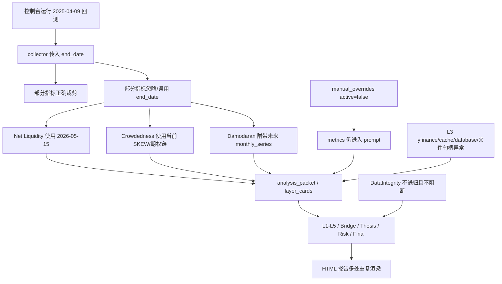

# 2025-04-09 回测报告严重问题复核调查

## 一句话说明

这次 2025-04-09 回测报告的问题不是单一文案瑕疵，而是数据边界、人工数据隔离、运行环境、报告表达四条链路同时出问题。其中最严重的是：部分指标在回测报告中使用了晚于 2025-04-09 的数据，导致报告看起来像是在回测，实际部分判断已经混入未来信息。

## 为什么要调查

用户在 `vnext_brief_20260518_1940_20250409_0000.html` 中批注了多处异常：

- 回测日期显示为 `2025-04-09`，但指标时间戳大量显示 `2026-05-18`。
- 控制台未启用人工数据，报告却出现 `PE 36.6（manual override）`。
- `Net Liquidity` 报告值 `5889.27B` 与 workbench 中 `6253.22/6253.25B` 不一致。
- 报告重复展示“不能淡化的风险”和最终判断。
- `置信度 中`、`safe/warning` 没有解释。
- L3/L4 数据缺口很大，但最终报告仍给出较完整的结论。

本次调查目标不是修复代码，而是复核第一阶段发现是否完整、是否准确，并把问题写成可留档、可执行、普通读者也能理解的调查文档。

## 调查范围

本次复核读取了以下材料：

- 运行日志：`output/logs/control_service/20260518_193311_613.log`
- 采集数据：`output/data/data_collected_v9_20250409.json`
- vNext artifacts：`output/analysis/vnext/20250409/`
- 原生报告：`output/reports/vnext_brief_20260518_1940_20250409_0000.html`
- workbench 时间序列：`output/analysis/vnext/20250409/chart_time_series.json`
- 核心源码：
  - `src/core/collector.py`
  - `src/core/checker.py`
  - `src/tools_L1.py`
  - `src/tools_L2.py`
  - `src/tools_L3.py`
  - `src/tools_L4.py`
  - `src/tools_L5.py`
  - `src/agent_analysis/packet_builder.py`
  - `src/agent_analysis/orchestrator.py`
  - `src/agent_analysis/vnext_reporter.py`

同时进行了两轮多 agent 复核：

- 第一轮：分查时间边界、人工数据、报告表达、工件一致性。
- 第二轮：独立复核 log、artifact、HTML、源码根因，并检查第一阶段是否漏项。

## 总体结论

### 结论 1：第一阶段大方向正确

第一阶段指出的三条主线成立：

- 回测边界失守：部分指标在 2025-04-09 回测中使用了 2026 年数据。
- 人工数据隔离失效：人工数据虽然未被 collector 采用，但 inactive 的 manual metrics 仍进入了 agent prompt。
- 报告表达放大错误：同一错误风险在多个区块重复出现，且缺少解释。

### 结论 2：第二轮复核发现了新增问题

第二轮复核补充了第一阶段没有充分展开的漏项：

- L3 成分股数据抓取存在大量 yfinance/cache/database 失败，并出现 `Too many open files`。
- `QQQ/QQEW` raw 数据与 chart/workbench 使用了不同基准日。
- L3 `quality_self_check` 低估了缺口范围。
- VIX 回测路径曾尝试请求未来日期，虽然最终回退到缓存。
- `logic_vnext` 中有把普通数值显示成“% 分位”的 flattening 错误。
- `run_summary.json` 与 `console_run_summary.json` 的报告路径记录不一致。
- 一些 yfinance 调用可能因为 `end=effective_date` 的排他语义少取回测当天数据。

### 结论 3：workbench 图表不是主要污染源

第二轮复核确认：`chart_time_series.json` 对 Net Liquidity 和 Damodaran ERP 做了未来行裁剪。

也就是说，workbench 图表侧反而比较正确；问题主要出在 `raw_data / analysis_packet / layer_cards / logic_vnext / HTML 正文` 仍然保留或使用了未来信息。

## 严重程度分级

| 等级 | 问题 | 影响 |
| --- | --- | --- |
| P0 | 回测中使用未来数据 | 直接破坏回测可信度，可能改变投资判断 |
| P0 | inactive manual data 进入 prompt 并被主结论引用 | 违反“未启用人工数据不参与分析”的用户预期 |
| P0 | DataIntegrity 发现问题但不阻断，且漏扫嵌套日期 | 质量闸门失效，错误可继续进入报告 |
| P1 | L3/L4 数据缺口大，但报告仍给出较完整判断 | 读者容易高估结论可靠性 |
| P1 | 报告重复、置信度不透明、safe/warning 无解释 | 放大误解，降低报告可审计性 |
| P1 | 运行环境出现 yfinance/cache/database/文件句柄异常 | 数据失败不是孤立缺口，而是运行稳定性问题 |
| P2 | token usage、raw JSON、summary 路径等审计信息展示粗糙 | 不直接改变结论，但影响审计体验和可信度 |

## 关键事实 1：Net Liquidity 使用了未来数据

### 发生了什么

报告中的 Net Liquidity 显示：

- 数值：`5889.27B`
- 4 周动量：`-107.17B`
- 数据日期：`2026-05-15`

但这份报告宣称是 `2025-04-09` 回测。

### 为什么这是严重问题

回测的基本要求是：只能使用回测日期当时可见的数据。`2026-05-15` 是 `2025-04-09` 之后 13 个月的数据，不能参与 2025-04-09 的判断。

### 与 workbench 的对账

workbench 使用 `chart_time_series.json`，最后三行是：

- `2025-04-07`: `6261.980`
- `2025-04-08`: `6253.215`
- `2025-04-09`: `6253.252`

组件可以对上：

`2025-04-09 WALCL 6727.416 - TGA 306.049 - RRP 168.115 = 6253.252`

所以 `5889.27B` 与 `6253.252B` 的差额约 `364B`，不是单位问题，也不是四舍五入问题，而是日期错配。

### 根因

`collector` 主路径确实把 `end_date` 传给了指标函数。根因不在“collector 没传日期”，而在指标函数内部没有正确使用这个日期。

`get_net_liquidity_momentum(end_date)` 接收了 `end_date`，但：

- 调用 `_build_net_liquidity_series()` 时没有传入截止日。
- 后续直接取 `net_liq_df` 的最后一行。
- 组件 `fed_assets/tga/rrp` 也取最新行。

因此，在缓存或数据源已经更新到 2026 年时，回测会吃到未来值。

### 证据

- `output/data/data_collected_v9_20250409.json`: Net Liquidity `value.date=2026-05-15`
- `output/analysis/vnext/20250409/analysis_packet.json`: Net Liquidity 同样为 `5889.27`
- `output/analysis/vnext/20250409/layer_cards/L1.json`: L1 实际消费了这个值，并写入推理
- `src/tools_L1.py`: `get_net_liquidity_momentum` 未按 `end_date` 裁剪

## 关键事实 2：Crowdedness Dashboard 存在伪标注日期

### 发生了什么

Crowdedness Dashboard 的父级日期是 `2025-04-09`，但内部数据并非全部属于该日期：

- `skew_index.date = 2026-05-15`
- `qqq_put_call_ratio_oi.notes = 基于到期日: 2026-05-18 的期权持仓量`
- `qqq_put_call_ratio_oi.value = 2.64`

报告 L2 使用了这些值，并写出 SKEW 接近 150、QQQ put/call 极端看空、空头拥挤等判断。

### 为什么这是严重问题

这比普通缺失更危险，因为外层日期看似正确，内部数据却是当前或未来数据。读者和 DataIntegrity 都容易被父级 `date=2025-04-09` 误导。

### 根因

`get_crowdedness_dashboard(end_date)` 解析了 `effective_date`，但核心数据仍取当前：

- SKEW 用 `period="5d"` 获取最近数据。
- QQQ option chain 获取当前最近到期期权链。
- QQQ info 获取当前资料。
- 之后却把部分子项日期写成 `effective_date`。

这是“用回测日期打标签，但数据来自当前”的伪标注。

### 证据

- `output/data/data_collected_v9_20250409.json`: `skew_index.date=2026-05-15`
- `output/analysis/vnext/20250409/layer_cards/L2.json`: L2 用 SKEW 和 put/call 写入判断
- `src/tools_L4.py`: `get_crowdedness_dashboard` 用 yfinance 最近数据和当前期权链

## 关键事实 3：Damodaran 主值正确，但附带序列泄漏未来

### 发生了什么

Damodaran ERP 主值是：

- `data_date = 2025-04-01`
- `erp_t12m_adjusted_payout = 4.43%`
- `erp_t12m_cash_yield = 4.61%`
- `expected_return = 8.85%`

这个主值作为 2025-04-09 回测的月度参考可以接受。

但问题在于：`monthly_series` 没有按 `target_date` 裁剪，里面包含了 `2025-05-01` 到 `2026-05-01` 的未来月份。L4 推理实际引用了“最新 2026-05-01”趋势。

### 为什么这是严重问题

即使主值正确，只要同一个 raw payload 带着未来序列进入 prompt，agent 就可能引用未来趋势。实际运行中已经发生了。

### 根因

解析 Damodaran Excel 时：

- 主行选择使用了 `target_date`，因此能选到 `2025-04-01`。
- 但 `monthly_series` 直接取最新 `tail(120)`，没有过滤到 `target_date`。

workbench 图表侧已经裁掉未来行，并记录 `future_rows_dropped=13`。这再次说明：图表路径有裁剪，raw/analysis 路径没有统一裁剪。

### 证据

- `output/analysis/vnext/20250409/analysis_packet.json`: Damodaran `monthly_series` 包含 `2026-05-01`
- `output/analysis/vnext/20250409/layer_cards/L4.json`: L4 引用 “最新2026-05-01”
- `output/analysis/vnext/20250409/chart_time_series.json`: Damodaran chart 记录 `future_rows_dropped=13`
- `src/tools_L4.py`: Damodaran `monthly_series` 未按 target date 过滤

## 关键事实 4：未启用人工数据仍进入了 agent prompt

### 发生了什么

控制台没有启用人工数据，`manual_overrides.active=false`，`manual_override_count=0`。collector 没有把人工数据当作有效 raw data 使用。

但 `manual_overrides.metrics` 仍然进入了 L4 agent 的 prompt，其中包含：

- `PE_TTM = 36.6`
- `PE_TTM_percentile_10y = 90`

L4 随后写出：“参考 manual_overrides 中未启用的数据暗示 PE 36.6，10年分位90”。这个叙事继续传播到 Thesis、Risk、Reviser、Final，最后在报告首页和风险区多次出现。

### 为什么这是严重问题

用户没有选择使用人工数据，报告却在核心风险里引用了人工 PE。这会让读者误以为：

- 人工数据已经启用；
- PE 36.6 是本次回测正式证据；
- 估值压缩风险有 NDX PE 数据支撑。

实际情况是：L4 核心 NDX 估值指标在回测中被跳过，只有 Damodaran US ERP 背景参考可用。

### 根因

`packet_builder` 总是把完整 `manual_overrides` 放进 `AnalysisPacket`。

`orchestrator._build_layer_manual_overrides()` 只按 layer 过滤 function id，不在 `active=false` 时清空 metrics。

最终 prompt payload 被序列化进 `Runtime Input`，模型看到了 inactive manual metrics。

### 证据

- `config/manual_data.local.json`: `active=false`，但包含 `PE_TTM=36.6`
- `src/core/collector.py`: 只有 active 时才实际使用 manual
- `src/agent_analysis/orchestrator.py`: inactive metrics 仍进入 prompt
- `output/analysis/vnext/20250409/layer_cards/L4.json`: PE 36.6 首次进入叙事
- `output/analysis/vnext/20250409/final_adjudication.json`: 风险中保留 PE 36.6
- 报告 HTML：首页和风险区多次显示 `PE 36.6（manual override）`

## 关键事实 5：DataIntegrity 发现了问题，但不是阻断闸门

### 发生了什么

`DataIntegrity` 报告：

- `confidence_percent = 84.6`
- `5 个指标因回测前瞻风险被跳过`
- `1 个指标存在晚于回测日的数据日期`
- 示例：`Net Liquidity ... value.date=2026-05-15`

但 pipeline 继续生成 packet、运行 agent、生成报告。

### 为什么这是严重问题

如果质量检查只写报告、不阻断，严重数据污染仍可进入最终报告。对回测系统来说，未来数据泄漏应该是硬错误，至少应进入不可发布状态。

### 为什么它还漏掉了问题

`DataIntegrity` 当前只检查：

- raw 顶层 `date/data_date/effective_date`
- raw.value 第一层 `date/data_date/effective_date`
- raw.data_quality 第一层 `date/data_date/effective_date`

它不递归扫描：

- `value.skew_index.date`
- `value.monthly_series[].data_date`
- notes 中的期权到期日
- 深层 list/dict 日期字段

因此它只发现 Net Liquidity，漏掉了 Crowdedness 和 Damodaran 的嵌套未来日期。

### 证据

- `output/analysis/vnext/20250409/logic_vnext.json`: DataIntegrity 84.6% 与 Net Liquidity 未来日期
- `src/core/checker.py`: 日期检查不递归
- `src/main.py`: DataIntegrity 运行后继续 build packet 和报告

## 关键事实 6：L3 数据失败不是小缺口，而是运行环境层面异常

### 发生了什么

日志中大量 NDX 成分股行情下载失败，错误包括：

- `possibly delisted`
- `no price data`
- `OperationalError('unable to open database file')`
- DNS 错误
- yfinance silent rate limit
- `Too many open files`

这些错误多次出现，集中影响 L3 广度与内部结构数据。

### 为什么这是严重问题

L3 的广度、参与度、内部结构是判断“纳斯达克上涨或下跌是否健康”的关键。如果 L3 大面积失败，报告就不能像完整掌握内部结构一样下结论。

### 具体缺口

明确缺失或弱化的 L3 指标包括：

- `get_advance_decline_line`
- `get_percent_above_ma`
- `get_new_highs_lows`
- `get_mcclellan_oscillator_nasdaq_or_nyse`
- `get_qqq_top10_concentration`
- `get_m7_fundamentals`

其中前四个是抓取失败或计算数据不足，后两个是在回测模式下主动跳过，以避免前瞻偏差。

### 新增复核发现

L3 `quality_self_check` 只把前四个广度指标列入 missing/weak，但没有完整计入 Top10 concentration 和 M7 fundamentals 的跳过。正文提到了，质量自检没有完整反映。

### 证据

- `output/logs/control_service/20260518_193311_613.log`: 大量 yfinance/cache/database/文件句柄异常
- `output/data/data_collected_v9_20250409.json`: L3 多项 unavailable 或 backtest_skipped
- `output/analysis/vnext/20250409/layer_cards/L3.json`: quality_self_check 低估缺口范围

## 关键事实 7：QQQ/QQEW raw 与 chart/workbench 基准日不一致

### 发生了什么

第二轮复核发现，`QQQ/QQEW` 并非未来泄漏，但 raw 和 chart/workbench 的基准日不一致：

- raw/analysis 使用 `2025-04-08` 的 `3.8953`
- chart/workbench 使用到 `2025-04-09` 的 `3.935478...`

### 为什么这是问题

这不会造成未来数据污染，但会造成“报告文字”和“图表工具”对同一指标给出不同数值。用户看到两个界面不同，就会怀疑所有数据。

### 可能根因

源码复核提示：多个 yfinance 调用可能使用了 `end=effective_date`。yfinance 的 `end` 通常是排他边界，可能导致少取回测当天，只取到前一交易日。

这属于“高度疑似”，需要单独用小样本验证。

## 关键事实 8：报告层把问题放大为读者误导

### 重复展示

同一组 `must_preserve_risks` 在多个位置重复出现：

- 首页 hero
- 最终判断 section
- 风险边界 section
- governance / Risk Sentinel section

重复本身不是最大问题，最大问题是：一旦上游风险文本被 PE 36.6 或未来数据污染，重复展示会把错误变成“全篇主旋律”。

### 置信度不透明

首页只显示：

`置信度 中`

但没有解释：

- 为什么是中；
- 哪些数据缺口要求降权；
- Critic 为什么认为可能过度自信；
- DataIntegrity 84.6% 如何影响最终置信度。

### safe/warning 无解释

`risk_boundary_report.boundary_status` 直接显示：

- `valuation_compression: warning`
- `trend_breakdown: safe`

问题是：

- 英文标签没有中文解释；
- `safe` 也被渲染成类似警戒样式；
- 没有展示每个状态的判定理由；
- 用户无法知道这些标签对投资判断有什么用。

### 时间戳误导

报告顶部显示 `数据日期 2025-04-09`，但指标卡片有大量 `2026-05-18` 采集时间。对于普通读者来说，这很容易造成两个误解：

- 误以为报告可能用了 2026 年数据跑 2025 年回测；
- 或误以为所有 2026 时间只是采集时间，不影响数据本身。

真实情况更复杂：大部分 2026 时间是采集时间，但有些指标的数据日期本身也穿越到了 2026 年。

报告应该全局区分：

- 回测日期：`2025-04-09`
- 数据观察日期：每个指标真实 as-of date
- 采集日期：`2026-05-18`
- 报告生成日期：`2026-05-18`
- 是否发现晚于回测日的数据

### 买方视角不足

用户明确指出报告应以纳斯达克买入研究为主。当前报告虽然指出风险和反弹条件，但没有转化为买方需要的动作：

- 当前仓位如何处理；
- 什么条件可以加仓；
- 什么条件必须减仓；
- 反弹是买点还是减仓窗口；
- 观察期多长；
- 哪些指标是下一步决策开关。

这不是数据 bug，但属于报告产品定位问题。

### token usage 可见但不可读

报告把 token usage 作为 Python dict 直接塞进审计区。它说明大体成本与容量，但不能直接说明数据质量。当前展示方式对普通读者没有帮助，反而增加噪音。

## 第一阶段结论的修正

第一阶段结论总体正确，但需要以下修正：

| 第一阶段说法 | 第二轮修正 |
| --- | --- |
| 回测边界失守 | 正确，但要补充 Damodaran nested monthly_series 和 QQQ/QQEW raw/chart 基准日不一致 |
| collector 没正确处理日期 | 要精确表述为：collector 传了 `end_date`，部分函数内部忽略、误用或伪标注 |
| DataIntegrity 发现但不阻断 | 正确，且还要补充：DataIntegrity 不递归，漏掉嵌套未来日期 |
| manual inactive 仍进入 prompt | 正确 |
| 报告重复/不透明 | 正确，但要补充“信息能找到，不等于读者能正确理解” |
| token usage 似乎合理 | token usage 不是数据质量信号，只是成本/容量信号；当前展示方式不合格 |

## 不应误判的事项

### 1. 不是所有 2026 时间戳都是数据污染

很多 `2026-05-18` 是采集时间或报告生成时间，这是正常元数据。真正的问题是：报告没有清晰区分采集时间和数据观察日期，并且确实存在部分数据观察日期晚于回测日。

### 2. collector 并非完全没有传回测日期

源码显示 collector 主路径会传 `end_date`。不能把责任简单写成“collector 没传日期”。更准确的说法是：部分指标函数接到 `end_date` 后没有正确执行日期边界。

### 3. workbench 图表没有发现未来行污染

`chart_time_series.json` 对 Net Liquidity 和 Damodaran 都记录了 `future_rows_dropped`。当前证据显示 workbench 图表裁剪是有效的。真正的问题是 raw packet 和 agent prompt 没有使用同样严格的裁剪结果。

### 4. L4 Damodaran 主值不是错的

Damodaran 主值 `2025-04-01` 本身可以作为 `2025-04-09` 的月度参考。错误在于附带序列泄漏未来月份，并被 L4 推理引用。

### 5. token usage 不是病因

token usage 大说明 prompt 大、成本高、上下文多，但不直接说明数据错。真正病因是 prompt 里包含了未过滤的未来数据和 inactive manual metrics。

## 根因结构图

## 建议修复顺序

### 第一优先级：阻断回测穿越

必须先修：

- `get_net_liquidity_momentum` 按 `end_date` 裁剪。
- `get_crowdedness_dashboard` 在回测模式下禁用当前期权链或明确标为 unavailable，不能伪标日期。
- Damodaran `monthly_series` 按 `target_date` 裁剪。
- DataIntegrity 递归扫描日期字段。
- 任何晚于回测日的数据进入 raw packet 时，应至少使本次报告不可发布。

验收标准：

- 2025-04-09 回测中不存在任何数据观察日期晚于 2025-04-09 的指标、嵌套字段或序列。
- Net Liquidity report/raw 与 chart/workbench 对同一日期数值一致。

### 第二优先级：隔离未启用人工数据

必须修：

- `manual_overrides.active=false` 时，不向 layer prompt 暴露 metrics。
- 报告中禁止引用 inactive manual metrics。
- 如果需要展示“可选人工数据存在但未启用”，只能在审计区显示，不能进入分析判断。

验收标准：

- 未启用人工数据时，报告全文不出现 `manual override`、`PE 36.6` 等未启用数值。

### 第三优先级：修复质量闸门

必须修：

- DataIntegrity 从“提示器”升级为“闸门”。
- P0 数据污染时，禁止生成可发布报告。
- 对嵌套日期、列表日期、notes 中可解析日期建立扫描规则。

验收标准：

- 发现未来数据时，run summary 明确标为 failed 或 blocked。
- UI 顶部显示“不可发布 / 数据边界失败”。

### 第四优先级：修复 L3 运行稳定性

必须调查：

- `Too many open files` 的来源。
- yfinance cache/database 并发访问策略。
- NDX 成分股历史数据是否需要本地快照或稳定数据源。
- 回测成分股 fallback 是否会退回最新成分股，造成幸存者偏差。

验收标准：

- L3 广度指标失败时，质量自检完整列出所有缺失项。
- 不能把“广度全部不可用”包装成“结构判断充分”。

### 第五优先级：重做报告信息架构

必须修：

- 首页并列显示回测日期、数据观察日期范围、采集时间、生成时间。
- 对 `置信度` 给出依据：数据完整性、缺口、冲突、Critic 降权理由。
- `safe/warning/breached` 本地化并显示判定理由。
- 去重 `must_preserve_risks`，同一风险只在最合适的位置展开。
- token usage 改为审计表格，不作为正文判断。
- 买方视角增加动作层：加仓、减仓、等待、失效条件。

验收标准：

- 普通读者不需要翻 raw JSON，也能知道这份报告哪些证据可靠、哪些证据缺失、哪些结论只是条件性假设。

## 工作审视报告

### 原定目标

复核第一阶段调查结论是否完整、是否正确，并将两轮调查综合成一份通俗但深入的根目录文档。

### 完成情况

- [x] 已完成：第二轮多 agent 复核 log、artifact、HTML、源码。
- [x] 已完成：确认第一阶段主结论成立。
- [x] 已完成：补充第一阶段漏项。
- [x] 已完成：区分已确认事实、高度疑似和待验证事项。
- [x] 已完成：写成本调查文档。

### 发现的问题

| 严重程度 | 问题描述 | 根本原因 | 改进建议 |
| --- | --- | --- | --- |
| 必须改正 | Net Liquidity 在 2025-04-09 回测中使用 2026-05-15 数据 | 指标函数忽略 `end_date` | 指标内部按回测日裁剪，并加入测试 |
| 必须改正 | Crowdedness 外层标 2025-04-09，内部使用当前 SKEW/期权链 | `end_date` 只用于打标签 | 回测模式禁用不可历史回溯数据或提供历史源 |
| 必须改正 | inactive manual PE 进入 prompt 并污染主结论 | prompt 构建未按 active 隔离 metrics | inactive 时清空 metrics，不给模型看 |
| 必须改正 | DataIntegrity 发现未来日期但不阻断 | 质量检查只报告不 gating | P0 问题阻断报告发布 |
| 应当改正 | L3 大规模抓取失败但质量自检低估缺口 | 运行环境与 self-check 都不够严格 | 修 cache/文件句柄，并完整披露缺口 |
| 应当改正 | 报告重复、置信度不透明、safe/warning 无解释 | 信息架构没有面向读者解释 | 重构首页、风险、审计区 |
| 建议改进 | token usage 原样展示为 dict | 审计信息未产品化 | 改成表格并标注是否异常 |

### 做得好的地方

- workbench 图表路径已有未来行裁剪能力。
- 回测模式已经主动跳过部分 latest-only L4 指标，方向是对的。
- DataIntegrity 已经能发现一部分未来日期，只是还不够严格。
- artifacts 保留较完整，足以追踪问题传播链。

### 下次重点关注

- 不再只看最终 HTML，要同时查 raw data、analysis packet、layer cards、logic、chart、log。
- 不把“报告有提示”当成“读者能理解”。
- 不把“DataIntegrity 有记录”当成“系统已阻断”。
- 不把“collector 传了日期”当成“指标一定遵守日期”。

## 最后总结

这次 0409 回测报告不能作为可信研究报告发布。它暴露的是系统性质量问题：数据边界没有统一执行，未启用人工数据没有被彻底隔离，质量检查没有阻断能力，报告层又把错误叙事重复放大。

下一步必须先修数据与 prompt 边界，再修报告表达。否则即使报告 UI 更漂亮，也只是把不可靠的结论包装得更像真的。
