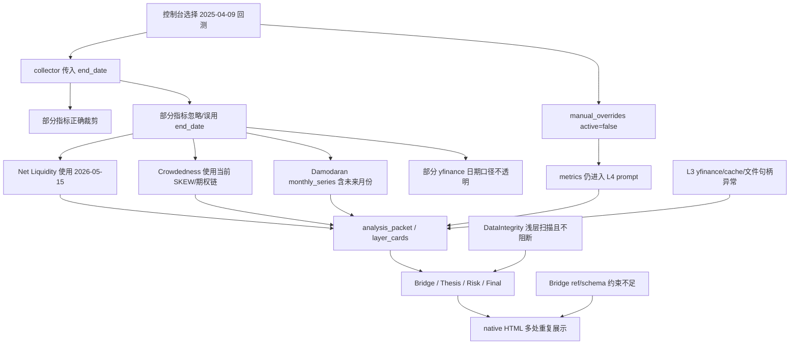

# 2025-04-09 vNext 回测事故最终综合审计

日期：2026-05-19  
对象：`2025-04-09` NDX vNext 回测产物  
定位：给后续 AI agent 的一锤定音交接文档

## 使用说明

这份文档已经综合并复核了此前所有同主题调查材料，以及对应的 log、artifact、HTML 和源码。后续 AI agent 默认只需要阅读本文件，不需要再打开旧审计材料。

除非用户明确要求追溯原始审计过程，否则不要把工作重点放在“重新比较旧材料”上。后续工作应直接从本文件的“已完成并验证”和“未完成待办”开始。

## 最终判定

`2025-04-09` 这次原始 vNext 回测产物不可发布。

问题不是报告文案瑕疵，而是系统性事故：未来数据进入回测、未启用人工数据进入 prompt、质量检查发现问题但不阻断、L3 数据运行环境失稳、Bridge 证据结构不可审计、HTML 报告又把错误叙事重复放大。

截至本文件最新修订，P0 硬污染和多项 P1/P2 问题已经在代码中修复并通过全量测试。旧产物仍只能作为事故样本使用；后续 agent 不应继续基于旧 `output/analysis/vnext/20250409/` 产物判断市场结论，而应在当前代码基础上继续完成剩余待办，必要时重新生成新 run。

## 当前执行状态

### 已完成并验证

以下修复已经落地，且当前全量测试通过：

- P0-1 未来数据入口已封住：
  - `get_net_liquidity_momentum(end_date=...)` 按回测日裁剪净流动性主序列、组件、4 周动量和统计。
  - `get_crowdedness_dashboard(end_date=...)` 回测模式下 SKEW 只用不晚于回测日的历史行；当前期权链 OI 和当前 short interest 不再伪标为回测证据，而是 `backtest_unavailable`。
  - Damodaran `monthly_series` 按 `target_date` 裁剪，不再把 `2025-05` 至 `2026-05` 泄漏给 L4。
  - L5 / QQQ / QQEW / chart adapter 的 yfinance 日频请求统一处理排他 `end`：请求 `effective_date + 1 day`，再过滤回 `effective_date`，避免回测日收盘数据被误落到 T-1。
- P0-2 inactive manual metrics 已隔离：
  - `manual_overrides.active=false` 时，AnalysisPacket 和 layer prompt 不再暴露人工 PE、分位等具体值。
  - 只保留 inactive 计数和隐藏标记，作为审计元数据。
- P0-3 DataIntegrity 已从提示器升级为闸门：
  - 递归扫描 dict/list 中的数据观察日期。
  - 解析 notes/reason 中的 `YYYY-MM-DD`。
  - 发现晚于回测日的数据即写出 `blocked/unpublishable`，主流程在 LLM/报告前停止，并写 `data_integrity_report.json` 和 blocked `run_summary.json`。
- P1-1 L3 缺口不再冒充事实：
  - `failed / skipped / unavailable / source_tier=unavailable / availability=unavailable / nested value 全 None` 被统一识别。
  - 这类指标不再计入成功、不进入 `key_metrics`，也不会被标成 `analysis_required=true`。
  - L3 证据不足时可落为 `insufficient_data`，不再自动包装成 `neutral`。
- P1-2 Bridge ref 和 transmission path 可审计性已加闸门：
  - `supporting_facts`、typed conflict、resonance、transmission path 的 refs 必须是可定位的 `LX.function_id`。
  - 重复 `path_id`、空 `evidence_refs`、空 `implication` 会被 Schema Guard 拦下。
- P1-3 复合指标子项过度升格已加治理：
  - Bridge prompt 明确 CNN Fear & Greed / Crowdedness 等复合指标必须先读总分/总状态，再解释子项。
  - Schema Guard 会拦截“只用 CNN FGI 子项如 Market Momentum、却不说明总分语义”的 high severity typed conflict。
- P1-4 价格技术日期口径已第一轮修复：
  - 回测目标按“回测日收盘后可见”处理，QQQ 技术指标、QQQ/QQEW 和 chart QQQ OHLCV 均请求 T+1 并过滤至 T。
  - native brief 首屏会显示观察日期范围，避免只写一个模糊“数据日期”。
- P1-5 `backtest_data_boundaries` 已进入主审计通道：
  - 进入 `analysis_packet.meta/context`。
  - native brief 审计区展示跳过项、原因和 future upgrade。
- P1-6 报告信息架构已完成第一轮止血：
  - 首屏显示发布状态、分析目标日、回测日、观察日期范围、采集时间、生成时间和指标覆盖。
  - `safe / warning / breached` 中文化。
  - token usage 不再原样显示 dict，而是显示阶段数、输入、输出和合计 token 摘要。
  - `must_preserve_risks` 主展示只保留在“风险边界”，首屏/判断/Governance 只显示数量摘要，避免重复放大。
- P2-1 run summary 与 console summary 已同步：
  - console full run 会把 `native_brief`、`workbench` 和 native fallback `report_path` 回写到同目录 `run_summary.json`。
- P2-2 L2 首次 schema 校验失败已第一轮固化：
  - Layer prompt 明确 `indicator_analyses[].evidence_refs` 必须是字符串数组。
  - normalizer 会把模型偶发输出的 dict / dict 列表收敛成标准字符串 ref。
- P2-3 yfinance 长退避与 cache 异常已产品化为运行诊断：
  - `cached_yf_download()` 和 `get_yf_ticker_info_with_retry()` 记录 provider success、cache hit、cache fallback、retry、failed、退避秒数和耗时。
  - 失败类型区分 `rate_limited`、`empty_response`、`dns_or_network`、`sqlite_cache_error`、`file_descriptor_exhausted`、`provider_unavailable`、`provider_error`。
  - Collector / DataIntegrity / collect-only summary / run_summary / native brief 审计区都会暴露 yfinance runtime diagnostics 和慢指标/降级指标摘要。
- P2-4 报告买方动作层已落地第一版：
  - native brief 新增“买方动作层”，把上游风险边界和失效条件转成加仓、减仓、等待、观察窗口。
  - 动作层只消费 final adjudication 与 Risk Sentinel 的既有输出，不新增未经 evidence refs 支持的点位、概率或历史胜率。

验证记录：

- P0/P1 第一轮修复后：`python3 -m pytest -q` 为 `294 passed, 4 warnings`。
- audit 剩余项第一轮 targeted tests：`26 passed, 4 warnings`。
- 复合指标升格治理专项：`1 passed, 4 warnings`。
- evidence_refs dict normalizer 专项：`2 passed, 4 warnings`。
- 最新全量验证：`python3 -m pytest -q` 为 `304 passed, 4 warnings`。
- 旧污染采集包 `output/data/data_collected_v9_20250409.json` 经新 DataIntegrity 复核为 `blocked=true` / `publish_status=blocked`，阻断原因覆盖 Net Liquidity、Crowdedness 和 Damodaran 未来日期。

### 未完成待办

后续 agent 应优先处理以下未完成项：

1. L3 / yfinance / SQLite / 文件句柄运行稳定性真实 run 复盘
   - 代码已能区分并展示 `Too many open files`、SQLite cache、DNS/network、yfinance silent rate limit、空响应和 cache fallback。
   - 仍需用真实失败日志确认根因关系，并在必要时调整批量下载、文件句柄、cache 读写或 fallback 策略，目标是减少 L3 数据源系统性失败。
2. 严格回测 invariant 设计
   - ALFRED vintage、财报 first-reported、point-in-time universe、LLM 后验知识仍未系统化。
   - 这些不应和 `2026-05-15` 这类硬未来泄漏混为一谈，但必须进入后续路线图。
3. 重新生成并复盘新的 `2025-04-09` run
   - 当前修复已通过测试，但旧 run artifacts 仍是污染样本。
   - 后续应在当前代码上重新生成 2025-04-09 run，复核 `analysis_packet.json`、DataIntegrity、native brief 和 workbench 是否与新规则一致。

## 一句话事故链

控制台选择 `2025-04-09` 回测后，collector 主路径确实把 `end_date` 传给了指标函数；但部分指标函数没有真正执行日期边界，导致 `2026` 年数据进入 raw packet 和 agent prompt。同时，`manual_overrides.active=false` 的人工 PE 仍被传给 L4 agent。DataIntegrity 发现部分越界但没有阻断，报告层又把这些污染后的结论多处重复展示。

## 目标架构方向

后续修复不要把系统改成两套完整流水线，也不要继续让每个指标函数零散地“猜测”自己该如何处理回测。正确方向是：

```text
实时模式数据入口
回测模式数据入口
人工数据入口
        ↓
统一可见性校验 / 日期边界裁剪 / manual 隔离
        ↓
统一 Evidence Packet / AnalysisPacket
        ↓
共用 L1-L5 / Bridge / Thesis / Risk / Final
        ↓
共用 native report
```

原则：

- 回测模式和实时模式应在数据入口、缓存读取、日期裁剪、历史可见性判断上分开。
- 进入 agent 前必须统一成同一种可信证据包，让 agent 不需要猜“这是回测还是实时”。
- L1-L5、Bridge、Thesis、Risk、Final 和报告模板应尽量共用，避免复制两套推理系统。
- 所有数据必须先通过可见性闸门，再进入 agent prompt。
- inactive manual metrics 不能进入任何 agent prompt，只能作为审计元数据存在。
- chart/workbench、raw packet、HTML 正文必须消费同一套日期边界规则。
- 不要把模式判断散落在 prompt、reporter 和各个下游 agent 中；模式差异应尽量收敛在数据入口和证据包构建前后。

一句话：**模式入口分离，证据包统一，推理与报告共用，质量闸门前置。**

## 硬事实

### 1. Net Liquidity 使用了未来数据

回测报告声称数据日期是 `2025-04-09`，但 `L1.get_net_liquidity_momentum` 使用了：

- `value.date = 2026-05-15`
- `level = 5889.27B`
- `momentum_4w = -107.17B`
- `fed_assets = 6728.5B`
- `tga = 838.58B`
- `rrp = 0.65B`

这比回测日晚了 13 个月。

对账结果显示，workbench/chart 路径在 `2025-04-09` 的 Net Liquidity 约为 `6253.252B`：

`6727.416 - 306.049 - 168.115 = 6253.252`

因此 `5889.27B` 与 `6253.252B` 的差异约 `364B`，不是单位问题，也不是四舍五入问题，而是日期错配。

关键路径：

- `output/data/data_collected_v9_20250409.json`
- `output/analysis/vnext/20250409/analysis_packet.json`
- `output/analysis/vnext/20250409/layer_cards/L1.json`
- `src/tools_L1.py`

根因：

`get_net_liquidity_momentum(end_date)` 接收了 `end_date`，但内部没有按 `end_date` 裁剪 `_build_net_liquidity_series()` 的结果，而是直接取最后一行和组件最新值。

### 2. Crowdedness Dashboard 伪标注日期

进入 L2 分析上下文的 `get_crowdedness_dashboard` 外层日期看似是 `2025-04-09`，但内部数据来自当前或未来：

- `skew_index.date = 2026-05-15`
- `qqq_put_call_ratio_oi.value = 2.64`
- `qqq_put_call_ratio_oi.notes` 写明基于 `2026-05-18` 到期期权链

这属于“外层标签合规，内部数据穿越”。

更严谨地说，问题不是简单的“2025-04-09 一定看不到 2026-05-18 到期合约”。合约是否当时挂牌需要交易所历史期权链验证。真正已确认的问题是：系统用了 `2026-05-18` 采集时的 OI 快照，却把它标成 `2025-04-09` 回测证据。

关键路径：

- `output/analysis/vnext/20250409/analysis_packet.json`
- `output/analysis/vnext/20250409/layer_cards/L2.json`
- `src/tools_L4.py`

根因：

函数解析了 `effective_date`，但 SKEW 使用最近数据，QQQ option chain 使用当前链，再把部分子项日期写成回测日期。

### 3. Damodaran 主值可接受，但 monthly_series 泄漏未来

`L4.get_damodaran_us_implied_erp` 的主值是：

- `data_date = 2025-04-01`
- `erp_t12m_adjusted_payout = 4.43%`
- `expected_return = 8.85%`

这个主值作为 `2025-04-09` 的月度背景参考可以接受。

问题在于 `monthly_series` 未裁剪，包含：

- `2025-05-01`
- `2025-06-01`
- ...
- `2026-05-01`

L4 推理实际引用了“最新 `2026-05-01`”趋势，因此未来序列已经污染叙事。

关键路径：

- `output/analysis/vnext/20250409/analysis_packet.json`
- `output/analysis/vnext/20250409/layer_cards/L4.json`
- `output/analysis/vnext/20250409/chart_time_series.json`
- `src/tools_L4.py`

重要边界：

workbench/chart 路径已经记录并裁掉未来行，raw packet / agent prompt 路径没有同步裁剪。修复时应把 chart 路径的日期纪律推广到 raw/prompt，而不是误伤 workbench。

### 4. 未启用人工数据仍进入 agent prompt

控制台未启用人工数据：

- `manual_overrides.active = false`
- `manual_override_count = 0`

collector 没有把人工 PE 当作正式 raw data 使用。

但 `manual_overrides.metrics` 仍进入 L4 prompt，其中包含：

- `PE_TTM = 36.6`
- `PE_TTM_percentile_10y = 90`

L4 写出“参考 manual_overrides 中未启用的数据暗示 PE 36.6，10年分位90”。该叙事随后进入：

- `synthesis_packet.json`
- `thesis_draft.json`
- `risk_boundary_report.json`
- `analysis_revised.json`
- `final_adjudication.json`
- HTML 报告首页和风险区

关键路径：

- `config/manual_data.local.json`
- `src/agent_analysis/packet_builder.py`
- `src/agent_analysis/orchestrator.py`
- `output/analysis/vnext/20250409/layer_cards/L4.json`
- `output/analysis/vnext/20250409/final_adjudication.json`

根因：

`packet_builder` 无条件保存完整 `manual_overrides`；`orchestrator._build_layer_manual_overrides()` 只按 layer 过滤 function_id，没有在 `active=false` 时清空 metrics。

### 5. DataIntegrity 发现问题但不阻断

DataIntegrity 报告记录：

- `confidence_percent = 84.6`
- `1 个指标存在晚于回测日的数据日期`
- 示例：Net Liquidity `value.date=2026-05-15`

但 pipeline 继续运行，并生成最终 HTML 报告。

同时，DataIntegrity 只扫描浅层日期字段，漏掉了：

- `value.skew_index.date`
- `value.monthly_series[].data_date`
- notes 中可解析出的期权到期日

关键路径：

- `output/analysis/vnext/20250409/logic_vnext.json`
- `src/core/checker.py`
- `src/main.py`

根因：

当前 DataIntegrity 是“提示器”，不是“闸门”；它会降低 confidence，但不会让报告进入 blocked/unpublishable 状态。

### 6. L3 内部结构证据严重不足

L3 数据不是普通小缺口，而是运行环境和数据源稳定性出现了系统性问题。

日志中出现：

- `OperationalError('unable to open database file')`
- `Too many open files`
- DNS / `getaddrinfo() thread failed to start`
- yfinance silent rate limit
- 大量 `possibly delisted` / empty frame

受影响项包括：

- `get_advance_decline_line`
- `get_percent_above_ma`
- `get_new_highs_lows`
- `get_mcclellan_oscillator_nasdaq_or_nyse`
- `get_qqq_top10_concentration`
- `get_m7_fundamentals`

其中前四个是广度抓取/计算失败或不可用；后两个是回测模式主动跳过；`QQQ/QQEW` 有值，但存在 raw 与 chart/workbench 基准日不一致。

关键路径：

- `output/logs/control_service/20260518_193311_613.log`
- `output/data/data_collected_v9_20250409.json`
- `output/analysis/vnext/20250409/layer_cards/L3.json`
- `output/analysis/vnext/20250409/context_brief.json`
- `output/analysis/vnext/20250409/analysis_packet.json`

问题扩大点：

`context_brief` / `facts_by_layer` 把 None 值当“关键事实”展示；L3/L4 有时被包装成 `neutral`，掩盖了“无法判断”。

### 7. L5 与 QQQ/QQEW 日期口径不透明

这不是未来泄漏，但会造成报告误读。

`QQQ/QQEW` 和大量 L5 技术指标实际基于 `2025-04-08`：

- RSI
- ATR
- ADX
- MACD
- OBV
- volume analysis
- price-volume quality
- Donchian channels
- multi-scale MA position

报告顶部却显示数据日期 `2025-04-09`。

如果系统定义是“用 `2025-04-08` 收盘做 `2025-04-09` 盘前判断”，这可以接受，但必须在报告中明确。如果目标是 `2025-04-09` 收盘后判断，则当前数据少取了一天。

关键路径：

- `output/analysis/vnext/20250409/analysis_packet.json`
- `output/analysis/vnext/20250409/layer_cards/L5.json`
- `output/analysis/vnext/20250409/chart_time_series.json`

疑似根因：

部分 yfinance 调用可能使用 `end=effective_date`，而 yfinance 的 `end` 通常是排他边界。该点需要小样本专项验证。

### 8. Bridge 证据结构不可审计

Bridge 的 `supporting_facts` 出现自由文本和“短语+数字”，不是标准 `LX.function_id`：

- `L1.净流动性收缩`
- `L1.实际利率高位`
- `L2.CNN Fear & Greed 9.5`
- `L2.QQQ put/call 2.64`
- `L5.RSI 23.11超卖`

HTML 会把这些拼成无法定位真实指标卡的 ref chip，例如 `L1.get_净流动性收缩`。这不是展示小问题，而是 evidence ref 死链。

Bridge 的 `transmission_paths` 还存在：

- 多条 `path_id` 重复为 `transmission_path`
- `evidence_refs = []`
- `implication = ""`

关键路径：

- `output/analysis/vnext/20250409/bridge_memos/bridge_0.json`
- `output/reports/vnext_brief_20260518_1940_20250409_0000.html`
- `src/agent_analysis/contracts.py`
- `src/agent_analysis/orchestrator.py`
- `src/agent_analysis/vnext_reporter.py`

根因：

Bridge schema 和 schema_guard 对 evidence ref、空字段、重复 id、死链没有足够强的约束。

### 9. 复合指标子项被过度升格

CNN Fear & Greed 总分是 extreme fear，但 Bridge 把其中一个子指标 `Market Momentum (S&P500)=98.2` 单独拿出来，与 L5 下跌趋势构成跨层冲突。

这个子项可以作为“情绪指标内部张力”，但不应越过总分语义，成为高严重度跨层冲突。

复核后的准确链路是：

- Bridge 阶段该冲突并非一开始就是 high。
- Thesis / Reviser 下游阶段逐步把它升权。
- 治理层没有识别“复合指标子项被过度升格”的问题。

### 10. `backtest_data_boundaries` 没进入主审计通道

`output/data/data_collected_v9_20250409.json` 中确实存在 `backtest_data_boundaries`，长度为 5，记录了回测模式跳过项。

问题是：该字段没有进入 `analysis_packet.json`、agent 主上下文和 native report 的审计面板。

正确表述：

不是“完全没实现”，而是“只存在于采集文件，没有进入主分析和报告通道”。

后果：

agent 和读者无法在报告主入口看到本次到底跳过了什么、为什么跳过、未来如何升级。

### 11. 报告信息架构放大误导

HTML 报告把上游错误进一步放大：

- `must_preserve_risks` 至少 3 处重复；若计入 governance/Risk Sentinel，可视为 4 处。
- `置信度 中` 没有解释依据。
- `safe/warning` 英文直出，没有阈值、理由和投资含义。
- 大量 `2026-05-18` 采集时间与 `2025-04-09` 回测日期混排。
- token usage 原始 dict 直接展示。
- 买方动作层不足，没有把风险和反弹条件转成加仓、减仓、等待、失效条件和观察窗口。

关键边界：

不是所有 `2026-05-18` 都是污染。很多是采集时间或报告生成时间，可以存在。真正问题是报告没有清楚区分：

- 回测日期
- 数据观察日期
- 采集日期
- 报告生成日期
- 是否存在晚于回测日的数据观察日期

### 12. VIX 当前日期请求是设计风险，不是已确认污染

日志显示回测过程中曾请求 `2026-05-19` 的 `^VIX`，随后失败并回退缓存。

当前产物中的 VIX 值最终仍是 `2025-04-09`。因此这条应定性为：

> 回测模式仍触发当前日期请求，存在稳定性和设计风险。

不要把它写成：

> VIX 已被未来数据污染。

## 严重程度分级

### P0：已完成并验证

#### P0-1：未来数据进入 raw packet 和 agent prompt

范围：

- Net Liquidity 使用 `2026-05-15`
- Crowdedness 内部 SKEW 使用 `2026-05-15`
- QQQ put/call 使用当前 OI 快照并伪标 `2025-04-09`
- Damodaran `monthly_series` 包含 `2025-05` 至 `2026-05`

修复原则：

- 所有指标函数必须在内部执行 `end_date` / `target_date` 边界。
- 所有进入 `analysis_packet` 和 prompt 的嵌套日期必须递归检查。
- 无法证明历史可见的数据，在回测模式下必须 unavailable / skipped，不能伪标日期。

状态：已完成。Net Liquidity、Crowdedness、Damodaran monthly series、L5/QQQ/QQEW 日频边界均已修复；DataIntegrity 会递归阻断晚于回测日的数据观察日期。

#### P0-2：inactive manual metrics 进入 prompt

范围：

- `manual_overrides.active=false`
- 但 `PE_TTM=36.6`、`PE_TTM_percentile_10y=90` 进入 L4 prompt
- 最终报告多处引用该 PE

修复原则：

- inactive manual metrics 不得进入任何 layer prompt。
- 未启用人工数据时，正文不得出现具体人工数值。
- 若要记录“存在未启用人工数据配置”，只能在审计区记录，不给模型看具体值。

状态：已完成。`active=false` 时具体 manual metric 值被移出 packet/prompt，只保留审计元数据。

#### P0-3：DataIntegrity 不阻断、不递归

范围：

- 发现 Net Liquidity 越界但继续生成报告。
- 漏扫 Crowdedness、Damodaran、notes 中日期。

修复原则：

- 未来数据进入 packet 应触发 blocked/unpublishable。
- DataIntegrity 必须递归扫描 dict/list。
- notes 中可解析日期也要纳入回测边界检查。

状态：已完成。主流程会在 LLM/报告前阻断，且写出 `data_integrity_report.json` 和 blocked `run_summary.json`。

### P1：部分完成，剩余见“未完成待办”

#### P1-1：L3 证据缺口被包装得过于完整

问题：

- 广度指标大面积失败。
- 部分指标回测主动跳过。
- None/unavailable 被写入 core facts。
- L3/L4 状态被写成 neutral，弱化了“无法判断”。

修复原则：

- failed / skipped / unavailable 必须与正常事实分离。
- None 值不能进入 core facts。
- 质量自检必须完整覆盖所有缺口。

状态：已完成第一轮。None/unavailable 不再进入 `key_metrics` 或 `analysis_required=true`，L3 可落为 `insufficient_data`。但 L3 数据源运行稳定性仍未完成。

#### P1-2：Bridge ref 和 transmission path 不可审计

问题：

- evidence refs 使用自由文本。
- HTML ref chip 死链。
- transmission_paths 有重复 id、空 evidence_refs、空 implication。

修复原则：

- ref 必须是标准 `LX.function_id`。
- schema guard 必须校验真实存在、可点击、可定位。
- 重复 id 和关键字段空值应失败。

状态：已完成。Schema Guard 已校验死链 refs、重复 transmission path 和空关键字段。

#### P1-3：复合指标子项被过度升格

问题：

CNN Fear & Greed 子项被下游逐步升权为高严重度冲突。

修复原则：

- prompt 和治理层必须区分综合指标总分与子项分歧。
- 子项分歧默认是内部张力，不应直接升级为高严重度跨层冲突。

状态：已完成。Bridge prompt 和 Schema Guard 已加入复合指标升格治理。

#### P1-4：价格技术指标日期口径不透明

问题：

L5 大量技术指标基于 `2025-04-08`，报告却显示 `2025-04-09`。

修复原则：

- 明确报告是盘前、盘中还是收盘后语义。
- 如果使用 T-1 收盘，报告必须显式写出。
- 如果目标是回测日收盘后，则必须取到回测日收盘。

状态：已完成第一轮。当前采用“回测日收盘后可见”口径，yfinance 日频请求 T+1 并过滤到 T；报告首屏显示观察日期范围。

#### P1-5：`backtest_data_boundaries` 未进入主审计通道

问题：

采集文件有跳过清单，但 `analysis_packet` 和 HTML 主入口没有。

修复原则：

- 该字段必须进入 `analysis_packet.meta` 或独立 vNext artifact。
- HTML 顶部审计面板必须展示跳过项、原因和 future upgrade。

状态：已完成。字段已进入 `analysis_packet.meta/context` 和 native report 审计区。

#### P1-6：报告 UI 信息架构误导读者

问题：

报告重复、置信度不透明、safe/warning 无解释、时间戳语义混乱、买方动作层不足。

修复原则：

- 首页必须显示回测日期、数据观察日期范围、采集时间、生成时间、质量状态。
- 风险主展示只保留一处，其余位置引用摘要。
- 置信度必须解释来源。
- safe/warning 必须中文化并显示判定理由。
- 买方报告必须提供动作框架。

状态：部分完成。首屏时间语义、发布状态、风险去重、safe/warning 中文化和 token usage 摘要已完成；买方动作层和更完整的置信度来源解释仍未完成。

### P2：部分完成，剩余见“未完成待办”

#### P2-1：run summary 与 console summary 不一致

`run_summary.json.report_path=""`，但 `console_run_summary.json` 有 native brief 和 workbench 路径。

影响：

外部脚本若以 run_summary 为入口，会找不到报告。

状态：已完成。console full run 会把 native brief / workbench / fallback report_path 回写 `run_summary.json`。

#### P2-2：L2 第一次 schema 校验失败

L2 第一次 LayerCard 输出 evidence_refs 为 dict，触发 string_type 错误，第二次重试成功。

影响：

这次被重试救回，但说明 prompt/schema 约束仍不稳，应固化测试。

状态：已完成第一轮。prompt 要求 evidence_refs 为字符串数组，normalizer 会收敛 dict / dict list。

#### P2-3：yfinance 长退避和 cache 异常拖慢运行

日志显示大量 10s/60s 退避，SQLite cache 与文件句柄异常可能彼此放大。

影响：

运行慢、脆弱、不可预测；不一定直接改变这次结论，但会持续伤害回测稳定性。

状态：未完成。仍需做 yfinance 长退避、cache、SQLite、文件句柄专项。

#### P2-4：token usage 展示粗糙

token usage 被原样显示为 dict。

影响：

token usage 是成本和上下文规模信息，不是数据质量证据。它应产品化为审计表格，不应成为正文噪音。

状态：已完成第一轮。native brief 不再原样显示 dict，改为阶段数和 token 汇总。

#### P2-5：first-reported / vintage 风险仍未解决

Fed Funds、M2 等月度数据虽然日期不晚于回测日，但真实发布时间和修订历史可能晚于回测日。

影响：

这是严格 point-in-time 回测升级项。它不应和 `2026-05-15` 这种硬未来泄漏混为一谈，但必须进入后续路线图。

状态：未完成。需要进入严格回测 invariant 设计。

## 根因图



## 后续推进顺序

### 第一优先级：L3 / yfinance 稳定性专项

要解决的问题：

- yfinance 并发下载与 SQLite cache 是否互相放大。
- `Too many open files` 的来源。
- DNS / thread failed 和 yfinance silent rate limit 是否需要统一降级策略。
- 是否需要为 L3 广度和成分股历史价格引入本地快照或分批采集。
- L3 失败时，DataIntegrity、AnalysisPacket、quality_self_check 和 native brief 是否表达一致。

完成标准：

- L3 广度函数失败时有结构化 unavailable/error 字段。
- 运行 summary 能说明 L3 是“证据不足”还是“结构恶化”，不能混淆。
- 文件句柄和 SQLite cache 异常不再造成批量失败放大。

### 第二优先级：报告买方动作层

要解决的问题：

- 当前报告已经能显示审计状态和风险，但仍没有把风险边界转成可执行观察框架。

完成标准：

- 报告能把风险、反弹条件、失效条件转成：等待、减仓、加仓、观察窗口。
- 不提供自动交易建议，不给单点价格承诺；只提供条件化动作框架。

### 第三优先级：严格回测 invariant 设计

要解决的问题：

- ALFRED vintage。
- 财报 first-reported。
- point-in-time index universe。
- LLM 后验知识边界。
- 数据发布时间与观察日期的差异。

完成标准：

- 写入 `RUN_REVIEW_CHECKLIST.md` 和 DataIntegrity / packet metadata。
- 明确哪些 invariant 可以工程强制，哪些只能降级或明示。

### 第四优先级：重新生成并复盘 2025-04-09 run

完成标准：

- 使用当前代码重新生成 `2025-04-09` vNext artifacts。
- DataIntegrity 不再发现硬未来日期。
- native brief 顶部审计信息完整。
- L3 缺口、回测跳过项和数据边界在 AnalysisPacket / context_brief / layer card / report 中一致。

## 验收状态

### 已通过或已有测试覆盖

1. `analysis_packet.json` / raw packet 的晚于回测日观察日期会被 DataIntegrity 递归扫描并阻断。
2. notes / reason 中可解析出的 `YYYY-MM-DD` 也会纳入回测边界检查。
3. 未启用 manual data 时，人工 PE 等具体数值不再进入 packet/prompt。
4. DataIntegrity 对未来数据触发 `blocked/unpublishable`，主流程停止。
5. Net Liquidity 按 `end_date` 裁剪所有序列和组件。
6. Crowdedness 回测模式不再使用当前期权链 OI 或当前 short interest 伪标为历史证据。
7. Damodaran 主值和 `monthly_series` 都裁剪到回测日之前。
8. L3 failed / unavailable / nested-None 不再进入 `key_metrics` 或 `analysis_required=true`。
9. Bridge evidence refs、transmission path 重复 id、空 refs、空 implication 已有 Schema Guard 校验。
10. native brief 顶部已区分分析目标日、回测日、观察日期范围、采集时间、生成时间和发布状态。
11. `backtest_data_boundaries` 在 native report 中可见。
12. L5 / QQQ / QQEW 日频边界已统一为请求 T+1 后过滤到 T。
13. run summary 会同步 native brief / workbench 路径。
14. token usage 不再作为原始 dict 噪音展示。
15. CNN FGI 子项不能无总分语义地升格成 high 冲突。
16. L2 `evidence_refs` dict 输出会被 normalizer 收敛为字符串 ref。

### 尚需真实 run 验证

1. 使用当前代码重新跑 `2025-04-09` 后，新的 `analysis_packet.json` 是否完全没有硬未来观察日期。
2. Net Liquidity raw、layer、chart、workbench 是否在同一观察日期上数值一致。
3. L3 缺口是否在 quality_self_check、context_brief、analysis_packet、HTML 中一致展示。
4. 新 native brief 的审计面板是否能让读者一眼区分回测日期、观察日期、采集时间、生成时间。
5. 报告买方动作层是否足够具体。

### 尚未设计完成

1. ALFRED vintage / first-reported / point-in-time universe。
2. LLM 后验知识边界。
3. yfinance 长退避、cache、SQLite、文件句柄异常的产品化治理。

## 后续 AI agent 禁区

不要做这些事：

- 不要再把时间花在比较两份旧报告谁更完整上。
- 不要把所有 `2026-05-18` 时间戳都当成污染。
- 不要把 VIX 当前日期请求写成已确认污染。
- 不要说 collector 完全没传回测日期。
- 不要说 Damodaran 主值本身错误。
- 不要说 workbench 是主要污染源。
- 不要把 token usage 当成数据质量证据。
- 不要把 L3 简化为“完全没数据”；应说“内部结构证据严重不完整”。
- 不要再把已修复的 P0 当作当前阻塞项重复修一遍；当前阻塞项是剩余稳定性、动作层和严格回测 invariant。

## 最短交接卡

如果后续新对话只能粘贴一小段，就粘贴下面这一段：

> 2025-04-09 原始 vNext 回测不可发布，但当前代码已完成并验证 P0 硬修复：未来数据入口、inactive manual 泄漏、DataIntegrity 阻断、Bridge refs、L3 None/unavailable 升格、L5/QQQ/QQEW 日期边界、native brief 首屏审计、run_summary 路径、复合指标子项升格和 L2 evidence_refs dict 输出。最新全量测试为 `302 passed, 4 warnings`。后续不要重修 P0，直接推进剩余项：L3/yfinance/SQLite/文件句柄稳定性，yfinance 长退避/cache 产品化，报告买方动作层，严格回测 invariant（ALFRED vintage、first-reported、point-in-time universe、LLM 后验知识），并用当前代码重新生成和复盘新的 `2025-04-09` run。

## 最终结论

这次事故的核心不是“报告写得不好”，而是“回测证据链不可信”。当前代码已经完成硬未来泄漏、prompt 隔离、质量闸门和多项审计主通道修复；旧 `2025-04-09` 产物仍不可发布，但它现在主要作为事故样本和回归验证对象存在。

后续工作的关键不是继续争论旧报告立场，而是在当前代码基础上解决剩余稳定性和严格回测问题，然后重新生成新的 `2025-04-09` artifacts。只有新 artifacts 通过 DataIntegrity、审计面板、L3 缺口一致性和报告动作层复盘后，才可以讨论是否作为 NDX 投研判断材料。
