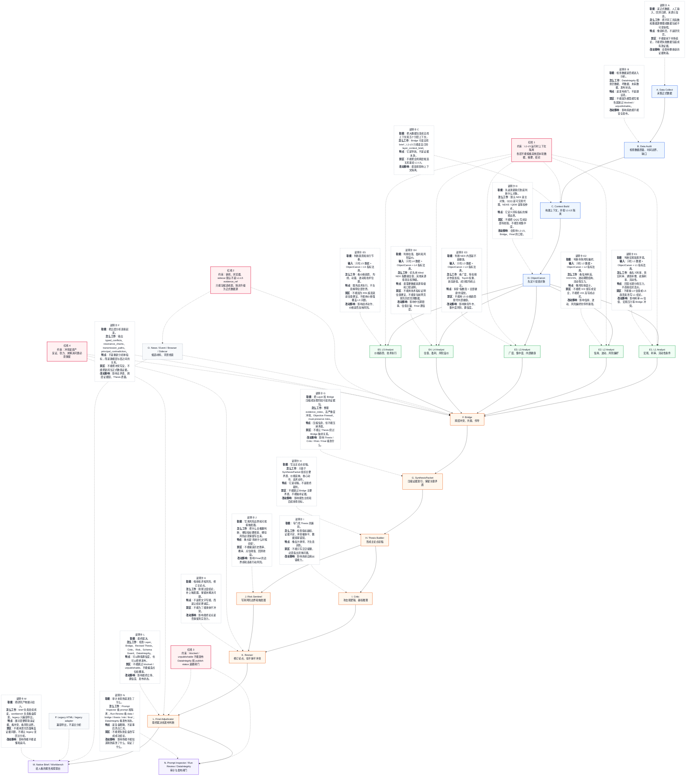
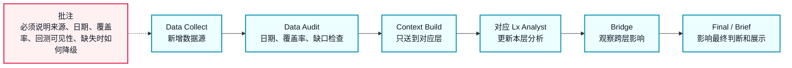
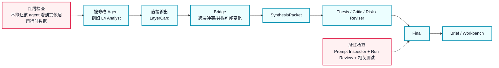
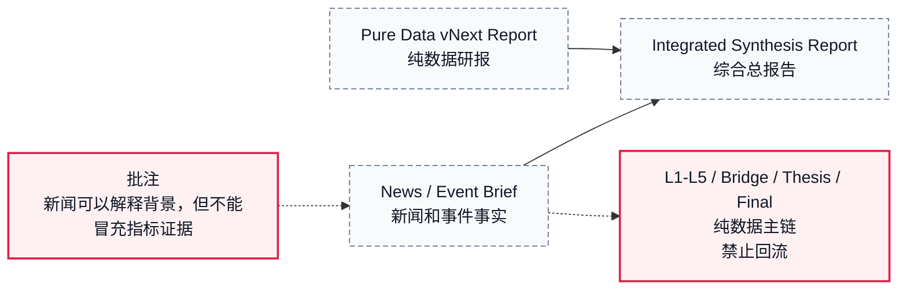

# NDX vNext 可视化流程总图

写作日期：2026-07-05

这份文件只做一件事：把 NDX vNext 画成一张**可阅读、可批注、可讨论改动影响**的大图。

如果你要缩放、拖动和贴批注，优先打开同目录的 `NDX_流程总图.canvas`。

读法很简单：

- **主链路**：实线箭头，表示一次正式研究从数据到报告的流动。
- **说明卡**：虚线箭头连出来的白话说明，讲这个节点的职能、工作方式、特点、禁区和改动影响。
- **红线节点**：不能破坏的架构规则。
- **旁路节点**：新闻、浏览器、sidecar、legacy 等辅助材料，默认不是主证据。

## 一张大图



## 怎么用这张图批注改动

以后如果你让我“加一个模块”或“改一个 agent”，批注应该直接画在链路上，而不是写成一堆文件名。

### 批注模板：新增正式数据源



### 批注模板：修改某个 agent



### 批注模板：新增新闻/事件模块



## 每次改动必须附的图上批注

以后交付代码改动时，应该按这个格式贴在这份图下面：

```md
## 修改批注：YYYY-MM-DD 标题

改动节点：
- 例如：L3 Analyst、Bridge、Run Review

影响路径：
Data Collect -> Data Audit -> Context Build -> L3 Analyst -> Bridge -> SynthesisPacket -> Thesis -> Final -> Brief

我改了什么：
- 用人话说清楚，不只报文件名。

为什么要改：
- 解决哪个误判、缺口、阅读问题或审计问题。

不应该影响：
- 哪些层不该收到新数据。
- 哪些旁路材料不该升级成主证据。

我怎么验证：
- 跑了哪些检查。
- 结果是什么。
- 没跑什么，为什么没跑。

剩余风险：
- 还有什么不能保证。
- 下一轮真实 run 要重点看什么。
```

## 这版和上一版的区别

上一版的问题是：它把你的“可视化猜想”写成了长文档。

这一版改成：

- 图是主体。
- 每个节点都有挂在图上的说明卡。
- 红线直接画在图里。
- 新增模块和修改 agent 的批注方式也画成图。
- 文字只服务于读图，不再单独铺开解释。
