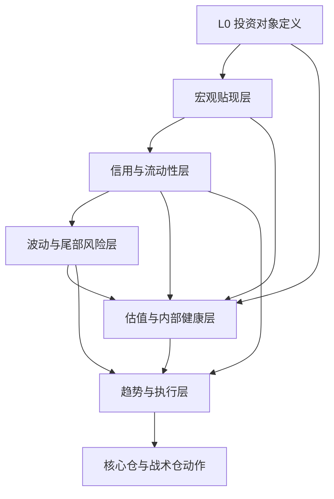

# Research Canon：美国市场顶级金融指标框架

用途：这是 vNext 的权威研究语料，用来指导指标判读、市场状态诊断、跨层级推理和少文本提示范例。它不是运行时 prompt，不应被整篇塞进任何 agent。

## 执行摘要

这份完整权威版的核心结论只有一句话：**真正可用于长期投资与跨层级推理的指标框架，不是“看很多指标”，而是先把指标分成不同层级，再明确每个指标究竟是在回答“事实”、在估计“代理变量”，还是在表达“市场情绪/技术行为”，最后只允许它们在各自权限内发言。** 你此前的《纳斯达克100指挥中心[MECE]》与“小白说明”最大的优点，是先搭框架、再做风控、再谈执行；本报告保留这一长处，但把其中偏经验阈值、单点触发、口径混用的部分，升级为“对象定义—数据口径—本质—交叉验证—反证—行动边界”的制度化体系。

本报告最重要的现实更新有两点。第一，**Nasdaq-100 不是静态对象**：它本质上是一个**规则化、改良市值加权、季度再平衡、年度重组**的指数，而且 Nasdaq 已在 2026 年完成方法学更新，更新自 2026 年 5 月 1 日起生效，涉及大型新上市公司更快纳入、低流通比例公司权重处理与资格判定逻辑等事项。这意味着任何把 QQQ/NDX 当成“天然稳定的科技篮子”的旧式思路，都需要升级。第二，**等权代理正在变化**：历史上很多人用 First Trust 的 QQEW 做 NDX 等权代理，但 2026 年 3 月 Invesco 已推出 QEW，直接跟踪 Nasdaq-100 Equal Weighted Index；因此未来做“QQQ vs 等权纳指”时，最佳实践应从“ETF 名称记忆”升级为“底层指数 NDX / NDXE + 可交易 ETF 代理”的双层写法。

对非金融专业人士最关键的认知是：**美股，尤其是纳斯达克100，长期并不是被单一变量驱动。** 它同时受五个大系统影响：贴现率系统、盈利与估值系统、信用与流动性系统、波动与尾部风险系统、集中度与内部健康系统。只看一个指标，最多能让你“觉得自己有逻辑”；只有看指标之间的先后顺序、背离关系与反证条件，才会真正接近金融行业里可复用的 know-how。官方与原始来源显示，联邦基金利率通过货币政策框架影响短端资金价格；10 年名义/实际利率与盈亏平衡通胀共同决定长期贴现率；信用利差刻画融资风险溢价；VIX/VXN 与期限结构提供对未来波动的前瞻信息；而 QQQ 自身又存在非分散化与行业集中风险。

因此，本报告给出的不是“预测美股下一周涨跌”的工具书，而是一套**供 AI 和人共同使用的判读法典**：先定义投资对象，再将所有指标分成层级，逐项给出统一判读卡，再把它们接到跨层级情景矩阵里，最后用一套“客观性防火墙”防止 AI 为了迎合先验结论而误判。它不是为了让判断更快，而是为了让判断**更慢、更准、更可反驳**。

本报告写作日期为 **2026-04-25**。除特别说明外，使用的是截至该日**最新可得**的官方或原始数据页面：多数 FRED 日频序列更新至 2026-04-23/24，ICE/BofA OAS 在 FRED 上的现行可见历史多从 2023-04-24 起，H.4.1 为周频、通常周四下午发布，H.6 月频、通常每月第四个周二发布。读者必须把**数据发布日期**与**经济发生日期**分开。

本章小结：**框架优先，单点信号从属；对象定义优先，交易冲动从属；反证优先，结论从属。**

## 目录与使用说明

目录建议按下面顺序阅读，这不是排版顺序，而是**实际判读顺序**：

- 先读“框架总图与方法论”
- 再读“指标法典”
- 然后只使用“跨层级情景矩阵”做行动映射
- 最后用“数据治理与复现”把系统落地
- 每次 AI 判读前，必须先过“客观性防火墙”

对非专业人士最有效的使用方式不是把 20 多个指标同时盯着看，而是固定采用以下顺序：**先看 L0 是否变化，再看宏观贴现率，再看信用与流动性，再看波动与内部健康，最后才看技术执行。** 这是因为美股尤其是 QQQ 的大波动，通常先由政策与资金条件改变，再经信用与波动机制放大，最后才在价格图上“显形”。把顺序倒过来，只看 RSI 或均线，容易把“结果”误当成“原因”。



这张图不是“因果真理”，而是**优先级图**。它的意思是：对象定义与贴现率决定长期框架，信用与流动性决定风险偏好底色，波动与内部健康决定市场是否脆弱，而技术指标更适合做**执行管理**，不适合越位充当长期价值判断。Fed 的政策实施框架、H.15/H.4.1/H.6 的统计算法、Cboe 波动率体系与 Nasdaq-100 的规则化方法学，都支持这种“先制度、后价格”的阅读方式。

建议把所有指标分成五类权限：

| 权限层 | 可以回答什么 | 不能回答什么 |
|---|---|---|
| 事实型 | 发生了什么、利率多高、资金多少 | 未来必然怎么走 |
| 代理型 | 市场在大致定价什么 | 真实经济一定如此 |
| 合成型 | 多因素压缩后的方向感 | 单一成分导致了什么 |
| 技术型 | 行情现在怎么走、何时执行 | 资产为什么值这个价 |
| 结构型 | 指数本身的再平衡、集中度、权重 | 个股基本面质量 |

这个权限表有一个很强的实践意义：**任何情绪指标都不能推翻事实型指标；任何技术指标都不能单独否定结构型风险。** 比如，RSI 超卖本身不能推翻信用利差急扩；VIX 回落本身也不能抵消指数集中度上升。

本章小结：**你不是在“收集信号”，你是在给不同信号分配发言权。**

## 框架总图与方法论

### 对象优先于指标

如果投资对象都没有定义清楚，那么后面所有指标都会失真。对美国市场长期投资而言，**“美国市场”至少要区分为总量市场、风格市场、行业市场、集中龙头市场与具体可交易载体**。对 QQQ/纳指100 来说，这个问题尤其重要，因为 Nasdaq-100 并不等于“美国科技创新全市场”，而是**Nasdaq 上最大的 100 家非金融公司**，并使用**改良市值加权**，并且基金层面还叠加了 ETF 结构、申赎、费用与持仓披露规则。Nasdaq 自身说明其指数是规则化、系统化编制；Invesco 也明确披露 QQQ 跟踪 Nasdaq-100、基金与指数季度再平衡、年度重组，并提示非分散化与行业集中风险。

这一步的现实更新非常关键。2026 年 5 月 1 日起，Nasdaq-100 方法学已经迎来新一轮更新；与此同时，Invesco 在 2026 年 3 月推出了 QEW 作为新的纳指100等权 ETF。对任何旧系统而言，这意味着两件事：**第一，指数纳入逻辑和低流通股权重处理不能再按旧经验静态理解；第二，QQQ vs 等权纳指的历史对比要升级为“底层指数 + ETF 代理”的双口径。** 否则，你会把“投资对象变了”误判成“市场风格变了”。

### 指标的正确读取方式

顶级框架并不追求“神奇阈值”，而追求**统一读法**。每个指标都应该至少经过四层处理：

| 处理层 | 标准动作 | 目的 |
|---|---|---|
| 水平层 | 看绝对值、历史分位、长期均值 | 判断位置 |
| 变化层 | 看 1 个月、3 个月、12 个月变化 | 判断方向 |
| 相对层 | 看与同层/邻层指标的差分和背离 | 判断原因 |
| 结构层 | 看期限结构、广度、集中度、样本口径 | 判断可持续性 |

例如，10 年名义利率必须拆成真实利率与通胀补偿；VIX 必须联接期限结构与实际波动；信用利差必须区分 IG 与 HY；QQQ 的强弱必须同时看等权代理、广度与前十大权重。官方与学术资料都表明，简单把任何一个前瞻价格型指标当成“纯预期”都是危险的，因为其中常常同时包含风险溢价、流动性溢价与头寸因素。breakeven inflation 既是通胀预期的近似，也包含风险溢价与 TIPS 流动性溢价；VIX 与 VIX futures 既是预期波动，也包含波动风险溢价；信用 OAS 则是对 Treasury 曲线之上的额外补偿，不是“违约率本身”。

### 行动映射的基本原则

本报告使用“核心仓 / 战术仓”二分法。**核心仓**服务长期配置与复利，不因短期情绪轻易大幅摇摆；**战术仓**服务于估值修正、情绪失衡与技术确认。它们的权限不同：核心仓更看 L0、贴现率、估值与信用；战术仓更看波动、内部健康与技术。这样做，是为了避免非专业投资者最常见的错误——**拿短期指标管理长期仓，或拿长期故事给短线亏损找理由。** 这与你早先材料中强调的“风险提示、识别黄金坑、长期与阶段区分”的思路一致，但这里把它写成了可以被 AI 反复调用的明确规则。

### 推荐图表模板

最值得固定做成面板的图表并不多，以下五张最有信息效率：

| 图表 | 推荐形式 | 目的 |
|---|---|---|
| DGS10 / DFII10 / T10YIE | 三线叠图 | 把名义利率拆成真实利率与通胀补偿 |
| HY OAS / IG OAS | 历史分位带状图 | 判断风险偏好与融资压力 |
| VIX / VXN / 期限结构 | 曲线 + 热力图 | 判断短期恐慌与中期均值回归 |
| QQQ 相对 NDXE 或 QEW | 比率图 + 广度副图 | 判断“少数巨头上涨”还是“全体改善” |
| 净流动性代理 / QQQ | 同比或标准化双轴图 | 判断资金扩张与资产价格的错位 |

本章小结：**指标不是越多越好，而是每个指标都必须可归类、可交叉、可反证、可行动。**

## 指标法典

### 对象与定义层

#### L0 投资对象定义

**判读卡**：名称/英文/代码：投资对象定义 / Investable Object Definition / L0，无单一代码。层级与性质：L0 结构型；时间维度长；决策权重核心。数据口径与来源：Nasdaq-100 方法学、Nasdaq 研究说明、Invesco QQQ 持仓与风险披露、Invesco QEW/历史 QQEW 与 NDXE 的对应关系；统一链接见后文数据治理。Nasdaq 说明 NDX 衡量 Nasdaq 上最大的 100 家非金融公司，采用改良市值加权、季度再平衡、年度重组；2026 年起方法学又有更新。Invesco 明确 QQQ 跟踪 NDX，并提示其非分散化与行业集中风险；QEW 于 2026-03-18 推出，直接跟踪 NDXE，历史上也存在使用 QQEW 作为等权 ETF 代理的做法。

它真正回答的问题是：**我到底持有什么？我承受的是美国总市场风险、成长风格风险、科技行业风险，还是“少数超级权重股”的集中度风险？** 正确判读方法是先把对象拆成三层：底层指数、可交易 ETF、你自己的仓位用途。常见误读是把 QQQ 当作“美国科技全市场”或者把其涨跌直接等同于“创新行业整体”。对美国市场的客观含义是：L0 变化会改变所有下游指标的解释边界；对 QQQ 的映射含义是：方法学、前十大权重、等权代理与成分重组本身就是一级风险。核心仓行动边界：只有当 L0 未变、长期贴现率未系统恶化、信用与估值尚可时，才允许把 QQQ 当长期核心工具；战术仓则可以围绕 L0 不变下的阶段性错价做增减。明确反证条件：若指数方法学显著改变、低流通大 IPO 快速纳入改变了成分结构，或等权/广度长期背离，则必须重写判读模板。**B版短提示**：先定义对象：QQQ 不是“科技等于未来”的故事，而是规则化、改良市值加权、集中度很高的 Nasdaq-100 可交易载体；若对象定义错，后面所有指标都错。

### 宏观与利率层

#### DGS10 名义十年期国债收益率

**判读卡**：名称/英文/代码：10 年期美国国债常到期收益率 / Treasury Securities at 10-Year Constant Maturity / DGS10。层级与性质：L1 事实型；短中长；核心。来源：H.15/FRED。计算与频率：日频名义无风险长期收益率。它真正回答的问题是：**市场给长期美元名义贴现率定了多少价？**

本质上，DGS10 是长期资产“分母”的第一层，但不能孤立看。正确读法：先看绝对水平，再拆成 DFII10 与 T10YIE；再看与 FEDFUNDS 的关系，判断是“长端被真实利率抬高”还是“通胀补偿上升”。常见误读是以为“10 年收益率下行就一定利好股市”；衰退恐慌中收益率下行也可能伴随盈利预期与信用条件恶化。交叉验证：DFII10、T10YIE、FEDFUNDS、HY OAS、VXN。对美国市场：DGS10 快速上行且由真实利率主导，通常对长久期资产更不友好；对 QQQ：若 DGS10 上行但 T10YIE 不升、DFII10 升，负面更直接。核心仓边界：不因单日 DGS10 变动改大仓，只在 3 个月以上趋势上行并得到 DFII10 与信用市场确认时降风险。反证条件：若 DGS10 上行同时信用利差收窄、盈利预期上修、广度改善，则利率上行可能代表增长而非压制。**B版短提示**：DGS10 先别直接判多空，先拆成真实利率和通胀补偿；真实利率上升比通胀补偿上升更伤 QQQ。

#### DFII10 十年期 TIPS 实际利率

**判读卡**：名称/英文/代码：10 年期通胀保值国债实际收益率 / 10-Year Treasury Inflation-Indexed Constant Maturity / DFII10。层级与性质：L1 事实型；短中长；核心。来源：FRED、Fed TIPS yield curve and inflation compensation。公式与频率：日频 10 年实际无风险收益率。真正问题：**市场要求真实贴现率是多少？**

底层本质：DFII10 对成长股的“久期杀伤力”通常比名义利率更直接。正确读法：看水平、3 个月变化、与 QQQ 估值的反向关系；再结合 FEDFUNDS 看是政策约束还是增长再定价。误读与失效：把 DFII10 视作“纯政策变量”不对，它也受真实增长、财政供给与避险需求影响。交叉验证：DGS10、T10YIE、ERP、QQQ trailing/forward P/E。对美国市场：DFII10 上行往往意味着所有远期现金流现值受压；对 QQQ：这是最不能忽视的分母变量之一。核心仓行动边界：若 DFII10 持续抬升且 ERP 不扩、估值仍高，应降低战术激进度；核心仓只在盈利扩张可覆盖贴现率上行时保持。反证条件：若 DFII10 上行由实际增长与生产率改善、且广度同步扩散，则未必构成熊市信号。**B版短提示**：判断成长股压力时，DFII10 常比 DGS10 更关键；它上行代表市场在抬高“真实分母”。

#### T10YIE 十年期盈亏平衡通胀

**判读卡**：名称/英文/代码：10-Year Breakeven Inflation Rate / T10YIE。层级与性质：L1 代理型；中长；核心。来源：FRED、Fed TIPS yield curve page。公式与频率：近似为 DGS10 - DFII10，日频。真正问题：**市场大致在预期未来 10 年平均通胀/通胀补偿是多少？**

本质上，T10YIE 不是“纯通胀预期”，它还含有通胀风险溢价与 TIPS 流动性溢价。正确读法：先看区间，再看与 DFII10 的相对强弱；若 DGS10 上行主要来自 T10YIE，而非 DFII10，则通常比真实利率主导更温和。误读：把 breakeven 当 CPI 预测。交叉验证：DFII10、DGS10、油价/大宗、美元、Fed 政策沟通。对美国市场：适度上行代表名义增长尚可；失控上行会压缩政策宽松空间。对 QQQ：轻度 T10YIE 上行并不必然利空，真正麻烦是 T10YIE 上行同时 FED 不能降、DFII10 也升。行动边界：核心仓不因单次 breakeven 波动动作；战术仓在“通胀补偿上行、真实利率不升、信用稳、广度回暖”时可接受风险回补。反证条件：若 breakeven 高企但油价/美元/实际数据并不支撑，需警惕技术性溢价。**B版短提示**：T10YIE 看的是“市场愿意为通胀风险付多少钱”，不是未来 CPI 的精确答案。

#### FEDFUNDS 联邦基金有效利率

**判读卡**：名称/英文/代码：Federal Funds Effective Rate / FEDFUNDS；实时实施利率参考为 EFFR。层级与性质：L1 事实型；短中；核心。来源：FRED H.15、纽约联储 EFFR。公式与频率：FEDFUNDS 月频，EFFR 日频且为 FR 2420 报告交易的成交量加权中位数。真正问题：**美元最核心的隔夜资金价格是多少，政策是真紧还是已转向？**

本质：Fed funds 是所有风险资产贴现与杠杆条件的“短端锚”。正确读法：不要只看点位，要看**方向、维持时间、与市场预期的偏差**。误读：把“暂停加息”当“进入宽松”；或者把降息本身机械理解为股市必涨。必须交叉验证：DGS10、DFII10、RRP、WALCL、信用利差。对美国市场：短端利率越高、维持越久，现金替代性越强，风险资产需要更高风险溢价。对 QQQ：当高估值与高短端并存，而利润扩张不足时，压力最大。行动边界：核心仓看趋势而非会议噪音；战术仓只在“实际已进入宽松或市场已深度price in、且信用未坏”的情况下加大风险。反证条件：若降息发生在增长急剧恶化和信用扩张时，降息是坏消息。**B版短提示**：FEDFUNDS/EFFR 是短端资金之锚；“停止紧缩”不等于“利好已确认”，必须连信用和盈利一起看。

### 信用与波动层

#### HY OAS 与 IG OAS 信用利差

**判读卡**：名称/英文/代码：高收益期权调整利差 / ICE BofA US High Yield Index OAS / BAMLH0A0HYM2；投资级期权调整利差 / ICE BofA US Corporate Index OAS / BAMLC0A0CM。层级与性质：L2 事实+代理混合；短中；核心。来源：ICE/BofA via FRED。公式与频率：相对 Treasury spot curve 的 OAS，按市值加权构造，日频。IG 代表投资级公司债；HY 代表 BB 及以下。

它真正回答的问题是：**企业融资风险溢价被压缩还是被抬高？** 本质上，信用利差比单纯股指更早反映“资金愿不愿意承担真实风险”。正确读法：先看 HY，再看 IG，再看 HY-IG 差；看绝对值、变化率与历史分位。误读：把“利差窄”理解成绝对安全，它也可能意味着定价过满。必须交叉验证：VIX/VXN、净流动性、FEDFUNDS、A/D、盈利预期。对美国市场：HY 急扩通常是风险偏好恶化或经济压力上升；对 QQQ：若指数仍强但 HY OAS 扩、A/D 走弱，多数时候是结构脆弱。行动边界：核心仓最怕“高估值 + 利差走阔”；战术仓只在信用稳定或修复时做右侧加仓。反证条件：若个别事件驱动信用扰动但 IG 稳、HY 很快回落、股市广度修复，则可视为短期噪音。**B版短提示**：信用利差是股市的“真风险体温计”；QQQ 创新高而 HY OAS 扩张，多半不是健康牛市。

#### VIX 与 VXN 隐含波动率

**判读卡**：名称/英文/代码：Cboe Volatility Index / VIX；Cboe Nasdaq-100 Volatility Index / VXN。层级与性质：L2 代理型；短中；确认/警报。来源：Cboe。公式与频率：VIX 基于 SPX 期权、代表 30 天预期波动；VXN 反映 Nasdaq-100 期权隐含的近端波动预期。真正问题：**市场为未来一个月的大盘/纳指不确定性支付了多高保险费？**

本质：VIX 更接近全市场风险温度，VXN 更贴近 QQQ 久期与成长风格温度。正确读法：看绝对值是不够的，必须看**跳升速度、持续时间、与股指跌幅是否匹配**。误读：把低 VIX 当无风险，把高 VIX 当一定是买点。必须交叉验证：期限结构、HY OAS、A/D、New High/Low、QQQ/QEW。对美国市场：VIX 回落说明对未来波动的保险费下降；对 QQQ：若 VXN 明显强于 VIX，说明科技/成长特有风险在定价。行动边界：核心仓不拿单日 VIX 变动做大动作；战术仓可把 VIX/VXN 爆升后的均值回归当观察窗口，但前提是信用没坏、内部健康出现修复。反证条件：若 VIX 下降只是因事件落地，而信用和广度未修复，则“恐慌消退”可能只是表面。**B版短提示**：VIX 看全市场、VXN 看纳指风格；高波动本身不是买点，只有“高波动 + 信用稳 + 内部修复”才接近可操作。

#### VIX 期限结构与 VRP 波动风险溢价

**判读卡**：名称/英文/代码：VIX term structure；Volatility Risk Premium / VRP。层级与性质：L2 代理+研究型；短中；确认/警报。来源：Cboe term structure，纽约联储/学术研究。公式与频率：期限结构看 9D/1M/3M/6M/1Y 或近远月 VIX futures 的形状；VRP 常以隐含波动减去后续实现波动近似。真正问题：**市场是在买短期保险，还是在给长期不确定性定更高价；保险费是否过贵？**

本质：contango 常见于正常环境，backwardation 往往代表近端紧张；VRP 反映“市场愿意为不确定性支付多少额外费用”。正确读法：先看曲线形状，再看兑现后的 realized vol；不单看 VIX 点位。误读：把 backwardation 机械理解成“马上暴跌”，或把 VRP 为正机械理解成“必卖波动”。必须交叉验证：VIX/VXN、HY OAS、Put/Call、A/D、ATR。对美国市场：期限结构倒挂常意味着短端风险定价急剧抬升；对 QQQ：若 VXN 曲线更陡、VRP 更高，说明市场对科技集中度或财报事件更敏感。行动边界：战术仓只在“期限结构恐慌化但信用未系统恶化、价格跌幅明显超过基本面恶化”的情形下逐步回补；核心仓不依据 VRP 做大幅切换。反证条件：若实现波动开始持续追上甚至超过隐含波动，卖波动或逢恐慌买入都要收敛。**B版短提示**：VIX 点位只是表面；真正关键是曲线是否倒挂，以及隐含波动是否远高于后续实际波动。

#### 净流动性代理

**判读卡**：名称/英文/代码：净流动性代理 / Net Liquidity Proxy；常用近似为 `WALCL - TGA - RRP`，必要时再做同比或 Z-score。层级与性质：L2 代理+合成；中；核心/确认。来源：Fed H.4.1、NY Fed Temporary OMO、Treasury General Account/FRED。公式与频率：把 Fed 资产（WALCL）作为供给，把 TGA 与 RRP 作为抽水项。真正问题：**银行体系与风险资产面前，净可用美元流动性是在扩张还是收缩？**

本质：它不是 Fed 官方指标，而是投资界常用资金面代理，因此必须明确它是**代理**。正确读法：看变化率，不迷信绝对水平；更重要的是看它与 QQQ/信用利差是否背离。误读：把净流动性代理当成单线因果；现实中财政融资、银行负债结构、准备金分布都会干扰。必须交叉验证：RRP、TGA、WALCL、HY OAS、DTWEXBGS。对美国市场：净流动性改善常有利风险偏好，但并非自动转化为股价；对 QQQ：当盈利与 AI 叙事很强时，流动性改善更容易放大估值扩张。行动边界：核心仓只把它当背景增强器；战术仓可把“净流动性改善 + 信用稳 + 广度修复”视为加仓确认。反证条件：若净流动性改善但信用在恶化，或只是 TGA 技术性回落导致，则不要高估其利多。**B版短提示**：净流动性代理不是官方真理，而是资金面近似；只在与信用、广度、波动同步改善时才有高解释力。

### 估值与内部健康层

#### PE 与 Forward PE

**判读卡**：名称/英文/代码：Trailing P/E 与 Forward P/E。层级与性质：L3 合成型；中长；核心。来源：Fidelity 估值定义、Invesco QQQ fact sheet。公式与频率：Trailing P/E = 价格 / 过去 12 个月 EPS；Forward P/E = 价格 / 未来 12 个月一致预期 EPS。Invesco 最新 fact sheet 显示 QQQ 在 2026-03-31 的 trailing P/E 为 36.52。真正问题：**你今天支付的价格，相对于已实现和被预期的利润，贵到什么程度？**

本质：P/E 是“市场愿意为每一单位盈利付多少钱”，但它受**利率、增长、会计口径与利润周期**共同影响。正确读法：必须同时看 trailing 与 forward 的差：若 trailing 高而 forward 快速回落，说明市场在押注盈利加速兑现；若两者都高，且实际利率不低，则容错率低。误读：把高 P/E 直接判死刑，或把低 P/E 当便宜。必须交叉验证：DFII10、ERP、FCF yield、QQQ/QEW、A/D。对美国市场：P/E 只是估值位置，不是择时按钮；对 QQQ：高 P/E 在高集中度环境下要配合更严格的反证制度。行动边界：核心仓只在 P/E 进入极高分位且 DFII10/信用恶化时降低风险；战术仓可利用因盈利上修导致的“forward P/E 回落”做右侧。反证条件：若盈利预期上修被持续兑现，高 P/E 可以维持很久。**B版短提示**：PE 要成对看：trailing 看已发生，forward 看市场押注；真正危险是“估值高、真实利率高、信用也开始坏”。

#### FCF Yield 自由现金流收益率

**判读卡**：名称/英文/代码：Free Cash Flow Yield / FCF Yield。层级与性质：L3 合成型；中长；核心。来源：CFI 与 Fidelity 对 FCF/FCF yield 的定义。公式与频率：常用为 FCF / Market Cap，或每股 FCF / 股价；FCF 近似 CFO - CapEx。真正问题：**在会计利润之外，这个资产真实产生了多少自由现金？**

本质：FCF yield 通常比 P/E 更接近“现金回报感”，尤其适合识别高资本开支、高股权薪酬或利润质量复杂的标的。正确读法：对纳指100必须看**结构性差异**——部分龙头公司现金极强，部分成长股则要牺牲当前现金以换未来增长。误读：把低 FCF yield 一律当泡沫，忽视高回报率再投资。必须交叉验证：P/E、Forward P/E、ROE/资本开支趋势、QQQ 前十大权重。对美国市场：FCF yield 是“估值抗冲击能力”的好补充；对 QQQ：它能帮助区分“真现金机器”和“纯叙事久期”。行动边界：核心仓在高利率环境中更重视 FCF yield；战术仓若押成长扩张，必须接受低 FCF yield 带来的更高波动。反证条件：若企业处于投资高峰期、未来现金流可见度高，则当前低 FCF yield 未必坏。**B版短提示**：FCF yield 看的是“真钱”，不是会计利润；高利率时代，它往往比单看 P/E 更有约束力。

#### 收益差距与 ERP 股权风险溢价

**判读卡**：名称/英文/代码：Earnings Yield Gap / Equity Risk Premium / ERP。层级与性质：L3 估算型；中长；核心。来源：Damodaran implied ERP 数据、学术/教学资料。公式与频率：粗略收益差距常用 Earnings Yield - 10Y Treasury；更严谨的 implied ERP 以未来现金流、增长和无风险利率反推。Damodaran 的 2026 年更新显示历史隐含 ERP 持续可得。真正问题：**股票相对无风险债，到底多给了你多少补偿？**

本质：ERP 是跨资产比较中最重要的桥梁之一。正确读法：不要只用“E/P - 10Y”这个简式；它适合粗框架，不适合精确定价。误读：把 ERP 低理解成“马上暴跌”，或把 ERP 高当“立刻大买”。必须交叉验证：DFII10、P/E、Forward P/E、HY OAS、美元。对美国市场：ERP 压缩过度通常说明市场很贵或债很有吸引力；对 QQQ：高成长资产更依赖“增长足以覆盖 ERP 压缩”。行动边界：核心仓在 ERP 极低且真实利率上行时降低预期收益假设；战术仓不拿大盘 ERP 直接替代 QQQ 专属风险补偿。反证条件：若生产率拐点、盈利增速与资本开支形成新周期，低 ERP 可能被较长时间容忍。**B版短提示**：ERP 不是神奇时点器，但它决定了长期回报的地板；低 ERP + 高真实利率时，长期预期回报要下调。

#### A/D 进退线

**判读卡**：名称/英文/代码：Advance/Decline Line / A/D Line。层级与性质：L3 技术+结构混合；短中；确认。来源：Fidelity、StockCharts。公式与频率：上涨家数减下跌家数的累计值。真正问题：**指数上涨时，究竟是绝大多数股票在跟，还是少数权重股在拖着走？**

本质：A/D 是市场内部健康度的首要广度指标。正确读法：看它是否与指数同步创新高；上涨但 A/D 不创新高，常见于狭窄牛市。误读：把一次背离当立即转折。必须交叉验证：%Above MA、QQQ/QEW、New High/Low、Top10 权重。对美国市场：A/D 反映普涨还是抱团；对 QQQ：它帮助识别“纳指指数强，但内部其实并不强”。行动边界：核心仓不因单周 A/D 背离而大改仓；战术仓在“价格创新高但 A/D 走弱”时收缩追涨。反证条件：若指数恰处在少数超级盈利龙头驱动阶段，A/D 弱可以持续。**B版短提示**：A/D 看参与度；指数新高而 A/D 不新高，说明上涨变窄，不该用最乐观脚本解释。

#### %Above MA 均线上方成分占比

**判读卡**：名称/英文/代码：Percent Above Moving Average，如 NDXA50R、NDXA200R 等。层级与性质：L3 技术+结构；短中；确认。来源：StockCharts。公式与频率：某指数中位于 50/150/200 日均线上方的成分股比例。真正问题：**趋势强度是全市场参与，还是只体现在指数价格本身？**

本质：这是最直观的“趋势广度”指标。正确读法：50 日更短期，200 日更长期；读法要看水平区间和方向，不要迷信单个阈值。误读：认为高占比一定过热、低占比一定能抄底。必须交叉验证：A/D、New High/Low、均线、RSI。对美国市场：高占比说明跨成分趋势扩散；对 QQQ：若 QQQ 创高但 50 日/200 日在上方的成分比例不升，说明少数龙头权重效应在主导。行动边界：战术仓更适合用它决定“追涨还是等回撤”；核心仓只把它作为长期趋势是否破坏的辅助证据。反证条件：重组或行业剧烈分化时期，该指标可能被成分变化污染。**B版短提示**：看 %Above MA，不是看指数站上均线，而是看“多少成分股”站上均线；这比单看价格更诚实。

#### QQQ 相对等权纳指

**判读卡**：名称/英文/代码：QQQ / QEW 或 NDX / NDXE 比率；历史连续研究可参考 QQEW 或直接用 NDXE。层级与性质：L3 结构型；短中长；核心。来源：Invesco QEW、Nasdaq NDXE、历史 QQEW 信息。公式与频率：市值加权纳指相对等权纳指的相对强弱。真正问题：**是头部公司在赢，还是整个纳指100在赢？**

本质：这是理解“抱团与扩散”的顶级指标之一。正确读法：比率上升 = 权重股跑赢等权；比率下降 = 扩散。误读：把等权跑赢理解成指数一定更强；有时等权跑赢只是大票休整。必须交叉验证：Top10 权重、A/D、%Above MA、VXN。对美国市场：扩散通常意味着市场更健康；对 QQQ：若 QQQ/等权比率持续抬升，长期回报会越来越依赖少数龙头兑现。行动边界：核心仓把它当集中度温度计；战术仓在比率见顶回落、广度修复时更适合做扩散交易。反证条件：AI 或平台型龙头进入超级盈利期时，集中度上升可以长期存在。**B版短提示**：QQQ/等权纳指看的是“抱团还是扩散”；比率越高，未来越依赖少数巨头不出错。

#### Top10 权重

**判读卡**：名称/英文/代码：前十大成分权重 / Top 10 Weight。层级与性质：L3 结构型；中长；核心/警报。来源：Nasdaq 研究、Invesco 持仓。Nasdaq 研究显示，截至 2025-12-31，纳指100前十大证券占比为 52%。Invesco 还明确提醒 QQQ 为非分散化产品，行业集中风险较高。真正问题：**指数收益是否已高度依赖少数名字？**

本质：集中度不是坏事，但它会提高系统对个别叙事/财报/监管的脆弱度。正确读法：看绝对权重、变化趋势、与 QQQ/等权比率是否一致。误读：把高集中度机械等同于见顶。必须交叉验证：QQQ/QEW、A/D、VXN、Forward P/E。对美国市场：少数龙头主导时，指数对公司事件更敏感；对 QQQ：这是其最核心的结构性风险之一。行动边界：核心仓在高集中度上升期应降低对“指数天然分散”的自我安慰；战术仓在财报密集季需要更注意仓位与 ATR。反证条件：若前十大公司基本面同步强劲、现金流与盈利持续兑现，高集中度也能带来高回报。**B版短提示**：Top10 权重高不是立即看空，而是提醒你：你买的不是“100 家平均公司”，而是少数超级龙头。

#### New High / New Low 新高新低

**判读卡**：名称/英文/代码：Net New 52-Week Highs / New Highs minus New Lows。层级与性质：L3 技术+广度；短中；确认。来源：StockCharts、Fidelity breadth materials。公式与频率：新高家数减新低家数，也可做比例、累积和或平滑。真正问题：**市场内部是在扩张创新高，还是越来越多股票跌到新低？**

本质：这是“内部动能”与“风险蔓延”最直接的市场宽度数据。正确读法：看绝对值、三日/十日平滑与趋势，而不是只看一天。误读：把单日暴增/暴减当长期信号。必须交叉验证：A/D、%Above MA、VIX、HY OAS。对美国市场：持续净新高说明内部趋势健康；对 QQQ：若指数强而新低家数增加，应警惕权重掩盖。行动边界：战术仓可把“三日净新高转正并扩大”作为右侧加仓辅助；核心仓主要把它作为风险监测器。反证条件：财报季与季度再平衡期间，短期统计可能失真。**B版短提示**：新高新低不是看热闹，而是看“潮水方向”；指数新高但净新高不扩，说明上涨不耐用。

### 趋势、技术与执行层

#### 均线

**判读卡**：名称/英文/代码：Moving Averages / SMA、EMA。层级与性质：L4 技术型；短中长；辅助/执行。来源：Fidelity technical guide。公式与频率：价格在固定窗口内的平均，常用 20、50、100、200 日。真正问题：**价格趋势是否仍在？**

本质：均线解决的是“趋势管理”，不是“价值发现”。正确读法：长期看 200 日，中期看 50 日，短期看 20 日；更重要的是均线斜率与回踩行为。误读：把均线金叉死叉当万能信号。必须交叉验证：ADX、ATR、A/D、%Above MA。对美国市场与 QQQ：在高集中度指数里，价格站稳均线比个股更有用，但仍仅是结果变量。行动边界：战术仓适合用均线做提高胜率的执行；核心仓只用 200 日均线辅助判断长期趋势是否破坏，不做频繁切换。反证条件：震荡市里均线最容易反复打脸。**B版短提示**：均线负责管执行，不负责替你解释世界；先用宏观和结构定方向，再用均线定进退。

#### ATR 平均真实波幅

**判读卡**：名称/英文/代码：Average True Range / ATR。层级与性质：L4 技术型；短中；辅助/风控。来源：Fidelity。公式与频率：真实波幅的平均，考虑跳空。真正问题：**现在该给仓位与止损多大呼吸空间？**

本质：ATR 不是方向指标，而是**风控尺度尺**。正确读法：用它决定分批距离、止损容忍与减仓阈值。误读：ATR 高就是卖出；很多大机会恰恰发生在高 ATR 后。必须交叉验证：VIX/VXN、均线、ADX。对美国市场：ATR 扩张说明交易成本上升；对 QQQ：财报季与宏观事件期 ATR 会显著变化。行动边界：战术仓的止损/止盈最好用 ATR，而不是固定百分比；核心仓只用 ATR 决定加仓节奏，不用来颠覆长期判断。反证条件：若波动由一次性事件造成，ATR 高可能很快回落。**B版短提示**：ATR 不告诉你方向，只告诉你“你该给市场多少空间”；波动大时，先缩尺子再谈胜负。

#### ADX 趋势强度指数

**判读卡**：名称/英文/代码：Average Directional Index / ADX。层级与性质：L4 技术型；短中；辅助/确认。来源：Fidelity、Schwab。公式与频率：基于方向移动的平滑趋势强度指标。真正问题：**现在是趋势市还是震荡市？**

本质：ADX 只看趋势强弱，不看方向。正确读法：上涨与下跌都可能有高 ADX；要和均线或价格结构配合。误读：ADX 上升就等于看多。必须交叉验证：均线、MACD、RSI、ATR。对美国市场：高 ADX 时，趋势延续策略更有效；对 QQQ：单边趋势阶段 ADX 是提高执行效率的好工具。行动边界：战术仓在低 ADX 震荡区减少追涨杀跌，在高 ADX 顺势阶段才放大趋势策略权重。反证条件：重大事件前后 ADX 会滞后。**B版短提示**：ADX 看的是趋势有没有力量，不是多还是空；高 ADX 才适合更顺势，低 ADX 更该防来回打脸。

#### RSI 相对强弱指数

**判读卡**：名称/英文/代码：Relative Strength Index / RSI。层级与性质：L4 技术型；短中；辅助。来源：Schwab/Fidelity。公式与频率：一段时间内涨跌动量相对强弱。真正问题：**短期动量过热还是过冷？**

本质：RSI 更擅长做节奏管理，不擅长单独做方向判断。正确读法：趋势市里 RSI 高可以继续高；最好看失败摆动、背离和区间切换。误读：70 以上必跌、30 以下必涨。必须交叉验证：ADX、均线、A/D。对美国市场与 QQQ：在龙头抱团时，RSI 会长期高位钝化。行动边界：战术仓可用 RSI 优化买回撤而非追尖峰；核心仓几乎不直接用 RSI 改变长期配置。反证条件：财报驱动与强趋势环境里 RSI 反转信号常失灵。**B版短提示**：RSI 是节奏工具，不是世界观；趋势越强，越不能用固定超买超卖线机械决策。

#### MACD 指数平滑异同移动平均

**判读卡**：名称/英文/代码：Moving Average Convergence/Divergence / MACD。层级与性质：L4 技术型；短中；辅助/确认。来源：Fidelity、Schwab。公式与频率：两条 EMA 的差及其信号线。真正问题：**趋势动量是在增强还是衰减？**

本质：MACD 适合趋势市场中的二次确认。正确读法：信号线交叉、零轴位置与背离结合看；不要离开价格结构孤立使用。误读：每次交叉都交易。必须交叉验证：ADX、均线、ATR。对美国市场：MACD 可提高择时纪律；对 QQQ：在强趋势和财报驱动阶段作用更好。行动边界：战术仓可把 MACD 当右侧确认；核心仓不拿 MACD 否定估值与宏观判断。反证条件：横盘期噪音最大。**B版短提示**：MACD 适合做趋势的确认，不适合在震荡里频繁出手；它是“跟随器”，不是“预测器”。

### 资金面与政策实施层

#### RRP 隔夜逆回购余额

**判读卡**：名称/英文/代码：Overnight Reverse Repurchase Agreements / RRPONTSYD。层级与性质：L2 事实型；短中；确认。来源：纽约联储 Temporary OMO、Fed ON RRP page、FRED。公式与频率：日频余额。Fed 明确称 ON RRP 是帮助把联邦基金利率维持在目标区间内的补充政策工具。真正问题：**货币市场现金是在停泊到 Fed，还是释放回市场？**

本质：RRP 下降往往代表现金从 Fed 停泊池回流私营市场，但未必直接流入股市。正确读法：看趋势和与 T-bill 利率、TGA 的联动。误读：RRP 降 = 股市必涨。必须交叉验证：FEDFUNDS、TGA、WALCL、净流动性代理。对美国市场：RRP 见底后，资金边际改善的解释力会下降；对 QQQ：它更多是背景变量，不是前线信号。行动边界：核心仓只当流动性背景；战术仓必须等待信用和广度确认。反证条件：RRP 下降若主要被国库券发行吸收，则对风险资产未必利多。**B版短提示**：RRP 是“钱停在 Fed 还是回流市场”的观察窗，但它不是股市自动加速器。

#### WALCL 美联储总资产

**判读卡**：名称/英文/代码：Assets: Total Assets: Total Assets Less Eliminations from Consolidation / WALCL。层级与性质：L2 事实型；中长；核心/确认。来源：H.4.1/FRED。公式与频率：周频资产负债表总资产。真正问题：**Fed 的资产负债表是在扩张还是收缩？**

本质：WALCL 是基础流动性供给的最官方指标之一，但不是净流动性。正确读法：看趋势、同比与和 TGA/RRP 的净额关系。误读：以为 QE/QT 变化会线性一一对应股市。必须交叉验证：RRP、TGA、信用利差、DGS10。对美国市场：表扩张往往托底流动性环境；对 QQQ：在高估值阶段，表扩张会加强分母宽松效应。行动边界：核心仓在 WALCL 扩张与信用稳定共振时，愿意提高风险预算；战术仓更适合在 QT 放缓但价格仍悲观时布局。反证条件：若 WALCL 稳定但准备金分布与财政操作导致资金面偏紧，单看表会误判。**B版短提示**：WALCL 是 Fed 供给流动性的总表头，但读它必须扣掉 TGA 和 RRP，才更接近市场感受到的流动性。

#### TGA 财政部一般账户

**判读卡**：名称/英文/代码：Treasury General Account / TGA；FRED 常用 Treasury, General Account 相关序列。层级与性质：L2 事实型；短中；确认。来源：H.4.1。公式与频率：周频。真正问题：**财政部是在从市场抽水，还是在把现金释放回体系？**

本质：TGA 上升通常意味着市场流动性被财政吸收，TGA 下降则相反。正确读法：一定要和国债发行节奏、RRP、WALCL 一起看。误读：认为 TGA 下降必定利多股票。必须交叉验证：RRP、WALCL、净流动性、短票利率。对美国市场：TGA 常造成短期流动性波动；对 QQQ：它是资金边际条件，而非盈利驱动。行动边界：战术仓在 TGA 快速回落且信用/波动改善时更敢做右侧；核心仓只把它看作净流动性的组成项。反证条件：若 TGA 下降伴随避险风险上升，股市未必受益。**B版短提示**：TGA 是财政抽水/放水的水位表；它必须与 RRP、WALCL 连成一张图一起看。

### 情绪与外部镜像层

#### FGI / CNN Fear & Greed 与 Put/Call 比率

**判读卡**：名称/英文/代码：Fear & Greed Index；Cboe Put/Call Ratios。层级与性质：L4 合成型+情绪型；短；辅助/警报。来源：CNN 指数的公开二手说明、Cboe 日度 Put/Call 数据。FGI 常综合动量、广度、垃圾债需求、波动与避险需求等；Cboe 日度公示总 put/call、指数 put/call、SPX put/call 等。真正问题：**市场情绪到了哪一个极端？**

本质：情绪指标可用，但地位必须降级。正确读法：FGI 只适合作为“情绪温度条”，Put/Call 更适合作为客观情绪补充。误读：极度恐惧就是必买、极度贪婪就是必卖。必须交叉验证：VIX/VXN、A/D、New High/Low、HY OAS。对美国市场：情绪极端是二阶条件，不是一阶因果；对 QQQ：财报前后、宏观冲击时情绪读数容易极端化。行动边界：战术仓可以把情绪极端当“准备清单”，不能当“自动下单按钮”；核心仓基本不直接回应情绪指标。反证条件：若情绪极端与事实恶化同步，情绪并不构成逆向机会，只是现实映射。**B版短提示**：情绪指标只配做辅助；真正有效的是“情绪极端 + 信用没坏 + 广度先修复”。

#### DTWEXBGS 广义美元指数

**判读卡**：名称/英文/代码：Nominal Broad U.S. Dollar Index / DTWEXBGS。层级与性质：L2 事实型；中；确认。来源：FRED/H.10。公式与频率：对主要贸易伙伴的加权平均美元名义汇率指数。真正问题：**金融条件是在被更强美元收紧，还是在被更弱美元缓和？**

本质：强美元常压制全球流动性与风险偏好，也会影响海外收入折算。正确读法：看趋势而非日波动，并结合利差与风险情绪理解。误读：美元涨就一定利空美国股市。必须交叉验证：DGS10、FEDFUNDS、铜金比、HY OAS。对美国市场：强美元通常偏紧；对 QQQ：海外收入占比高的大盘科技更敏感。行动边界：核心仓把美元作为金融条件辅助项；战术仓在美元急升阶段收敛外向型成长乐观度。反证条件：若美元走强来自美国相对增长优势，而非风险厌恶，影响会更复杂。**B版短提示**：美元不是背景噪音；它是全球资金松紧的镜子，尤其会影响大盘科技的估值与海外收入。

#### 铜金比

**判读卡**：名称/英文/代码：Copper/Gold Ratio。层级与性质：L2 代理型；中；辅助/确认。来源：FRED 铜价 PCOPPUSDM、World Gold Council/LBMA 金价。公式与频率：铜价除以金价，最好统一为同频率同币种。真正问题：**市场更偏向增长/工业，还是偏向避险/真实利率防守？**

本质：铜更偏增长、金更偏避险与实际利率敏感资产，因此铜金比是一个很实用的宏观风险偏好镜像。正确读法：看趋势和同比，不迷信绝对值。误读：把铜金比当任何周期的万能先导。必须交叉验证：DGS10、DFII10、美元、HY OAS。对美国市场：铜金比走强通常对应更好的增长偏好；对 QQQ：如果铜金比走弱而 QQQ 仅靠巨头上行，说明行情更脆。行动边界：它只做二次验证，不单独决定仓位。反证条件：战争、央行购金或供给扰动会扭曲金价。**B版短提示**：铜金比是“增长对避险”的简洁镜像；它不是主信号，但很擅长揭穿表面繁荣。

#### 债市应力看板

**判读卡**：名称/英文/代码：10Y-2Y / T10Y2Y；10Y-3M / T10Y3M；MOVE index。层级与性质：L2 事实+代理；中；确认/警报。来源：FRED、纽约联储收益率曲线衰退概率模型、ICE MOVE。T10Y2Y/T10Y3M 为期限利差；MOVE 为美债市场预期波动率。真正问题：**债市在定价衰退概率、期限结构修复，还是利率波动失控？**

本质：收益率曲线是增长/政策周期读数，MOVE 是利率波动性读数。正确读法：利差看“倒挂—再陡峭化”的性质；MOVE 看债市是否变得难以定价。误读：曲线再陡化就是牛市信号；实际上“熊陡”和“衰退式再陡”完全不同。必须交叉验证：FEDFUNDS、DGS10、DFII10、HY OAS。对美国市场：若曲线再陡而 MOVE 高、信用坏，多半不是好消息；对 QQQ：利率波动上升会直接抬高贴现率不确定性。行动边界：核心仓在“曲线改善 + MOVE 下降 + 信用稳”时更愿意提高风险；战术仓在 MOVE 高位阶段要降低杠杆和频繁交易。反证条件：曲线信号滞后且对股市不是短线择时器。**B版短提示**：曲线看周期、MOVE 看利率市场心跳；“再陡化”要先问是增长修复还是衰退恐慌。

本章小结：**指标法典真正要训练的，不是“记住阈值”，而是记住每个指标该在什么时候闭嘴。**

## 跨层级情景矩阵

下面的矩阵不是预测清单，而是**行动模板**。仓位区间均指你计划用于美国权益/QQQ 这部分风险预算中的占比，而不是你的全部总资产。本表是基于前文各指标的机制、层级权限与常见背离关系合成出来的操作母版；它的价值不在于“神准”，而在于**先写清主假设、再写清反证条件**。利率、信用、波动、广度与结构集中度的官方机制，构成了这张矩阵的证据边界。

| 情景 | 指标组合 | 主因果逻辑 | 主假设 / 次假设 | 反证条件 | 核心仓建议 | 战术仓建议 | 风控触发器 |
|---|---|---|---|---|---|---|---|
| 软着陆扩张 | DFII10稳、T10YIE温和、HY/IG稳、A/D扩散 | 贴现率不恶化，盈利与风险偏好共振 | 主：增长温和扩张；次：政策将更中性 | HY OAS突然扩张 | 80%–100% | 15%–25% 顺势持有 | 跌破200日均线且A/D转负 |
| 金发姑娘 | FED趋松、DGS10回落、VIX低、广度改善 | 分母改善且信用没坏 | 主：宽松而非衰退 | 利差扩大、曲线恶化 | 85%–100% | 20%–30% | VXN高于VIX并持续放大 |
| 利率再定价压估值 | DFII10上行、ERP压缩、QQQ仍高估 | 真实利率抬分母 | 主：分母杀估值；次：盈利未跟上 | Forward PE 快速回落且盈利兑现 | 55%–75% | 0%–10% | 3周内再上行配合信用恶化 |
| 通胀补偿升温但真实利率稳 | T10YIE升、DFII10稳、信用稳 | 名义增长改善多于真实分母抬升 | 主：再通胀交易 | 油价/美元/信用不支持 | 70%–90% | 10%–20% | T10YIE升同时DFII10转升 |
| 流动性修复 | WALCL稳或扩、TGA降、RRP降、信用稳 | 净流动性改善传导风险偏好 | 主：资金条件边际转松 | 只是财政技术项、信用不跟 | 75%–95% | 10%–20% 分批三次 | HY OAS转阔、A/D不跟 |
| 狭窄龙头牛市 | QQQ/QEW上升、Top10升、A/D弱 | 少数龙头驱动指数 | 主：超级龙头盈利压倒一切 | 扩散恢复、比率回落 | 60%–80% | 5%–15%，尽量不追尖峰 | 龙头财报失手、VXN飙升 |
| 广度扩散健康牛 | QQQ/QEW回落、A/D强、%Above MA升 | 涨势从龙头扩展到成分群体 | 主：市场健康度提升 | 信用与利率不配合 | 80%–100% | 15%–25% | Net New Highs 连续转弱 |
| 恐慌但非信用危机 | VIX/VXN急升、期限结构倒挂、HY未系统扩 | 保险费激增但基本融资未坏 | 主：情绪过冲 | HY OAS 跟着爆开 | 65%–85%，分四批 | 10%–20% 逢恐慌布点 | 实现波动持续追上隐含波动 |
| 信用压力市 | HY急扩、IG走阔、VIX高、A/D弱 | 风险偏好与融资条件同步恶化 | 主：风险预算收缩 | 快速政策托底且信用回落 | 35%–60% | 0%–5% | 连续周线走弱、New Lows 扩大 |
| 衰退式降息 | FED降、DGS10跌、HY开、广度坏 | 降息是坏消息 | 主：盈利下修大于分母利好 | 信用先稳、广度先修 | 30%–55% | 0%–10%，只做超跌反弹 | 财报季盈利下修扩散 |
| 熊陡与债市波动冲击 | 曲线再陡、MOVE高、DFII10波动大 | 债市难定价，股市分母不确定 | 主：利率波动主导 | MOVE 快速回落 | 45%–65% | 0%–10% | ATR 扩张、200日均线失守 |
| 假突破风险 | 指数创新高，A/D/%AboveMA/New Highs不跟 | 价格强于内部 | 主：抱团尾段 | 信用稳且内部补涨开启 | 55%–75% | 5%–10%，不追涨 | 三日新低扩张、VXN走高 |
| 真右侧修复 | 价格站回50/200日，ADX升，A/D与新高跟上 | 结果变量开始证实底层修复 | 主：趋势恢复 | 信用跟不上 | 70%–90% | 15%–25% | MACD死叉且Breadth再失真 |
| 黄金坑候选 | VIX高、情绪极恐、RSI极冷，但信用未穿透 | 情绪崩、基本面未崩 | 主：错杀 | HY 和 New Lows 同步恶化 | 60%–85%，四批逆向 | 10%–20% 只做分批 | HY OAS、MOVE、A/D 三坏共振 |

这张矩阵最值得记住的，并不是某一格仓位区间，而是一个铁律：**只有当主假设比反证条件更强时，行动才有意义。** 如果你说“这是黄金坑”，那你必须先回答：信用有没有坏、真实利率有没有继续升、广度有没有开始修。不能回答，就不能下结论。

本章小结：**仓位不是观点的装饰品，而是对不确定性的量化承认。**

## 数据治理与复现

### 优先数据源与历史限制

最重要的数据治理结论有三条。第一，**优先使用官方或原始来源，不要把二手图站当一手数据。** 第二，**任何长期回测都要先检查历史长度和成分口径是否足够。** 第三，**ETF 只是交易载体，不一定是研究底层。** 这点在纳指100上尤其重要，因为 NDX/NDXE 的指数历史与 ETF 可交易历史并不完全同构，同时 2026 年对象层又发生了 QEW 新增与方法学更新。

一个非常容易踩坑但必须明确写出的现实限制是：**FRED 里现行可见的 ICE/BofA OAS 历史，在不少系列上只从 2023-04-24 开始。** 这意味着如果你真的要做接近 20 年的信用周期研究，就不能只依赖今天 FRED 的公开可见窗口，必须使用 лицензed ICE 数据、历史留存数据，或者在研究笔记中明确标注“信用长历史不足”。同理，QEW 作为 Invesco 新 ETF 的交易历史自 2026-03-18 才开始；做长历史“市值加权 vs 等权”对比时，更稳妥的底层应是 NDX 与 NDXE 指数，而不是直接用 ETF 拼接。

### 可执行数据源表

| 数据模块 | 优先来源 | 频率 | 历史限制 / 注意事项 |
|---|---|---|---|
| DGS10 / DFII10 / T10YIE / FEDFUNDS | FRED / H.15 / Fed TIPS | 日 / 月 | 注意发布日期与经济日期错位 |
| EFFR | 纽约联储 | 日 | 与 FEDFUNDS 月频不同，不要混用 |
| WALCL / TGA | H.4.1 / FRED | 周 | 周四发布，事件周要防滞后 |
| RRP | NY Fed Temporary OMO / FRED | 日 | 需与 T-bill / TGA 同看 |
| HY OAS / IG OAS | ICE/BofA via FRED | 日 | 现行公开窗口较短 |
| VIX / VXN / VIX term structure | Cboe | 日内 / 日 | 现货、期货、期限结构不要混成一条线 |
| NDX / NDXE / 方法学 | Nasdaq | 日 / 规则文档 | 2026-05-01 方法学更新 |
| QQQ / QEW / 持仓 | Invesco | 日 / 月报 / fact sheet | QEW 新上市；ETF 可能受费用与申赎影响 |
| ERP | Damodaran | 月 / 年 | 方法学属于估算，不是官方统计 |
| 铜 / 金 | FRED 铜价 + WGC/LBMA 金价 | 月 / 日 | 需统一币种与频率 |
| 曲线 / 衰退概率 | FRED / NY Fed | 日 / 月 | 短线择时作用有限 |
| MOVE | ICE | 日 | 多用于风险状态，不做单点方向 |

### 原始链接清单

下面给出一份可直接保存到你的研究仓库中的 URL 档。按系统规则，原始链接用代码形式给出。

```text
FRED API docs:
https://fred.stlouisfed.org/docs/api/fred/series_observations.html
https://fred.stlouisfed.org/docs/api/fred/v2/index.html

Fed releases:
https://www.federalreserve.gov/releases/h15/
https://www.federalreserve.gov/releases/h41/
https://www.federalreserve.gov/releases/h6/

NY Fed:
https://www.newyorkfed.org/markets/reference-rates/effr
https://www.newyorkfed.org/markets/rrp_op_policies

TIPS / inflation compensation:
https://www.federalreserve.gov/data/tips-yield-curve-and-inflation-compensation.htm

Nasdaq:
https://indexes.nasdaq.com/docs/Methodology_NDX_Effective_May_1_2026.pdf
https://indexes.nasdaq.com/Index/Overview/NDXE

Invesco:
https://www.invesco.com/qqq-etf/en/about.html
https://www.invesco.com/us/en/financial-products/etfs/invesco-qqq-equal-weight-etf.html
https://www.invesco.com/content/dam/invesco/us/en/product-documents/etf/fact-sheet/qqq-invesco-qqq-etf-fact-sheet.pdf

Cboe:
https://www.cboe.com/tradable-products/vix/
https://www.cboe.com/tradable-products/vix/term-structure/
https://www.cboe.com/us/options/market_statistics/daily/

Damodaran:
https://pages.stern.nyu.edu/~adamodar/New_Home_Page/datafile/histimpl.html

Commodities:
https://fred.stlouisfed.org/series/PCOPPUSDM
https://www.gold.org/goldhub/data/gold-prices
```

### 获取与校验流程表

| 步骤 | 动作 | 核验点 |
|---|---|---|
| 拉取 | 从 FRED / Fed / NY Fed / Cboe / Nasdaq / Invesco 直接拉数据 | 是否来自原始页面 |
| 对齐 | 统一时区、交易日、发布日与观察日 | 日频不要强行填充月频 |
| 口径标注 | 给每列加 `fact/proxy/composite/technical` 标签 | 防止权限越位 |
| 标准化 | 计算 YoY、3M 变化、Z-score、历史分位 | 统一读法 |
| 拼接 | ETF 与底层指数分开存；若需拼接要写接缝日期 | 防止历史断裂 |
| 审核 | 每次推理必须同时输出主结论与反证条件 | 防止迎合式 AI |
| 归档 | 保留原始下载、清洗后表、图表脚本、注释 | 可复验、可审计 |

### 复现示例代码

```python
import requests
import pandas as pd

FRED_KEY = "YOUR_KEY"
series = ["DGS10", "DFII10", "T10YIE", "FEDFUNDS", "WALCL", "RRPONTSYD", "BAMLC0A0CM", "BAMLH0A0HYM2"]

def get_fred_series(series_id):
    url = "https://api.stlouisfed.org/fred/series/observations"
    params = {
        "series_id": series_id,
        "api_key": FRED_KEY,
        "file_type": "json"
    }
    r = requests.get(url, params=params, timeout=30)
    r.raise_for_status()
    obs = pd.DataFrame(r.json()["observations"])
    obs["date"] = pd.to_datetime(obs["date"])
    obs[series_id] = pd.to_numeric(obs["value"], errors="coerce")
    return obs[["date", series_id]]

dfs = [get_fred_series(s) for s in series]
data = dfs[0]
for d in dfs[1:]:
    data = data.merge(d, on="date", how="outer")

# 统一到周频或月频前，先保留原始频率
data["net_liquidity_proxy"] = data["WALCL"] - data["RRPONTSYD"]  # TGA 需加入后再完整计算
data["real_rate_3m_chg"] = data["DFII10"] - data["DFII10"].shift(63)
data["hy_ig_gap"] = data["BAMLH0A0HYM2"] - data["BAMLC0A0CM"]

# 研究阶段一定要把 data_release_date 与 observation_date 分开管理
print(data.tail())
```

### 需要明确写进研究日志的限制

当前框架仍有三个需要写进研究日志的限制。**一是信用长历史限制**：现行 FRED 可见 ICE/BofA 序列窗口偏短。**二是对象层变动**：2026 的 NDX 方法学更新与 QEW 上市，会影响历史类比。**三是情绪指标透明度有限**：FGI/CNN 更适合作为辅助温度条，而非一级输入。

本章小结：**没有数据治理，就没有“权威报告”；没有可复验性，AI 再会说也只是讲故事。**

## 客观性防火墙与可复制提示卡

### 指标客观性防火墙

每次 AI 输出任何市场判断前，必须先回答以下五个问题：

| 问题 | 必答内容 |
|---|---|
| 我现在判断的对象是什么 | NDX、QQQ、QEW、美国大盘、成长风格，还是某个交易组合 |
| 我引用的指标分别属于什么权限层 | 事实、代理、合成、技术、结构，必须写明 |
| 这些指标的频率和发布日期对齐了吗 | 日频、周频、月频是否混用，是否有滞后 |
| 有没有至少两个不同层级在相互验证 | 例如利率与信用、广度与技术，而不是同层自嗨 |
| 我的结论最强的反证是什么 | 若出现何种数据组合，我必须撤回当前结论 |

如果 AI 不能明确回答这五问，就不允许给出“大买”“大卖”“黄金坑”“顶”等结论。因为这类词语的危害不在于激烈，而在于它们**掩盖了对象、频率、层级和反证条件**。

### 自动检查清单

| 检查项 | 通过标准 |
|---|---|
| 对象清晰 | 写明底层指数与可交易载体 |
| 口径清晰 | 写明代码、频率、是否代理 |
| 时间清晰 | 写明观察日期与发布日期 |
| 交叉验证 | 至少三项指标、且跨层级 |
| 反证存在 | 不是象征性一句话，而是可观测条件 |
| 动作边界清晰 | 核心仓与战术仓分开 |
| 风控可执行 | ATR 或均线等具体触发器明确 |

### B版 可复制短提示卡

| 指标 | B版短提示 |
|---|---|
| L0 对象定义 | 先定义对象：QQQ 是规则化、改良市值加权且集中度高的 Nasdaq-100 交易载体，不是“美国科技全市场”。 |
| DGS10 | 10年名义利率先别直接判多空，先拆真实利率与通胀补偿；真实利率上行更伤 QQQ。 |
| DFII10 | DFII10 是成长股分母的硬核变量；它持续上行时，要降低高估值资产的容错预期。 |
| T10YIE | Breakeven 是通胀补偿近似，不是未来 CPI 预测；要和 DFII10 配合读。 |
| FEDFUNDS | 看的是短端资金之锚；暂停加息不等于宽松确认，必须连信用一起看。 |
| HY/IG OAS | 信用利差是股市真风险体温计；HY 扩而指数强，多半不是健康牛市。 |
| VIX/VXN | VIX 看全市场，VXN 看纳指风格；高波动不是买点，需等信用和广度配合。 |
| 期限结构/VRP | 别只盯 VIX 点位，先看曲线是否倒挂，再看隐含波动是否远高于已实现波动。 |
| 净流动性代理 | 净流动性是代理，不是官方真理；只有和信用、广度同步改善才可信。 |
| PE/Forward PE | trailing 看已发生，forward 看市场押注；最危险是估值高、真实利率高、信用也坏。 |
| FCF yield | FCF yield 看真钱，不只看利润；高利率时代，它比单看 P/E 更有约束力。 |
| ERP | ERP 决定长期回报地板；低 ERP + 高真实利率时，长期预期收益应下调。 |
| A/D | A/D 看参与度；指数新高而 A/D 不新高，说明上涨变窄。 |
| %Above MA | 看多少成分股站上均线，比单看指数价格更诚实。 |
| QQQ/QEW | 市值加权相对等权的强弱，能看出是抱团还是扩散。 |
| Top10 权重 | Top10 权重高提醒你：你买的不是 100 家平均公司，而是少数超级龙头。 |
| New High/Low | 新高新低看潮水方向；指数新高但净新高不扩，耐久性要打折。 |
| 均线 | 均线负责执行，不负责解释世界；先定框架，再用均线定进退。 |
| ATR | ATR 不看方向，只给你仓位尺度和止损宽度。 |
| ADX | ADX 看趋势强度，不看方向；高 ADX 才适合更顺势。 |
| RSI | RSI 是节奏工具，不是世界观；强趋势里别用固定超买超卖线机械决策。 |
| MACD | MACD 是趋势确认器，不是预测器；震荡里最容易失灵。 |
| RRP | RRP 看钱停在 Fed 还是回流市场，但它不是股市自动加速器。 |
| WALCL | WALCL 是 Fed 总供给表头，但读它必须扣掉 TGA 和 RRP。 |
| TGA | TGA 是财政抽水/放水水位表，必须与 RRP、WALCL 一起看。 |
| FGI/CNN/PCR | 情绪指标只配做辅助；真正有效的是情绪极端 + 信用没坏 + 广度先修复。 |
| DTWEXBGS | 美元不是噪音，它是全球资金松紧的镜子，也影响科技龙头海外收入。 |
| 铜金比 | 铜金比看增长对避险，不是主信号，但擅长揭穿表面繁荣。 |
| 曲线/MOVE | 曲线看周期，MOVE 看债市心跳；“再陡化”要先问是扩张还是衰退恐慌。 |

### C版 跨层级推理模板

| 常见组合 | C版推理模板 |
|---|---|
| 高估值成长是否危险 | 先看 DFII10 是否上行；再看 ERP 是否压缩；再看 HY OAS 是否走阔。若三者共振，QQQ 的下跌多数不是情绪，而是分母与风险补偿同步恶化。 |
| 恐慌是否是黄金坑 | 看 VIX/VXN 是否急升；再看 HY OAS 与 IG OAS 是否尚未系统恶化；再看 A/D、%Above MA、New High/Low 是否先修。只有“恐慌先爆、信用未穿、内部先修”才接近黄金坑。 |
| 指数新高是否健康 | 看 A/D 是否同步创新高；看 %Above MA 是否扩散；看 QQQ/QEW 比率是否继续抬升。若只有指数强而内部不跟，多半是狭窄龙头市。 |
| 降息是利好还是利空 | 先问降息对应增长放缓还是通胀回落；再看 HY OAS 是否走阔；若信用坏、盈利下修、波动升，降息往往是坏消息。 |
| 流动性是否真利多 | 看 WALCL、TGA、RRP 合成后的净流动性代理方向；再看信用利差与美元是否同意。只有“流动性改善 + 信用稳定 + 美元不再收紧”才更可靠。 |
| 什么时候可做右侧加仓 | 先看价格站回关键均线；再看 ADX/MACD 是否确认趋势；最后看 A/D 和净新高是否跟上。技术信号若没有内部健康配合，右侧质量不足。 |
| 集中度风险何时失控 | 看 Top10 权重和 QQQ/QEW 比率是否继续上升；若同时 VXN 更强、A/D 更弱、Forward PE 仍高，则指数越来越依赖少数龙头不出错。 |
| 债市信号如何影响纳指 | 看 DGS10 拆出的 DFII10 与 T10YIE；再看曲线与 MOVE。真实利率上行且利率波动升，会比单纯通胀补偿上行更压制纳指估值。 |

本章小结：**顶级少文本提示，不是“更短”，而是“短到只剩最高密度、最低歧义的信息”。**

## 结论与实施建议

这份报告最终想建立的，不是“我该看哪些指标”，而是下面这套更成熟的认知：

其一，**美国市场顶级指标框架的第一层不是宏观，而是对象定义。** 只要对象定义错了，后面的利率、估值、流动性和技术都容易被误用。对纳指100/QQQ 尤其如此，因为方法学、集中度、等权代理和 ETF 层结构都在改变。2026 年的 NDX 方法学更新与 QEW 的推出，意味着你的旧版“QQQ/QQEW 哲学”需要升级为“NDX/NDXE 底层逻辑 + QQQ/QEW 交易实现”。

其二，**真正决定长期胜率的，不是看得见多少指标，而是你是否严格区分了分母、分子、风险溢价、结构集中度和执行信号。** 在美国市场里，DGS10/DFII10/T10YIE/FEDFUNDS 解决的是贴现框架；HY/IG OAS 与净流动性解决的是风险预算；VIX/VXN 与期限结构解决的是波动与尾部风险；P/E、FCF yield、ERP 解决的是长期回报边界；A/D、%Above MA、QQQ/QEW、Top10 权重解决的是指数内部是否健康；均线、ATR、ADX、RSI、MACD 只负责执行。任何把这些层级打乱的系统，都会在市场容易赚钱的时候看起来很聪明，在真正困难的时候集中失效。

其三，**面向 AI 的最权威底座，不应追求“立场鲜明”，而应追求“对象清晰、口径统一、因果谨慎、反证充分、动作边界明确”。** 这也是本报告相对大多数市场评论最本质的不同：它不是把指标当作结论的装饰，而是把指标当作证据链中的不同法官。只有这样，AI 才不会为了迎合“黄金坑”“牛市继续”“马上崩盘”这些人类最爱的强叙事，而牺牲客观性。

### 开放问题与限制

这份报告仍有三类限制需要长期维护。第一，**信用长历史**：公开的 FRED-ICE/BofA OAS 现行窗口有限，如要做 20 年严格研究，最好补充授权数据库。第二，**对象变动**：2026 年 NDX 方法学已变，“历史经验继续有效”的前提必须改写。第三，**情绪透明度不足**：FGI/CNN 不应被提升到与 Fed、FRED、Nasdaq、Cboe 同级的证据位。

