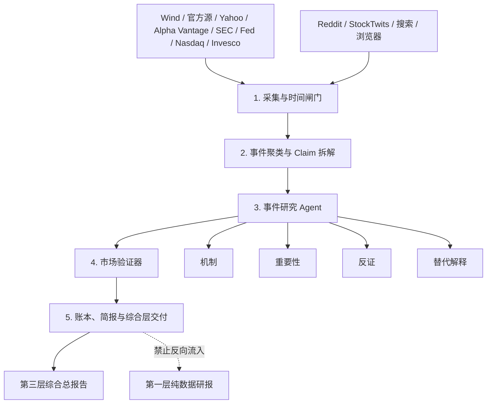

# 第二层事件研究 Agent 实施计划：第一性原理、对抗审查与落地路线

日期：2026-07-01  
状态：设计计划；供后续工程接入使用。  
相关文档：

- `docs/2026-6-27 三层架构暂定结构.md`
- `docs/2026-06-27_THREE_LAYER_REPORT_ARCHITECTURE_PLAIN.md`
- `docs/2026-06-27_三层研报的辩证法方法论：数据、新闻与市场本质.md`
- `docs/2026-06-30_THREE_LAYER_ARCHITECTURE_FIRST_PRINCIPLES_REVIEW.md`
- `ARCHITECTURE.md`
- `RESEARCH_CANON.md`

---

## 0. 一句话结论

第二层不应长期停留在“新闻标题整理”或“事件账本”。按照三层架构原意，它应该升级为：

> **成熟事件研究 Agent：专门研究外部事件、新闻叙事、公告披露和市场解释，但永远不把这些材料冒充成 L1-L5 的正式数据证据。**

它的目标不是“更会讲新闻故事”，而是：

> **把外部世界的信息拆成可审计 claim，追清来源和时间，映射金融机制，寻找反证，再判断这些事件是否被市场数据确认。**

通俗说：

- 第一层像体检报告，只看正式数据。
- 第二层像调查组，查清外部发生了什么、别人怎么解释、哪些说法站不住。
- 第三层像会诊，把体检报告和调查材料放在一起质询。

当前工程里的 `event_narrative_ledger.json` 是必要的第一步，但它只是“账本骨架”。下一步应该把第二层升级为“事件研究流水线”。

---

## 1. 本文解决什么问题

此前计划里，我提出过 7 个模块：

1. 事件源采集器。
2. 时间与来源闸门。
3. 事件去重与聚类。
4. Claim 拆解 Agent。
5. 金融链路映射 Agent。
6. 反证与替代解释 Agent。
7. 事件数据验证器。

这套方案方向正确，但从第一性原理看还不够优雅：模块太多，容易让工程变成拼装流水线，也容易让读者看不懂每一步到底为什么存在。

本文做三件事：

1. 用第一性原理重新判断第二层到底应该承担什么职责。
2. 把计划压缩为更简洁、更可实施的 5 段流水线。
3. 用对抗式审查找出失败模式，并给出修复后的最终计划。

---

## 2. 外部高星项目给我们的启发

本次参考了几个高关注 AI 投资项目，但不照搬它们。

### 2.1 TradingAgents

TradingAgents 的启发最大。

它把新闻和情绪拆开：

- `News Analyst`：调用 `get_news`、`get_global_news`、`get_macro_indicators`、`get_prediction_markets`。
- `Sentiment Analyst`：预先抓 Yahoo Finance news、StockTwits、Reddit，再让模型分析。

源码层面值得借鉴的点：

- 新闻源通过 vendor router 切换，例如 Alpha Vantage、Yahoo Finance、FRED、Polymarket。
- Alpha Vantage 新闻使用 `NEWS_SENTIMENT`，传入 `tickers / time_from / time_to`。
- Yahoo Finance 新闻会解析发布时间，并过滤不在窗口内的新闻。
- 历史窗口中，无日期新闻默认排除，防止未来新闻泄露。
- Reddit 走 RSS fallback，遇到限流会退避；拿不到数据就返回占位，而不是让模型编。
- StockTwits 取公开 symbol stream，保留用户标注的 Bullish/Bearish，但只作为情绪材料。

我们应该借鉴：

- 多源适配。
- 时间窗口防未来函数。
- 情绪源降级。
- 真实数据先预取，再进入结构化分析。

我们不应照搬：

- 直接导向 BUY/HOLD/SELL 的交易式结论。
- 让新闻 agent 自由写综合投资判断。

参考：

- https://github.com/TauricResearch/TradingAgents
- https://github.com/TauricResearch/TradingAgents/blob/main/tradingagents/agents/analysts/news_analyst.py
- https://github.com/TauricResearch/TradingAgents/blob/main/tradingagents/agents/analysts/sentiment_analyst.py
- https://github.com/TauricResearch/TradingAgents/blob/main/tradingagents/dataflows/yfinance_news.py
- https://github.com/TauricResearch/TradingAgents/blob/main/tests/test_news_lookahead.py

### 2.2 AI Hedge Fund

AI Hedge Fund 的新闻情绪 agent 比较直接：

- 从 FinancialDatasets 拉公司新闻。
- 新闻模型保留 `title / source / date / url / sentiment`。
- 缺少 sentiment 时，用 LLM 对标题做正负中性分类。
- 聚合成 bullish / bearish / neutral。

可借鉴：

- 新闻结构字段简单清楚。
- 有缓存、分页和限流处理。
- sentiment 计数可以作为“市场叙事温度”。

不可照搬：

- 正负新闻数量不能直接变成 NDX 投研判断。
- 只看标题做情绪判断太薄。
- bullish/bearish 标签对可审计研报过粗。

参考：

- https://github.com/virattt/ai-hedge-fund
- https://github.com/virattt/ai-hedge-fund/blob/main/src/agents/news_sentiment.py
- https://github.com/virattt/ai-hedge-fund/blob/main/src/tools/api.py

### 2.3 FinRobot

FinRobot 更像股权研究平台，重视 filings、earnings calls、RAG 和研究报告生成。

可借鉴：

- SEC filings 抽取。
- Earnings call 和公告类材料进入专门流程。
- 新闻按主题分类，例如 earnings、regulatory、M&A、analyst actions。
- 新闻摘要 agent 用结构化任务约束输出。

不可照搬：

- 部分分类靠关键词，容易粗糙。
- 有些新闻抽样带随机性，不适合可审计报告。
- 它更偏单股研究，不能直接迁移到 NDX 指数研究。

参考：

- https://github.com/AI4Finance-Foundation/FinRobot
- https://github.com/AI4Finance-Foundation/FinRobot/blob/master/finrobot/data_source/finnhub_utils.py
- https://github.com/AI4Finance-Foundation/FinRobot/blob/master/finrobot_equity/core/src/modules/news_integrator.py

### 2.4 FinGPT

FinGPT 的启发不是某个新闻 agent，而是 data-centric 思想。

它提醒我们：金融新闻噪音高、时间敏感、来源复杂。真正重要的不是让模型自由发挥，而是先做好：

- 多源检索。
- 清洗。
- 去重。
- 来源分类。
- 语料准备。
- RAG 或上下文约束。

但 FinGPT 里一些网页 scraping 路径比较脆弱，不适合作为第二层主来源，只适合深度调查模式下作为补充。

参考：

- https://github.com/AI4Finance-Foundation/FinGPT
- https://github.com/AI4Finance-Foundation/FinGPT/tree/master/fingpt/FinGPT_RAG/multisource_retrieval

---

## 3. Wind 能贡献什么

本机已有两个相关 skill：

- `wind-mcp-skill`
- `wind-find-finance-skill`

其中最有价值的是 `wind-mcp-skill` 的这些能力：

| Wind 能力 | 第二层用途 | 边界 |
| --- | --- | --- |
| `financial_docs.get_company_announcements` | 公司公告、年报、季报、招股书、监管披露 | 可作为第二层事件事实候选，不自动成为 L1-L5 evidence |
| `financial_docs.get_financial_news` | 财经新闻、快讯、报道、政策动态 | 可作为新闻与叙事材料，需要来源分级和反证 |
| `economic_data.get_economic_data` | 宏观和行业 EDB 指标 | 可辅助验证事件背景，但是否进入第一层须另有正式数据规则 |
| `stock_data / fund_data / index_data` | 股票、ETF、指数事件和行情补充 | 第二层只能用于事件验证，不反向污染纯数据层 |

`wind-find-finance-skill` 的价值是能力发现。它的 catalog 里提到了若干未来可选工作流：

- `major_announcement_impact_skill`
- `conference_call_takeaway_skill`
- `guidance_change_impact_skill`
- `sec_filing_question_answer_skill`

这些工作流如果安装并验证可用，适合被接入第二层的“专项事件研究”分支。

重要边界：

> Wind 是优秀的金融材料入口，但 Wind 返回的新闻、公告、文档仍然先进入第二层。它们不能绕过第二层治理，直接成为 L1-L5 主证据。

---

## 4. 第一性原理：第二层到底是什么

### 4.1 第二层不是新闻摘要

新闻摘要回答的是：

> 今天有什么新闻？

第二层应该回答的是：

> 哪些外部事件可能改变 NDX 的定价条件？这些事件哪些是事实，哪些是解释，哪些是市场叙事？它们是否被正式数据或市场行为确认？

所以第二层不是“新闻列表”，而是“事件研究”。

### 4.2 第二层不是第一层的扩展

第一层是纯数据研报。它必须保持干净。

第二层可以接触新闻、公告、浏览器、Wind、社媒、搜索，但这些都只能在第二层内部被治理。

它不能说：

> 因为某条新闻，所以 L1-L5 应该改结论。

它只能说：

> 某条事件可能影响某条金融链路；这个解释需要哪些正式数据确认；当前确认程度是多少。

### 4.3 第二层的基本单位不是 article，而是 claim

一篇文章里通常混着四种东西：

- 事实：发生了什么。
- 披露：公司或官方正式说了什么。
- 解释：记者、分析师、机构如何理解。
- 叙事：市场愿意怎样讲这个故事。

如果把整篇文章当作一个材料，AI 很容易把解释当事实。

所以第二层的最小单位应该是 claim。

每个 claim 至少要说明：

- 这个说法是什么。
- 它来自哪里。
- 它属于事实、披露、观点、叙事还是传闻。
- 它能支持什么。
- 它不能支持什么。
- 它需要哪些数据确认。
- 它有哪些反证或限制。

### 4.4 第二层的金融本质是“外因如何作用于内因”

新闻不是机械导致涨跌。

金融上更准确的说法是：

> 外部事件只有打中市场内部已有矛盾，才可能放大影响。

例如同样是一条偏鹰派 Fed 新闻：

- 如果真实利率上行、估值高、信用利差扩、广度弱，它可能放大下跌压力。
- 如果盈利上修、信用稳定、广度扩散，它可能只是短期扰动。

所以第二层必须把事件映射到 NDX 的金融链路：

- `earnings_path`
- `valuation_multiple`
- `discount_rate`
- `risk_premium`
- `liquidity_condition`
- `credit_condition`
- `index_structure`
- `market_breadth`
- `technical_flow`

### 4.5 第二层的结论必须比第一层更克制

第一层可以说：

> 数据侧显示某个矛盾正在形成。

第二层更适合说：

> 事件材料提供了一个可能解释，但确认程度为 weak / plausible / confirmed / contradicted。

第二层绝不能因为自己“读了很多新闻”就输出强投资结论。

---

## 5. 优雅性审查：把 7 模块压缩成 5 段

原 7 模块计划的问题是：职责正确，但粒度过碎。

更优雅的版本应该满足四个条件：

1. 每一步都有不可替代的理由。
2. 每一步的输入输出清楚。
3. 日常运行不重，深度调查可加深。
4. 不把 agent 数量当作成熟度。

因此，第二层最终压缩为 5 段流水线。



---

## 6. 最终计划：五段式第二层事件研究流水线

### 第 1 段：采集与时间闸门

目标：

> 先保证材料真实、可追溯、没有未来函数。

输入：

- Wind financial docs。
- Wind economic data。
- SEC / EDGAR。
- Fed / BLS / BEA / FRED。
- Nasdaq / Invesco。
- 公司 IR / press release。
- Yahoo Finance / Alpha Vantage / Finnhub / FMP / FinancialDatasets。
- Reddit / StockTwits 等情绪源。
- 深度模式下的网页搜索和浏览器材料。

输出：

- `event_source_raw.jsonl`

每条材料至少包括：

- `source_id`
- `source_type`
- `source_name`
- `source_url`
- `title`
- `published_at`
- `event_date`
- `information_available_at`
- `retrieved_at`
- `effective_date_passed`
- `raw_text_available`
- `raw_text_hash`
- `collection_status`

规则：

- 历史 run 中，`information_available_at > effective_date` 的材料直接排除。
- 历史 run 中，无日期材料默认排除。
- 实时 run 中，无日期材料可以保留，但必须标 `date_uncertain`。
- 社媒、论坛、搜索结果默认 `narrative_candidate`，不能升级为事实。
- Wind 新闻和公告是高质量入口，但仍必须经过来源分级。

通俗解释：

> 这一步像资料室收件。先问“这东西从哪来、什么时候可见、是不是偷看了未来”，再谈分析。

### 第 2 段：事件聚类与 Claim 拆解

目标：

> 把重复报道合并，把文章拆成可审计的小句子。

输入：

- `event_source_raw.jsonl`

输出：

- `event_clusters.json`
- `event_claim_ledger.json`

事件聚类字段：

- `event_cluster_id`
- `canonical_title`
- `primary_source`
- `supporting_sources`
- `earliest_available_at`
- `latest_update_at`
- `related_entities`
- `related_symbols`
- `event_family`
- `source_conflicts`

Claim 字段：

- `claim_id`
- `event_cluster_id`
- `claim_text`
- `claim_type`
- `source_type`
- `source_refs`
- `fact_part`
- `interpretation_part`
- `narrative_part`
- `confidence_before_market_validation`
- `what_it_can_support`
- `what_it_cannot_support`
- `needs_data_confirmation`

`claim_type` 固定为：

- `official_fact`
- `company_disclosure`
- `data_release_claim`
- `interpretation_claim`
- `view_claim`
- `narrative_claim`
- `rumor_claim`

规则：

- 一篇文章可以拆成多个 claim。
- 一个 claim 可以由多个来源支持。
- 不允许把媒体解释写成官方事实。
- 只有官方或公司披露可默认进入较高来源等级。
- 标题-only 材料必须降级，不能假装读过正文。

通俗解释：

> 这一步像审讯笔录。不是“这篇新闻说了什么”，而是“里面每一句可用说法到底是什么性质”。

### 第 3 段：事件研究 Agent

目标：

> 让成熟 agent 做真正研究，但把它关在第二层里。

输入：

- `event_clusters.json`
- `event_claim_ledger.json`
- 可选全文、公告、filing、Wind 文档、官方原文。

输出：

- `event_research_packets/*.json`

每个重要事件生成一个研究包。

研究包字段：

- `event_cluster_id`
- `judgment_object`
- `minimum_fact`
- `materiality`
- `affected_financial_links`
- `mechanism_hypotheses`
- `supporting_claims`
- `counter_claims`
- `alternative_explanations`
- `source_conflict_review`
- `market_has_likely_priced`
- `data_needed_for_confirmation`
- `downgrade_reasons`
- `agent_confidence`
- `research_status`

事件研究 Agent 必须回答 8 个问题：

1. 最小事实是什么？
2. 这个事件与 NDX 的关系是什么？
3. 它可能打到哪条金融链路？
4. 它是新增信息、旧闻重炒，还是市场借口？
5. 支持这个解释的材料有哪些？
6. 反驳这个解释的材料有哪些？
7. 有没有更简单的替代解释？
8. 需要哪些数据确认或证伪？

触发深度研究的条件：

- 事件涉及 Fed、SEC、Nasdaq、Invesco、财政政策、重大宏观数据。
- 事件涉及 NDX 高权重公司 earnings / guidance / capex / regulation。
- 第一层出现 `not_explained` 或重大数据异动。
- 新闻源之间互相冲突。
- 市场大幅波动但固定数据无法解释。
- 用户显式开启“深度事件研究”。

通俗解释：

> 这一步才是真正的调查员上场。但它不是来下买卖结论的，它是来把事件研究清楚。

### 第 4 段：市场验证器

目标：

> 检查事件解释有没有被市场数据支持，避免事后讲故事。

输入：

- `event_research_packets/*.json`
- `chart_time_series.json`
- 第一层已经允许公开引用的正式数据产物摘要，但不能把第二层回写给第一层。

输出：

- `event_market_validation.json`

验证维度：

- NDX / QQQ 价格。
- NDXE 或等权参考。
- NDX / NDXE 比率。
- VIX / VXN。
- US10Y / real yield。
- HY OAS / IG OAS。
- HYG。
- 成交量。
- 广度。
- 权重股相对表现。

验证标签：

- `confirmed_by_market_data`
- `partly_confirmed`
- `not_confirmed`
- `contradicted_by_market_data`
- `insufficient_data`

重要规则：

- 只能说“数据支持/削弱/未确认该解释”。
- 不能说“新闻导致了价格变化”。
- 事件日前后数据窗口必须固定，例如 1、3、5、20 个交易日。
- 重大宏观事件可允许更长窗口，但必须注明。
- 如果价格先动、新闻后出，要标 `possibly_post_hoc_narrative`。

通俗解释：

> 这一步像查监控。调查员说某件事可能造成影响，市场验证器问：价格、利率、波动率、信用有没有同步给证据？

### 第 5 段：账本、简报与综合层交付

目标：

> 把第二层结果变成可读、可审计、可被第三层使用的材料。

输出：

- `event_narrative_ledger.json`
- `event_narrative_report.md`
- `event_adversarial_review.json`
- `event_layer_summary.json`

`event_narrative_ledger.json` 是机器可读入口。

`event_narrative_report.md` 是人可读入口。

`event_adversarial_review.json` 记录对第二层自身的攻击和降级。

`event_layer_summary.json` 给第三层综合总报告读取。

给第三层的摘要必须包含：

- 最重要事件。
- 最重要 claim。
- 最高置信解释。
- 最强反证。
- 未解释项。
- 与第一层数据最相关的金融链路。
- 被降级的叙事。
- 禁止用于 L1-L5 的明确声明。

通俗解释：

> 这一步像把调查卷宗归档。第三层可以读卷宗，但第一层不能被卷宗反向污染。

---

## 7. 运行模式：日常轻量，异常加深

为了优雅和成本可控，第二层不应该每天全量深度搜索。

### 7.1 日常模式

每日默认运行：

1. 固定源采集。
2. 时间闸门。
3. 去重聚类。
4. Claim 拆解。
5. 金融链路映射。
6. 基础市场验证。
7. 生成第二层账本和简报。

特点：

- 稳定。
- 快。
- 成本低。
- 不依赖浏览器自由搜索。

### 7.2 深度模式

满足触发条件时运行：

1. 追原始来源。
2. 读全文公告 / filing / transcript。
3. 多源交叉验证。
4. 找反方报道和替代解释。
5. 运行专项 Wind workflow skill。
6. 必要时搜索网页，但输出仍是候选材料。

特点：

- 慢。
- 更贵。
- 更适合异常、重大事件、用户追问。

### 7.3 降级模式

当 Wind、外部 API、新闻源不可用时：

- 不补编。
- 不拿通用知识替代。
- 产出 `source_gap`。
- 第二层结论降级。
- 第三层必须显示“事件材料不足”。

---

## 8. 对抗式审查与修复

### 8.1 失败模式：新闻 agent 变成故事机

风险：

模型读了几条新闻后，直接写出顺滑解释。

修复：

- 输出必须以 claim 为单位。
- 每个 claim 必须绑定来源。
- 每个解释必须绑定金融链路。
- 每个事件必须有反证字段。
- 没有反证不允许高置信度。

### 8.2 失败模式：第二层污染第一层

风险：

事件材料被塞进 L1-L5、Bridge、Thesis，导致纯数据研报不再纯。

修复：

- 第二层产物只能被第三层读取。
- 第一层运行时禁止读取 `event_*`、`news_*`、browser sidecar。
- 测试必须检查 prompt payload 不含第二层字段。
- 第三层不得回写第一层。

### 8.3 失败模式：未来函数

风险：

历史 run 中用了当时市场还不知道的新闻。

修复：

- 所有材料必须有 `information_available_at`。
- 晚于 `effective_date` 的材料排除。
- 历史 run 中无日期材料排除。
- 加 lookahead-safe 测试，参考 TradingAgents 的新闻窗口测试思路。

### 8.4 失败模式：标题党误导

风险：

只读标题就判断事件影响。

修复：

- 标题-only 材料必须标 `raw_text_available=false`。
- 标题-only 只能生成低置信 claim。
- 重大事件必须追原文。
- 公司披露和官方文件优先于媒体标题。

### 8.5 失败模式：情绪源越权

风险：

Reddit、StockTwits、社媒热词被当成事实。

修复：

- 情绪源默认 `narrative_claim` 或 `unverified_signal`。
- 只能说明叙事扩散或散户情绪。
- 不能支撑官方事实、盈利判断、估值判断。

### 8.6 失败模式：Wind 被误当正式数据证据

风险：

Wind 返回新闻或公告后，被系统直接当成第一层证据。

修复：

- Wind financial_docs 进入第二层。
- Wind economic_data 若要进入第一层，必须另走正式数据源升级规则。
- Wind 返回结果必须保留查询参数、返回时间、来源类型。
- Wind 只是材料入口，不是结论入口。

### 8.7 失败模式：复杂度过高，系统不可维护

风险：

第二层模块太多，维护成本大，失败点多。

修复：

- 固定 5 段流水线，不再扩成很多平行 agent。
- 日常模式轻量。
- 深度模式按触发条件启动。
- 每段只定义必要产物。

### 8.8 失败模式：过度依赖单一供应商

风险：

Wind、Yahoo、Alpha Vantage、Finnhub 任一来源缺失导致第二层失效。

修复：

- 采用 source adapter 设计。
- 每个来源返回统一 `SourceRecord`。
- 缺源时降级，不阻塞整个第二层。
- 官方源和公司披露优先级高于媒体聚合源。

### 8.9 失败模式：综合层拿第二层强行解释第一层

风险：

第三层为了好读，把新闻解释强行套到数据上。

修复：

- 第三层必须显示验证标签。
- `not_confirmed` 和 `contradicted_by_market_data` 不能被写成支持。
- 价格先动新闻后出时，必须标为事后叙事风险。
- 无法解释必须保留 `not_explained`。

---

## 9. 多方面校验后的最终设计原则

经过第一性原理和对抗审查，第二层应遵守 10 条原则：

1. **Claim-first**：最小单位是 claim，不是文章。
2. **Source-first**：没有来源，就没有 claim。
3. **Time-first**：没有可见时间，就不能用于历史解释。
4. **Mechanism-first**：事件必须映射到金融链路。
5. **Counterevidence-first**：没有反证字段，就不能高置信。
6. **Validation-first**：事件解释必须接受市场数据验证。
7. **No-backflow**：第二层不得流回第一层。
8. **Degrade-honestly**：材料不足时降级，不编。
9. **Daily-light / Deep-on-trigger**：日常轻量，异常加深。
10. **Audit-before-prose**：先生成结构化审计，再写可读简报。

---

## 10. 工程实施路线

### P0：保住边界

目标：

> 确认第一层不再接收任何第二层材料。

任务：

- 测试第一层 payload 不含 `event_refs`、`news_event_ledger`、`event_narrative_ledger`。
- 测试 Bridge / Thesis / Risk / Final 不读取第二层产物。
- 保留当前 `pure_data_report.json` 的 forbidden inputs。

完成标准：

- 纯数据研报在没有第二层存在时可独立生成。
- 第二层存在也不会改变第一层输入。

### P1：统一 SourceRecord

目标：

> 所有新闻、公告、文档、社媒材料先归一成同一种原始记录。

新增产物：

- `event_source_raw.jsonl`

新增 adapter：

- Wind financial docs adapter。
- Official source adapter。
- Yahoo / Alpha Vantage adapter。
- SEC / EDGAR adapter。
- Social narrative adapter。

完成标准：

- 每条材料有来源、时间、链接、正文可用性、采集状态。
- 历史 run 能过滤未来材料。

### P2：事件聚类和 Claim 拆解

目标：

> 从“文章列表”升级为“事件簇 + claim 账本”。

新增产物：

- `event_clusters.json`
- `event_claim_ledger.json`

完成标准：

- 同一事件多来源报道能合并。
- 每个 claim 有类型和来源。
- 媒体解释不会被标成官方事实。

### P3：事件研究 Agent

目标：

> 对重要事件做机制、重要性、反证、替代解释研究。

新增产物：

- `event_research_packets/*.json`

完成标准：

- 每个重大事件有最小事实、金融链路、反证、替代解释。
- 没有反证的事件不能高置信。
- 标题-only 事件不能高置信。

### P4：市场验证器

目标：

> 检查事件解释是否被价格、利率、波动、信用和广度确认。

新增产物：

- `event_market_validation.json`

完成标准：

- 输出验证标签。
- 价格先动、新闻后出会被识别。
- 只能写确认程度，不能写因果证明。

### P5：第二层报告和第三层交付

目标：

> 让人能读，让第三层能审。

新增或升级产物：

- `event_narrative_ledger.json`
- `event_narrative_report.md`
- `event_adversarial_review.json`
- `event_layer_summary.json`

完成标准：

- 第二层有可读报告。
- 第三层读取 `event_layer_summary.json`，不读散乱新闻材料。
- 反证、冲突、未解释项会被带入第三层。

---

## 11. 建议的核心 schema

### 11.1 SourceRecord

```json
{
  "source_id": "src:...",
  "provider": "wind",
  "source_type": "company_disclosure",
  "source_name": "Wind financial_docs",
  "source_url": "...",
  "title": "...",
  "published_at": "2026-07-01T09:30:00Z",
  "event_date": "2026-07-01",
  "information_available_at": "2026-07-01T09:30:00Z",
  "retrieved_at": "2026-07-01T10:00:00Z",
  "raw_text_available": true,
  "raw_text_hash": "...",
  "effective_date_passed": true,
  "collection_status": "ok"
}
```

### 11.2 EventClaim

```json
{
  "claim_id": "claim:...",
  "event_cluster_id": "event_cluster:...",
  "claim_type": "company_disclosure",
  "claim_text": "...",
  "source_refs": ["src:..."],
  "fact_part": "...",
  "interpretation_part": "",
  "narrative_part": "",
  "affected_financial_links": ["earnings_path", "valuation_multiple"],
  "what_it_can_support": "...",
  "what_it_cannot_support": "...",
  "needs_data_confirmation": true,
  "counterevidence_or_limits": [],
  "confidence_before_market_validation": "medium"
}
```

### 11.3 EventResearchPacket

```json
{
  "event_cluster_id": "event_cluster:...",
  "judgment_object": "NDX",
  "minimum_fact": "...",
  "materiality": "high",
  "affected_financial_links": ["discount_rate", "risk_premium"],
  "mechanism_hypotheses": [],
  "supporting_claims": [],
  "counter_claims": [],
  "alternative_explanations": [],
  "source_conflict_review": [],
  "market_has_likely_priced": "unclear",
  "data_needed_for_confirmation": [],
  "downgrade_reasons": [],
  "agent_confidence": "medium",
  "research_status": "ready_for_market_validation"
}
```

### 11.4 MarketValidation

```json
{
  "event_cluster_id": "event_cluster:...",
  "validation_label": "partly_confirmed",
  "validated_links": ["risk_premium"],
  "contradicted_links": [],
  "observations": [],
  "post_hoc_narrative_risk": false,
  "causality_statement": "temporal association only; no causal proof"
}
```

---

## 12. 测试清单

必须新增测试：

1. 历史 run 不允许未来新闻进入。
2. 历史 run 中无日期新闻默认排除。
3. 标题-only 材料只能低置信。
4. 社媒材料不能生成 official_fact。
5. Wind financial_docs 不会进入 L1-L5 evidence_ref。
6. 同一事件多来源报道能聚类。
7. 媒体解释和官方事实能被拆开。
8. 没有反证字段时，事件研究包不能高置信。
9. 市场验证器不能输出因果证明。
10. 第三层读取第二层摘要，但第一层 payload 不含第二层字段。

---

## 13. 最终通俗版计划

给非技术读者看，可以这样理解第二层升级：

第一步，先收材料。  
系统从 Wind、官方机构、公司公告、财经新闻、必要时网页搜索里收材料。每条材料都要写清楚来源和时间。历史报告不能偷看未来新闻。

第二步，把材料整理成事件。  
同一件事可能被很多媒体报道，系统先合并成一个事件，不重复计算热度。

第三步，把事件拆成一句句可审查的说法。  
例如“公司公布财报”是事实，“盈利前景改善”是解释，“市场重新追捧 AI”是叙事。三者不能混在一起。

第四步，让事件研究 Agent 做调查。  
它要回答：这个事件到底是什么？影响 NDX 哪条金融链路？有什么支持？有什么反证？有没有别的解释？需要什么数据确认？

第五步，用市场数据验证。  
如果说事件影响风险偏好，就看 VIX、VXN、信用利差、HYG、价格和广度有没有配合。如果不配合，就降级。

第六步，生成第二层报告。  
第二层会告诉你：发生了什么、哪些解释靠谱、哪些只是可能、哪些被数据反驳、哪些还解释不了。

第七步，交给综合总报告。  
第三层可以把纯数据研报和事件研究报告放在一起质询，但第二层不能反过来污染第一层。

---

## 14. 最终判断

第二层的正确形态不是“新闻摘要”，也不是“另一个纯数据研报”。

它应该是：

> **受严格证据治理的事件研究 Agent。**

它的成熟，不体现在 agent 名字多、材料多、文字长，而体现在：

- 能追源。
- 能拆 claim。
- 能分清事实和解释。
- 能找反证。
- 能映射金融机制。
- 能接受市场数据验证。
- 能在证据不足时降级。
- 能保护第一层纯净。

所以最终实施方向是：

> 以五段式事件研究流水线升级第二层：采集与时间闸门、事件聚类与 claim 拆解、事件研究、市场验证、账本与综合交付。日常轻量运行，重大事件深度调查，所有结果只进入第三层，不反向污染第一层。

