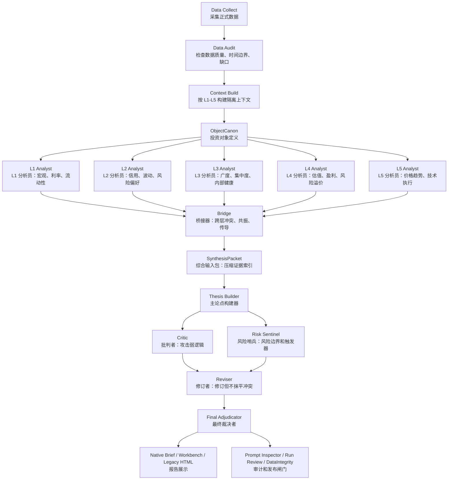
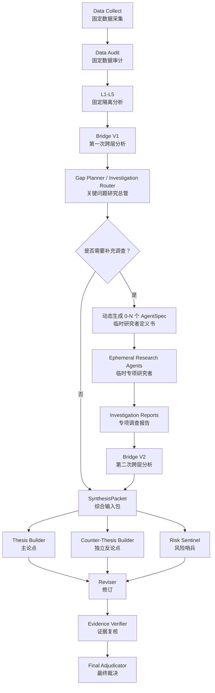

# 动态研究 Harness 通俗说明：现有架构、建议架构与差异

更新日期：2026-07-03

本文用于团队内部讨论 `ndx_vnext` 是否要引入更动态的临时 Agent / Subagent Harness。

本文不写代码实现细节，先把三件事说清楚：

1. 现有架构到底是什么。
2. 建议的新架构到底是什么。
3. 两者区别、优缺点和风险在哪里。

一句话结论：

> 现有 `ndx_vnext` 已经是一套领域专用投研 Harness，不是普通流水线。它现在的核心形态是“固定研究骨架 + 隔离 LLM 认知节点 + 强类型产物 + 审计闸门”。建议的新架构不是推倒重来，而是在 Bridge 之后加入“动态临时研究单元”，让系统能针对本轮未解决问题做有限、可审计、可停止的补充调查。

---

## 1. 先解释几个词

### 1.1 Harness 是什么

Harness 可以先理解成“研究运行装置”。

它负责：

- 接收输入。
- 决定调用哪些模型、工具和规则。
- 管理上下文。
- 保存中间产物。
- 检查输出是否合规。
- 最后生成报告。

所以 Harness 不一定非要是一个完全自由行动的 Agent。一个由代码控制的固定研究流程，只要能组织模型、工具、状态、产物和审计，也可以是 Harness。

### 1.2 Agent 是什么

这里的 Agent 可以先理解成“会看材料、会调用工具、会形成判断的研究单元”。

Agent 有两种形态：

- 固定 Agent：名字、职责、输入和输出长期固定。
- 临时 Agent：本轮运行时根据具体问题临时生成，做完任务后消失。

### 1.3 Orchestrator 是什么

Orchestrator 可以翻译为“调度器”或“总调度”。

它负责决定：

- 下一步跑什么。
- 谁能看什么材料。
- 谁能调用什么工具。
- 什么时候停止。
- 哪些结果进入后续报告。

当前项目里已经有 Python orchestrator，但它主要执行固定链式流程；它不是 Anthropic 那种会动态生成多个 Subagent、追问、恢复和继续探索的活调度器。

### 1.4 Subagent 是什么

Subagent 可以翻译成“子 Agent”或“子研究员”。

它通常有独立上下文，只做一个局部任务，最后把结果摘要返回给主流程。

本文建议的新架构里，最重要的不是预先准备很多固定 Subagent，而是让系统在运行时生成“临时专项研究者”。

---

## 2. 现有架构到底是什么

现有 `ndx_vnext` 不是随便把几个 prompt 串起来。它已经有清楚的研究骨架和纪律。

最准确的描述是：

> 确定性工作流骨架 + 隔离的 LLM 认知节点 + 强类型 Artifact + 审计闸门。

通俗说，就是：

```text
数据和规则
    ↓
五个互相隔离的研究房间
    ↓
Bridge 把五份研究拼起来，找冲突、共振和传导
    ↓
Thesis 提出总判断
    ↓
Critic 和 Risk 找问题
    ↓
Reviser 修订
    ↓
Final 裁决
    ↓
报告和审计
```

外面还有纪律检查部门：

```text
DataIntegrity
Schema Guard
Prompt Inspector
Run Review
```

---

## 3. 现有主流程



---

## 4. 现有 L1-L5 是什么

L1-L5 是现有系统的固定研究骨架。它们不是临时角色，而是 NDX 研究的固定体检项目。

### L1 Analyst（L1 分析员：宏观、利率、流动性）

看政策利率、长端利率、真实利率、通胀补偿、流动性背景。

它回答类似问题：

- 贴现率环境是否压制成长股？
- 真实利率上升是否对高估值资产不利？
- 流动性环境是在改善还是收缩？

### L2 Analyst（L2 分析员：信用、波动、风险偏好）

看信用利差、VIX/VXN、波动率结构、市场风险偏好。

它回答类似问题：

- 信用市场是否确认风险偏好恶化？
- 波动率是在提示恐慌，还是只是短期保险价格变化？
- 风险偏好是修复还是脆弱？

### L3 Analyst（L3 分析员：广度、集中度、内部健康）

看 NDX 内部结构，包括广度、集中度、等权与市值加权差异、Top10 权重。

它回答类似问题：

- 指数上涨是多数成分股参与，还是少数龙头拉动？
- NDX 强但 NDXE 弱，是否说明内部不健康？
- Top10 权重是否让指数过度依赖少数公司？

当前 L3 是重要薄弱层，因为 NDX 是市值加权指数。如果 L3 不强，系统容易把“少数龙头很强”误读成“整个指数很健康”。

### L4 Analyst（L4 分析员：估值、盈利、风险溢价）

看估值、盈利质量、PE/PB/PS、风险溢价、盈利预期。

当前 Wind NDX 指数级估值和风险溢价是主锚。Damodaran、WorldPERatio、yfinance 等只做背景、校验或 fallback，不能替代 Wind 主锚。

它回答类似问题：

- 当前估值是否有足够风险补偿？
- 盈利上修能否支撑高估值？
- 高真实利率和高估值是否构成核心冲突？

### L5 Analyst（L5 分析员：价格趋势、技术执行）

看价格趋势、成交、均线、RSI、ADX、ATR 等。

它回答类似问题：

- 当前趋势是否强？
- 技术上是否过热或超卖？
- 执行节奏应该更激进还是更等待？

重要边界：

> L5 只能帮助管理执行节奏，不能证明估值便宜，也不能替代 L3 的内部健康判断。

---

## 5. 现有架构的上下文隔离

现有系统最重要的原则是：

> 静态规则可以共享，运行时状态不能共享。

L1-L5 可以知道：

- 自己负责什么。
- 五层框架的静态职责。
- ObjectCanon，也就是投资对象定义。
- 本层 IndicatorCanon，也就是本层指标法典。

L1-L5 不能知道：

- 其他层本轮看到了什么数据。
- 其他层本轮得出了什么结论。
- Bridge 当前判断。
- Thesis / Final 当前判断。
- 新闻、浏览器、sidecar 候选材料。
- 未升级为正式数据源的网页或登录态工具结果。

通俗说：

> 每个研究房间知道别人负责什么，但不知道别人这次看到了什么、判断了什么。

这样做的好处是避免提前互相带偏。

---

## 6. 现有 Artifact 是什么

Artifact 可以理解成“系统每一步留下的正式研究产物”。

当前主产品不是 legacy HTML，而是这些 vNext artifacts：

```text
layer_cards/L1-L5.json
bridge_memos/*.json
synthesis_packet.json
thesis_draft.json
critique.json
risk_boundary_report.json
schema_guard_report.json
analysis_revised.json
final_adjudication.json
```

这些文件的价值是：

- 后续阶段可以读取它们。
- Prompt Inspector 可以审计它们。
- Run Review 可以复盘它们。
- 出错时可以追踪哪一步出了问题。

---

## 7. 现有 Bridge 是什么

Bridge 可以翻译为“桥接器”。

它是第一个读取 L1-L5 全部结果的阶段。

Bridge 不应该重新分析单个指标，而应该回答：

- 哪些层互相确认？
- 哪些层互相冲突？
- 哪些信号形成传导链？
- 哪些问题仍未解决？
- 当前主要矛盾是什么？
- 价格是否已经反映了关键风险或叙事？

当前 Bridge 的重要输出包括：

```text
typed_conflicts
resonance_chains
transmission_paths
unresolved_questions
principal_contradiction
secondary_contradictions
price_reflection_map
contradiction_transformation_signals
```

### principal_contradiction（主要矛盾）

它要说明：

- 当前最支配 NDX 收益风险判断的矛盾是什么。
- 为什么它是主要矛盾。
- 矛盾中哪一面暂时占主导。
- 什么信号会让它转化。

### price_reflection_map（价格反映地图）

它要判断关键风险或叙事是否已经进入价格。

当前至少覆盖：

- 信用。
- 利率。
- 估值。
- 技术恐慌。
- 流动性。

注意：

> “风险是否已进入价格”不是直接事实，而是推断。它需要证据、反证、时间尺度和替代解释，否则容易变成漂亮但不可证伪的标签。

---

## 8. 现有架构的优点

### 8.1 稳定

L1-L5 是固定体检项目，不会因为本轮新闻很热就跳过信用、广度或估值。

### 8.2 可审计

每一步都有 artifact，方便回头查。

### 8.3 防污染

新闻和其他层结论不会提前进入 L1-L5。

### 8.4 防指标越权

系统有 IndicatorCanon 和 PermissionType，规定每个指标能说什么、不能说什么。

### 8.5 适合回测和数据边界

因为流程固定、输入可控，更容易检查 effective_date、未来数据和发布状态。

---

## 9. 现有架构的短板

现有架构最大的短板不是“不够多 Agent”，而是：

> 系统能发现未解决问题，但不太会继续调查这个未解决问题。

例如 Bridge 可能发现：

```text
NDX 上涨，但 NDXE 落后。
真实利率上升，但价格趋势强。
盈利上修集中在少数龙头。
风险可能部分进入价格，但证据不足。
```

现有系统通常会把这些写进报告，然后进入 Thesis / Risk / Final。

它还不够像一个活的研究系统：

```text
Bridge 发现关键缺口
    ↓
系统自动生成专项调查任务
    ↓
临时 Agent 调查
    ↓
调查结果回到 Bridge V2
    ↓
再综合
```

所以现有架构是强纪律、强审计，但动态追问能力不足。

---

## 10. 建议的新架构是什么

建议的新架构不是推倒现有架构。

核心是：

> 固定主链继续保留，在 Bridge 之后加入一个“关键问题研究总管”，它根据本轮未解决问题，动态生成 0-N 个临时研究单元。

建议新流程：



---

## 11. 什么是临时研究单元

临时研究单元可以叫：

- Ephemeral Research Agent（临时专项研究者）。
- Runtime-generated Subagent（运行时生成的子 Agent）。
- Investigation Agent（专项调查 Agent）。

它不是固定名单里的一个角色。

它是系统根据本轮问题临时生成的研究单元。

公式是：

```text
本次临时 Agent
= 本次独特问题
+ 本次独特研究视角
+ 本次最小必要上下文
+ 本次适用工具
+ 统一研究纪律
+ 统一输出合同
```

动态的是：

- 名字。
- 研究角色。
- 研究任务。
- 看问题的角度。
- 允许读取的材料。
- 允许调用的工具。
- 成功标准。
- 停止条件。

固定的是：

- 证据纪律。
- 权限边界。
- 输出结构。
- 成本和时间预算。
- 不得伪造事实。
- 必须保留反证。
- 必须引用证据编号。

---

## 12. AgentSpec 是什么

AgentSpec 可以翻译成“临时研究者定义书”。

它不是代码类，而是本轮运行时生成的一份任务说明。

示例：

```yaml
agent_id: INV-20260703-01

name: 龙头盈利补偿能力研究员

role:
  从现金流久期、盈利预期变化和指数权重贡献三个角度，
  检验少数龙头的盈利改善是否足以抵消真实利率上升对估值的压制。

objective:
  回答当前 NDX 强势究竟具有基本面补偿，
  还是主要依赖估值和动量延续。

originating_gap:
  bridge_gap_07

why_this_agent_exists:
  该问题直接影响主要矛盾的主导面判断。

context_refs:
  - L1.real_rate_analysis
  - L3.top10_contribution
  - L4.earnings_revision
  - L5.relative_strength

allowed_tools:
  - earnings_revision_decomposer
  - weight_contribution_calculator
  - valuation_sensitivity_model
  - historical_analogue_search

forbidden_context:
  - thesis_draft
  - final_adjudication
  - portfolio_actions
  - unapproved_news_narrative

required_questions:
  - 盈利补偿的量级是多少？
  - 补偿集中在哪些公司？
  - 当前价格是否已经提前计入？
  - 最强反证是什么？

success_criteria:
  - 完成盈利贡献和利率压力的可比较分析
  - 至少给出一个替代解释
  - 所有关键判断存在证据引用

stop_conditions:
  - 核心问题已得到足够回答
  - 数据不足以进一步判断
  - 达到工具调用预算
```

这份 AgentSpec 里很多内容可能一辈子只出现一次。

这正是动态 Agent 的价值。

---

## 13. 临时 Agent 的输出结构

虽然临时 Agent 的名字、任务和工具可以不同，但输出外壳应该固定。

建议统一输出 `InvestigationReport`：

```yaml
investigation_id:
research_question:
temporary_role:
why_needed:

core_findings: []
supporting_evidence: []
counter_evidence: []
alternative_explanations: []
unresolved_questions: []

impact_on_original_conflict:
  - strengthened
  - weakened
  - reframed
  - unresolved

impact_on_principal_contradiction:
impact_on_price_reflection:

confidence:
falsification_conditions: []
evidence_refs: []
tool_usage_log: []
```

通俗说：

> 报告箱子固定，箱子里装什么由本轮问题决定。

---

## 14. 现有架构和建议架构的关键区别

| 维度 | 现有架构 | 建议新架构 |
| --- | --- | --- |
| 主链 | 固定 L1-L5 -> Bridge -> Thesis -> Final | 主链仍固定 |
| 动态调查 | 很弱，未解决问题多进入报告 | Bridge V1 后可生成临时调查任务 |
| Agent 类型 | 固定阶段 LLM 节点 | 固定节点 + 运行时临时 Agent |
| L1-L5 | 固定必做体检项目 | 继续固定，不动态跳过 |
| Bridge | 一次跨层分析 | Bridge V1 + 调查 + Bridge V2 |
| 未解决问题 | 主要被记录 | 可转成 InvestigationTask |
| 上下文隔离 | 强 | 继续强，还要给临时 Agent 设 allowed / forbidden context |
| 审计 | 已有 DataIntegrity、Prompt Inspector、Run Review | 继续保留，并增加 InvestigationReport 和 tool_usage_log |
| 风险 | 调度偏死，追问不足 | 调度更活，但要控制成本和污染 |

---

## 15. 为什么不建议把 L1-L5 改成完全动态

L1-L5 应该继续固定。

原因很简单：

> 它们是 NDX 研究的必做体检项目，不是临时想到的角色。

如果让主 Agent 每次自由决定要不要看广度、信用、估值，可能会因为当前新闻或行情太显眼而遗漏安静但重要的层面。

例如市场大涨时，主 Agent 可能重点研究：

- AI。
- 盈利。
- 技术趋势。

却忽略：

- 信用压力。
- 等权指数。
- 内部广度。
- 真实利率。

所以主干应该继续是：

```text
代码决定哪些必做
LLM 在规定边界内理解
```

而不是：

```text
LLM 自己决定今天研究什么、跳过什么
```

---

## 16. 动态 Agent 应该放在哪里

适合动态化的地方有四类。

### 16.1 Data Audit 后的数据异常调查

如果 Data Audit 发现：

- 数据缺失。
- 数据源冲突。
- 日期错位。
- 异常跳变。
- 频率无法匹配。

可以生成有限的 Data Forensics Task（数据取证任务）。

但最终是否 publishable 仍应由代码规则裁决，不能交给 Agent 随意决定。

### 16.2 Bridge 后的未解决问题调查

这是最重要的动态区。

例如 Bridge 发现：

- 真实利率高，但估值仍扩张。
- 信用没恶化，但波动率快速上升。
- 盈利改善是否足以覆盖估值扩张。
- 技术超买是趋势强，还是脆弱性积累。
- 某个风险是否已经反映进价格。

这些问题适合临时生成专项研究者。

### 16.3 L3 内部结构调查

L3 很重要，也很适合定向调查。

可以调查：

- NDX 与 NDXE 背离来源。
- Top10 对指数收益的贡献。
- 上涨成分占比。
- 行业内部参与度。
- 龙头上涨、尾部下跌，还是普遍上涨。
- 集中度变化是否处于历史极端。

这里最好让 Python 先做确定性计算，Agent 负责解释计算结果。

### 16.4 新闻与事件侧链

新闻和事件天然适合动态 Agent，因为路径很开放。

但必须保留三层隔离：

```text
纯数据链
新闻事件链
综合解释链
```

新闻 Agent 不能把“市场正在担心 AI 泡沫”直接塞进 L4，变成估值事实。

新闻材料至少要分成：

- event_fact（事件事实）。
- official_statement（官方表态）。
- company_disclosure（公司披露）。
- market_narrative（市场叙事）。
- analyst_interpretation（分析师解释）。
- weak_signal（弱线索）。

---

## 17. 建议新架构的优点

### 17.1 保留固定骨架，防止遗漏

L1-L5 仍然必跑，所以系统不会因为新闻热度而跳过重要层面。

### 17.2 增加生命力

Bridge 发现问题后，不只是写“未解决”，而是可以自动发起有限调查。

### 17.3 更符合真实研究过程

真实研究不是一次性从数据到结论。它经常是：

```text
先看数据
发现异常
提出问题
查证
修正理解
再综合
```

新架构补上了这个环节。

### 17.4 更能处理混合问题

有些问题不是纯 L1、纯 L3 或纯 L4。

例如：

> 少数龙头高度集中的盈利上修，是否足以抵消真实利率上升带来的估值压力？

这个问题横跨 L1、L3、L4、L5。固定调查员名单很难优雅处理，临时 AgentSpec 更合适。

### 17.5 审计仍然可保留

只要临时 Agent 也输出强类型 `InvestigationReport`，并记录 evidence refs 和 tool_usage_log，它仍然可以被审计。

---

## 18. 建议新架构的风险

### 18.1 证据污染风险

临时 Agent 如果能随便看 Thesis / Final，就会被下游立场污染。

所以每个 AgentSpec 必须有：

```text
allowed_context
forbidden_context
```

### 18.2 成本失控风险

动态 Agent 如果无限生成，会变得又慢又贵。

需要固定预算：

```text
一次最多生成 3-5 个临时 Agent
每个最多 N 次工具调用
最多允许 1-2 轮追加调查
默认不允许临时 Agent 再生成下级 Agent
```

### 18.3 研究漂移风险

临时 Agent 可能越查越远，偏离原问题。

所以必须有：

```text
success_criteria
stop_conditions
originating_gap
why_this_agent_exists
```

### 18.4 虚假精确风险

特别是 `price_reflection_map`。

“风险是否已经进入价格”必须写明：

- 反映在哪个对象里。
- 反映到哪个时间尺度。
- 根据哪些可观察行为判断。
- 有哪些替代解释。
- 缺少什么证据。

否则 `partially_reflected` 这类标签会显得精确，但其实不可证伪。

### 18.5 压缩失真风险

现有流程会多次压缩：

```text
原始证据
  ↓
LayerCard
  ↓
Bridge
  ↓
SynthesisPacket
  ↓
Thesis
```

少数派证据可能在压缩中消失。

解决方向不是把所有原始数据塞回上下文，而是保留可检索 Artifact：

```text
get_evidence(evidence_id)
get_indicator_analysis(analysis_id)
get_conflict(conflict_id)
trace_claim(claim_id)
```

---

## 19. 是否还能一键启动

可以，而且应该可以。

用户体验仍然是：

```text
点击一次“开始研究”
系统自动跑完
```

只是内部流程从固定链变成带条件分支的链。

旧的一键启动：

```text
Data Collect
  -> Data Audit
  -> L1-L5
  -> Bridge
  -> Thesis
  -> Risk
  -> Final
```

新的一键启动：

```text
Data Collect
  -> Data Audit
  -> L1-L5
  -> Bridge V1
  -> 判断是否需要调查
      -> 不需要：直接 Synthesis
      -> 需要：生成 AgentSpec
          -> 跑临时调查
          -> 产出 InvestigationReport
          -> Bridge V2
  -> Thesis + Counter-Thesis + Risk
  -> Reviser
  -> Evidence Verifier
  -> Final
```

所以它不是手动流程。

关键是由代码控制：

- 是否需要调查。
- 最多调查几个。
- 每个调查能看什么。
- 每个调查能用什么工具。
- 超时或缺数据时如何停止。

---

## 20. 最小可行版本

不建议一开始就接完整 Deep Agents / LangGraph，也不建议重写整个系统。

最小可行版本可以是：

1. 保留现有主链。
2. Bridge 后新增 `Gap Planner / Investigation Router`。
3. 第一版最多生成 3 个临时调查任务。
4. 第一版只支持三类调查：
   - L3 结构调查。
   - Data Audit 异常调查。
   - 新闻/事件补查。
5. 调查结果不回灌 L1-L5，只生成 `investigation_reports/*.json`。
6. Bridge V2 读取原 L1-L5 + Bridge V1 + InvestigationReports。
7. 后续 Thesis / Risk / Final 读取 Bridge V2 和 SynthesisPacket。

---

## 21. 后续可考虑的增强

### 21.1 Counter-Thesis Builder（独立反论点构建器）

当前 Critic 是看过 Thesis 后挑问题，可能被 Thesis 锚定。

可以增加一个盲反方：

```text
SynthesisPacket
    ├── Thesis Builder
    └── Counter-Thesis Builder
```

Counter-Thesis 第一次生成时不能看 Thesis。

它只回答：

- 最强相反解释是什么？
- 哪些证据支持相反结论？
- 如果主判断错，最可能错在哪里？
- 是否存在同一证据的另一种解释？

### 21.2 Claim Ledger（结论台账）

每个最终结论都形成一条记录：

```yaml
claim_id:
claim_text:
claim_type:
evidence_refs:
counter_evidence_refs:
conflict_refs:
inference_steps:
data_quality:
confidence:
falsification_conditions:
originating_stage:
verified:
```

这样审计的不只是 JSON 字段是否存在，而是每句话从哪里来。

### 21.3 Portfolio Policy（组合策略层）

市场判断和仓位动作之间最好再隔一层。

研究主链输出：

- 市场状态。
- 主要矛盾。
- 主导面。
- 上行风险。
- 下行风险。
- 等待确认成本。
- 失效条件。

组合策略层再根据用户规则决定动作：

- 核心仓是否允许择时。
- 战术仓最大比例。
- 单次调整上限。
- 现金最低水平。
- 最大回撤容忍度。
- 再平衡规则。

这样可以防止研究系统因为一句“风险偏高”，直接跳到过度仓位建议。

---

## 22. 最终建议

当前 `ndx_vnext` 已经是一套优秀的领域专用 Harness。

它不需要被推倒重来，也不应该把 L1-L5 改成自由活动的动态 Agent。

最合适的路线是：

> 固定五层骨架继续做必做体检；Bridge 后加入动态临时研究单元，专门解决本轮真正影响主要矛盾和价格反映判断的未决问题；所有动态研究都必须有权限边界、工具白名单、停止条件、预算和强类型输出。

通俗说：

```text
现有架构负责“不漏看、不污染、不乱说”。
新增动态调查层负责“发现问题后还能继续追问”。
```

这两者不是冲突，而是互补。

