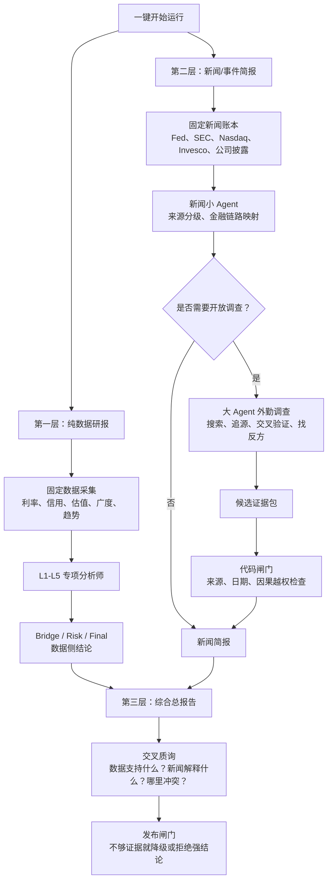

**最终结论**

未来的 NDX 三层架构，不是“数据报告旁边加一堆新闻”，而是更像一家投行研究部的流水线：

> **固定团队负责每天稳定生产，专项分析师负责分层判断，大 Agent 负责开放世界调查，审计部门负责最后把关。**

一句话：

> 数据层像体检中心，新闻层像外勤调查组，综合总报告像投委会纪要。  
> 体检数据不能被传闻污染，外勤调查不能冒充化验结果，投委会可以综合判断，但必须写清证据、反证和不确定性。

**一张图看懂**

````

````

**第一层：纯数据研报**

这层是现在 vNext 的主链，像“体检中心”。

它只看正式数据：

- 利率、真实利率、通胀补偿。
- 信用利差、波动率。
- 估值、盈利、风险溢价。
- 广度、集中度、NDX/NDXE。
- 趋势、成交、技术状态。

这里的 L1-L5、Bridge、Critic、Risk、Final，就像一个研究部里的专项分析师。每个人只看自己负责的材料，不能偷看别人本轮结论，也不能被新闻带节奏。

这层最重要的品质是：**干净、稳定、可审计。**

**第二层：新闻/事件简报**

这层像“外部事件调查组”。

它分三段。

第一段是固定新闻账本，代码负责。  
像资料员每天固定收：

- Fed / BLS / BEA。
- SEC filings。
- Nasdaq / Invesco 公告。
- 公司财报、guidance、新闻稿。
- 已配置的可靠新闻源。

这些是脏活累活，必须稳定，不能靠大 Agent 自由发挥。

第二段是新闻小 Agent。  
它负责把已收集材料整理成结构：

- 这是官方事实，还是公司披露？
- 是主流报道，还是卖方观点？
- 它影响盈利、估值、贴现率、风险溢价，还是指数结构？
- 它需要哪些数据确认？
- 它有哪些限制？

第三段才是大 Agent。  
大 Agent 不是每天无脑上场，它像“高级外勤调查员”或“金融版 Jarvis”，只在需要开放世界能力时启动：

- 固定新闻源解释不了市场异常。
- 出现 `not_explained`。
- 用户打开“深度新闻探索”。
- 有重大突发事件。
- 多家媒体说法冲突。
- 需要追原始来源或找反方材料。
- 需要判断某个新叙事是不是旧闻新炒。

大 Agent 的价值不是读 prompt，而是会用工具：搜索、追源、读网页、用 Skill、交叉验证、换路径。

但它输出的东西先叫**候选证据包**，不能直接变成正式结论。

**第三层：综合总报告**

这层像“投委会总结”。

它读取两份东西：

- 纯数据研报。
- 新闻/事件简报。

然后问：

- 数据侧最重要的判断是什么？
- 新闻侧最重要的事件是什么？
- 新闻有没有解释数据异常？
- 数据有没有确认新闻叙事？
- 哪里一致？
- 哪里打架？
- 哪些解释只是可能？
- 哪些事情暂时解释不了？

综合总报告可以写得通俗，可以有明确判断，但必须带着刹车：

- 每个判断要有数据支持。
- 每个新闻解释要有来源。
- 每个强结论要有反证。
- 每个不确定项要保留。
- 如果解释不了，就明确写“暂时解释不了”。

**最准确的角色比喻**

|模块|像什么人|负责什么|
|---|---|---|
|固定数据采集|资料搬运和数据会计|稳定拿数据，不能出错|
|L1-L5 小 Agent|专项行业/宏观分析师|各看一块，给专业判断|
|Bridge / Critic / Risk|研究主管和风控|找冲突、挑漏洞、写风险|
|固定新闻采集|新闻资料员|固定收官方和披露材料|
|新闻小 Agent|事件编辑|分类、摘要、映射金融链路|
|大 Agent|高级外勤调查员 / Jarvis|搜索、追源、交叉验证、找反方|
|代码闸门|审计和合规|强制检查来源、日期、越权|
|综合总报告|投委会纪要作者|把数据和新闻合成可读判断|

**最终原则**

死板不是低级，灵活也不是高级。  
正确的是：

> 该死板的地方必须死板，该灵活的地方必须灵活。

数据采集、日期检查、schema、发布闸门，要死板。  
新闻追源、突发事件、反方验证、未知解释，要灵活。  
最终结论，必须回到证据和闸门。

所以未来架构就是：

> **代码做骨架，小 Agent 做专项判断，大 Agent 打开未知世界，硬闸门负责最后纪律。**