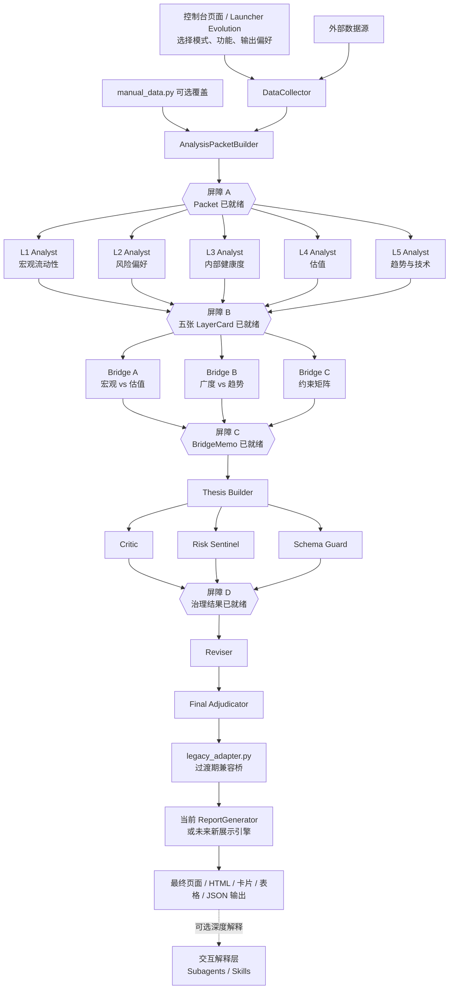

# 4.20 VNEXT_REPORT

> 日期：2026-04-21
> 状态：vNext 最终构建指导文档
> 适用对象：项目所有者、未来协作 AI，以及任何需要真正理解 vNext 要构建什么的人

---

## 1. 本报告的用途

这不是一份中立讨论稿。

这是一份**构建指导文档**。

它要明确三件事：

1. **vNext 真正试图解决的问题是什么**
2. **vNext 最终应该构建成什么架构**
3. **实施过程中哪些事情必须做，哪些事情绝不能做**

如果未来的人类维护者、AI 协作者，或者某个新分支不知道 vNext 应该变成什么样，这份文档就应该成为参考基准。

---

## 2. 执行摘要

vNext 不是一次表面重构。

vNext 之所以存在，是因为 legacy 分析流水线对于这个项目真正的使命来说，黑箱程度太高。

这个项目真正的使命是：

> 让一个不懂编程的投资者，也能理解、验证并信任每一个投资结论

旧流水线可以运行，但它把太多推理过程藏在了一个大 Prompt 和三段式循环里。

新流水线必须在四个方面明显更好：

1. **分工必须显式**
2. **跨层逻辑必须显式**
3. **每一步推理的上下文必须保持干净**
4. **整个工作流必须足够稳定，能自动运行并且能被调试**

本报告给出的最终建议是：

> **将 vNext 构建为一个由 Python 编排的固定 DAG，把专用的 LLM 调用作为推理节点，并把 subagent 放到单独的交互解释层。**

这意味着：

- **核心生产流水线**必须由你自己的 orchestrator 控制
- 每个推理节点在行为上可以像 agent，但不必依赖某个 agent runtime 才算 agent
- `.claude/agents/` 或类似 subagent 系统，应该作为**交互式解释增强层**，而不是每日自动报告引擎的心脏
- 当前 legacy HTML 报告链路应该被视为**过渡期兼容路径**，而不是未来展示层的唯一终局

---

## 3. vNext 真正试图解决的问题

vNext 要解决的，不只是文件结构问题，而是**思考架构问题**。

### 3.1 Legacy 系统有三层深病

#### 问题 A：太多东西被塞进一个推理空间

legacy analyzer 会让一个模型同时处理：

- L1 宏观流动性
- L2 市场风险偏好
- L3 内部广度与集中度
- L4 估值
- L5 趋势与技术结构
- prompt 规则
- few-shot 范例
- 推理过程范例

这让系统看上去很全面，但代价是隐藏的：

> 模型被迫把注意力分散到太多不同类型的思考任务上

典型结果通常是：

- 总结话术很多
- 跨层逻辑很浅
- 看起来正确，但投资价值不高

#### 问题 B：推理链太黑箱

legacy 流水线在表面上有三个阶段：

- Analyst
- Critic
- Reviser

但用户真正想知道的不是只有：

- “最终立场是什么？”

用户真正想知道的是：

- 为什么今天 L1 重要？
- L3 是怎么改变 L5 解读的？
- 估值到底有没有被认真权衡？
- 冲突到底被保留了，还是被抹平了？

如果这些关系不以中间产物的形式暴露出来，那系统本质上还是黑箱。

#### 问题 C：跨层逻辑被当作附带评论，而不是中心

你的五层框架不是一个分类目录。

它是一个因果决策结构：

- L1-L3 决定环境
- L4 判断值不值得
- L5 判断时机对不对

这意味着，最有价值的结论来自于**层与层之间的关系**，而不是孤立指标的罗列。

如果架构不显式强制：

- 支撑关系
- 冲突关系
- 约束关系

那么你这套框架最重要的部分就会消失。

---

## 4. vNext 必须达成什么目标

最终版 vNext 架构必须同时满足以下要求。

### 4.1 它必须能被人类读懂

一个不懂编程的人，应该能看明白：

- 每个阶段做了什么
- 它看到了什么证据
- 最终立场为什么被批准

### 4.2 它必须能被 AI 协作者读懂

未来的 coding AI 应该能从架构中直接读出：

- 哪些文件负责什么
- 每个节点吃什么输入
- 每个节点必须吐出什么输出
- 哪些步骤并行
- 哪些步骤必须等待

### 4.3 它必须足够稳定，能用于自动化

整个工作流必须支持：

- 固定执行顺序
- 有界并行
- 节点失败后重试
- 中间产物持久化
- 事后调试
- 用真实 API key 做 smoke test

### 4.4 它必须保持干净上下文

每一个推理节点都只应该看到自己真正需要的上下文。

这恰恰是质量提升的重要来源。

例如：

- `L1 Analyst` 不应该看到全部 L5 技术细节
- `Final Adjudicator` 不应该重新看原始市场数据然后自己发明新证据
- `Bridge` 应该读取层级产物和关系候选，而不是变成隐藏的大总管分析师

### 4.5 它必须允许展示层持续演化

vNext 的核心价值在于推理链，而不是绑定某一种固定报告皮肤。

因此，系统必须允许未来把展示层做得更好，例如：

- 比旧版更漂亮的页面
- 更强的可视化
- 更强的可操作性
- 表格、卡片、图表、摘要面板并存
- 根据模式切换不同输出形式

这意味着：

> legacy HTML 报告可以继续保留和使用，但不能被当作唯一圭臬。

---

## 5. 推荐的最终架构

推荐的最终架构是一个**三层真实系统**。

### 第 A 层：数据与预处理层

这一层是确定性的、代码驱动的。

它的职责是：

- 收集数据
- 规范化数据
- 应用人工覆盖
- 计算状态提示和历史位置
- 构建后续推理节点要消费的 packet

这一层不负责给出投资结论。

### 第 B 层：认知流水线

这是 vNext 的核心引擎。

它的职责是：

- 让专门化推理节点在干净输入上工作
- 保留中间产物
- 显式建模跨层关系
- 把分析、批判、风控、最终放行分开

这一层决定 vNext 成败。

### 第 C 层：交互解释层

这一层对自动化来说是可选的，但对用户信任非常有价值。

它的职责是：

- 回答追问
- 深化某个结论的解释
- 交互式质疑一份既有报告

`.claude/agents/`、skills 或其他 subagent 工具，最适合放在这里。

它不应该成为生产流水线的刚性运行时依赖。

### 外壳层：展示与控制界面

这不是“认知主链”的核心层，但它非常重要。

它的职责是：

- 提供一个比当前 `launcher.py` 更成熟的控制入口
- 允许用户选择不同模式
- 允许用户开启或关闭可选功能
- 允许用户选择不同输出偏好
- 组织最终展示，而不是反向污染推理主链

它最适合演化成：

- 一个漂亮的本地页面
- 或者一个更现代的 launcher/web console

典型可选项包括：

- 运行模式
- 新闻源开关
- 表格模块开关
- 图表模块开关
- 输出样式偏好
- 是否进入深度解释模式

这个外壳层的定位应该是：

> **控制入口 + 展示容器**，而不是新的黑箱分析器。

---

## 6. vNext 最终流程图

### 6.1 主构建流程



### 6.2 这张图应该怎么读

这张图有两种运动方式：

- **并行展开**
- **链式收敛**

#### 并行展开

这些阶段可以同时运行：

- `L1-L5 Analysts`
- `Bridge A/B/C`
- `Critic / Risk Sentinel / Schema Guard`

#### 链式收敛

这些阶段必须等前一步全部结束：

- `AnalysisPacketBuilder -> Layer Analysts`
- `Layer Analysts -> Bridge`
- `Bridge -> Thesis Builder`
- `治理检查 -> Reviser`
- `Reviser -> Final Adjudicator`

#### 图中屏障的含义

屏障不是装饰。

它代表：

> “所有上游必需产物都出现并通过基础校验之前，绝不能进入下一阶段。”

这正是稳定性的关键之一。

---

## 7. 各节点职责、输入与输出

这一节是最重要的实施说明。

### 7.1 DataCollector

**角色**

- 从注册的数据工具中收集原始 L1-L5 数据

**输入**

- tool registry
- config
- 可选回测日期

**输出**

- `data_json`

**必须做**

- 遵守 `TOOLS_REGISTRY`
- 在合适处尊重 `manual_data.py` 的优先级
- 产出可复现的原始采集结果

**绝不能做**

- 产出投资结论
- 做跨层判断

### 7.2 AnalysisPacketBuilder

**角色**

- 把原始采集数据转换成适合推理的 packet

**输入**

- `data_json`
- 可选 manual overrides

**输出**

- `AnalysisPacket`

**必须做**

- 按 L1-L5 组织数据
- 提供状态提示
- 在合适处提供历史位置提示
- 提供候选跨层关系，但它们只能是提示

**绝不能做**

- 变成最终裁判
- 硬编码完整投资结论

### 7.3 L1-L5 Analysts

**角色**

- 每个 analyst 只解释一个层级

**输入**

- `AnalysisPacket` 中对应层的数据
- 最小上下文摘要

**输出**

- `LayerCard`

**必须做**

- 把本层解释清楚
- 给出局部结论
- 暴露不确定性
- 在需要时生成跨层 hook

**绝不能做**

- 写最终 thesis
- 深度重做其他层的分析
- 用模糊语言藏住本层判断

### 7.4 Bridge Agents

**角色**

- 把层级分析结果转换为显式支撑关系和冲突关系

**输入**

- 所有 `LayerCard`
- 关系候选提示

**输出**

- `BridgeMemo`

**必须做**

- 识别支撑
- 识别冲突
- 识别约束
- 解释为什么这个关系重要

**绝不能做**

- 替代 layer analysts
- 为了让故事更顺滑而抹平冲突

### 7.5 Thesis Builder

**角色**

- 根据 layer 与 bridge 产物构建主叙事

**输入**

- `LayerCard`
- `BridgeMemo`

**输出**

- `ThesisDraft`

**必须做**

- 构建主结论
- 保留未解决冲突
- 说明这个结论依赖什么

**绝不能做**

- 擦掉冲突
- 假装不存在不确定性

### 7.6 Critic

**角色**

- 攻击逻辑链

**输入**

- `ThesisDraft`

**输出**

- `Critique`

**必须做**

- 找逻辑弱点
- 找证据不足的跳跃
- 挑战过度自信

**绝不能做**

- 变成最终放行人

### 7.7 Risk Sentinel

**角色**

- 保护风险可见性

**输入**

- `ThesisDraft`

**输出**

- `RiskBoundaryReport`

**必须做**

- 找出必须保留的风险
- 写明什么会击穿当前 thesis

**绝不能做**

- 因为主结论好看就隐藏风险

### 7.8 Schema Guard

**角色**

- 保证工作流结构可用

**输入**

- 上游产物

**输出**

- `SchemaGuardReport`

**必须做**

- 校验必要字段
- 拦住结构性损坏输出

**绝不能做**

- 发展成一个过度庞大的框架帝国

### 7.9 Reviser

**角色**

- 根据治理检查结果修订 thesis

**输入**

- `ThesisDraft`
- `Critique`
- `RiskBoundaryReport`
- `SchemaGuardReport`

**输出**

- `AnalysisRevised`

**必须做**

- 回应有效批评
- 保留必要风险提示
- 保证修订后仍与证据一致

**绝不能做**

- 偷偷覆盖核心冲突

### 7.10 Final Adjudicator

**角色**

- 对最终分析做放行或拦截

**输入**

- 修订后分析
- 支撑产物

**输出**

- `FinalAdjudication`

**必须做**

- 判断这个 case 是否足够成立
- 决定最终立场与置信度
- 保留必要风险

**绝不能做**

- 从零发明新证据
- 把整条流水线重新改写成一个新的大总结

### 7.11 legacy_adapter.py

**角色**

- 把 vNext 结构化输出翻译回 legacy 报告格式

**输入**

- 最终结构化产物

**输出**

- `__LOGIC__` 兼容对象

**必须做**

- 保护当前报告层在过渡期内可继续工作
- 在映射中尽量保留显式推理产物
- 为未来替换展示层争取过渡空间

**绝不能做**

- 扭曲或过度简化关键冲突

### 7.12 展示与控制界面

**角色**

- 作为用户操作入口与结果展示容器

**输入**

- 用户模式选择
- 可选功能开关
- 最终分析产物

**输出**

- 可阅读、可视化、可操作的结果界面

**必须做**

- 保留类似 `launcher.py` 的低门槛操作体验
- 支持模式切换
- 支持可选功能切换
- 支持更漂亮、更清晰的可视化组织

**绝不能做**

- 反向决定推理链条
- 把展示逻辑偷偷做成新的分析逻辑
- 让 UI 偏好污染核心认知主链

---

## 8. 为什么这个架构更好

这个架构之所以更适合你的项目，是因为它把你想要的三种改进变成了现实。

### 8.1 分工变成真实存在的执行事实

在 legacy 模式里，分工更多只是叙述上的说法。

在 vNext 里，分工会变成一个执行事实：

- 每个节点只负责一个角色
- 每个角色只拿到有限上下文
- 每个阶段都产出一个具名中间产物

### 8.2 逻辑变成显式产物，而不是藏在黑箱里

最终报告现在可以追溯到：

- `LayerCard`
- `BridgeMemo`
- `ThesisDraft`
- `RiskBoundaryReport`
- `FinalAdjudication`

这正是你的项目需要的东西，因为用户本来就应该理解并信任这个过程。

### 8.3 上下文真正变干净

每个推理步骤只看到它必须看到的内容。

这会带来：

- 更少的注意力稀释
- 更少的 prompt 膨胀
- 更清晰的角色定位
- 更少的跨层污染

### 8.4 稳定性变强

一个有屏障、有重试、有中间产物落盘的固定 DAG，比下面这些东西更容易调试：

- 一个超级大 Prompt
- 或一群自由聊天的 agents

---

## 9. 这个架构最适合什么运行时

这件事必须讲清楚，因为它会决定整个构建方向。

### 9.1 推荐的核心运行时

**推荐的核心运行时**是：

> **外部模型 API 调用 + 你自己的 orchestrator**

也就是：

- Python 控制执行
- prompt 定义角色
- 结构化 JSON 定义输出
- 节点在行为上依然可以被看作 agent

### 9.2 为什么这是最合适的选择

因为你的架构是：

- 某些地方并行
- 某些地方链式
- 强依赖中间产物落盘
- 面向自动化
- 需要被对比、测试和调试

这正是固定代码 orchestrator 最擅长的场景。

### 9.3 subagents 适合放在哪里

Subagents 依然有价值。

但它们最适合扮演的角色是：

- 交互式解释器
- 深挖型质疑器
- 按需追问分析器

例如：

- `@ndx-l1-explainer`
- `@ndx-bridge-explainer`
- `@ndx-critic`

这些角色之所以有价值，是因为它们能提升理解，而不用接管生产引擎。

但它们的建设顺序必须明确：

> **只有在主认知链跑通、关键中间产物可信、基础展示入口可用之后，交互解释层才值得建设。**

### 9.4 不推荐的方向

下面这个方向不适合作为生产主设计：

> 纯 subagent 驱动的自动报告流水线

不是因为技术上做不到，而是因为它对这个项目来说是错误的权衡。

它的弱点包括：

- 更强的运行时依赖
- 更麻烦的恢复与回放
- 更不透明的编排
- 更别扭的生产自动化

---

## 10. 不可谈判的构建规则

如果未来实现违反了这些规则，那它构建出来的就不是你想要的 vNext。

### 规则 1：工作流必须由唯一总控编排

不能让节点自己随意决定生产流水线的正式下一步。

### 规则 2：节点之间靠中间产物通信，而不是自由聊天

中间产物就是契约。

这是系统保持可检查性的关键。

### 规则 3：跨层逻辑必须有独立阶段

Bridge 逻辑不能偷偷消失进 Thesis Builder。

### 规则 4：最终放行必须和主叙事构建分离

Final Adjudicator 是裁判，不是综合分析师 + 写手。

### 规则 5：所有关键产物都必须落盘

至少要落盘：

- `AnalysisPacket`
- 所有 `LayerCard`
- 所有 `BridgeMemo`
- `ThesisDraft`
- `Critique`
- `RiskBoundaryReport`
- `SchemaGuardReport`
- `AnalysisRevised`
- `FinalAdjudication`

### 规则 6：并行必须有上限

要有界并发，不能无上限乱发。

### 规则 7：重试应该按节点进行，而不是默认重跑整条流水线

如果某一层失败，先重试这一层，而不是整个系统一起重来。

### 规则 8：过渡期必须兼容现有报告层，但不能把 legacy HTML 当最终圭臬

当前报告层值得保护，但未来展示层可以进化得更漂亮、更强可视化、更有操作性。

### 规则 9：skill 不是 orchestrator

Skill 可以定义角色行为。

但 skill 不能替代调度、DAG、屏障、重试和持久化。

### 规则 10：不要把大 Prompt 伪装回来

如果多个异质职责被偷偷塞回同一个节点里，那 vNext 就失败了。

---

## 11. 明确不应该构建的东西

这一节是为了阻止可预见的失败模式。

不要构建以下东西：

### 11.1 一个用硬编码字典伪装出来的多 agent 系统

如果这个工作流号称是 LLM 驱动的，那核心推理阶段就必须真的调用模型。

### 11.2 一个压过推理引擎本身的契约帝国

治理是必要的。

治理膨胀不是。

目的是让流水线可用，不是崇拜脚手架。

### 11.3 一个只是换了名字的“Bridge 总结器”

Bridge 必须显式处理关系和冲突。

如果它只是在总结，那它没完成自己的职责。

### 11.4 一个从头重写一切的终局阶段

如果 Final Adjudicator 的行为像隐藏的大总管分析师，那整个架构就会塌回黑箱。

### 11.5 一个依赖自由对话式 subagent 行为的生产设计

生产级工作流在流程形状上必须是确定的，哪怕推理内容本身仍然带概率性。

### 11.6 一个让展示层反向控制推理主链的设计

UI 可以驱动模式选择和功能开关。

但 UI 不应该偷渡新的分析逻辑，更不应该让页面结构决定推理结构。

---

## 12. 建议的文件级构建方向

具体文件名未来可以演化，但职责拆分最好接近下面这个样子：

```text
src/
├── core/
│   ├── collector.py
│   ├── analyzer.py              # legacy 路径继续保留
│   └── reporter.py
│
├── agent_analysis/
│   ├── llm_engine.py
│   ├── packet_builder.py
│   ├── orchestrator.py
│   ├── legacy_adapter.py
│   ├── validators.py            # 必须轻量，不能发展成帝国
│   ├── contracts.py             # 可选的轻量 schema 类型；绝不能主导架构
│   └── prompts/
│       ├── l1_analyst.md
│       ├── l2_analyst.md
│       ├── l3_analyst.md
│       ├── l4_analyst.md
│       ├── l5_analyst.md
│       ├── cross_layer_bridge.md
│       ├── thesis_builder.md
│       ├── critic.md
│       ├── risk_sentinel.md
│       ├── reviser.md
│       └── final_adjudicator.md
│
├── ui/ 或 app/
│   ├── launcher_web.py / app.py
│   ├── mode_config.py
│   ├── feature_flags.py
│   └── view_components/
│
└── ...
```

可选的交互解释层：

```text
.claude/
└── agents/
    ├── ndx-l1-explainer.md
    ├── ndx-bridge-explainer.md
    └── ndx-critic.md
```

---

## 13. 推荐的构建顺序

构建顺序很重要。

### Phase 1：稳定确定性输入

- 清理 `DataCollector`
- 稳定 `AnalysisPacketBuilder`
- 让 packet 产物变得可读、可信

### Phase 2：实现真实 layer 节点

- 实现 `LLMEngine`
- 实现 5 个 layer analyst prompt
- 保证每个 analyst 都能稳定产出 `LayerCard`

### Phase 3：实现跨层推理

- 实现 `Bridge` 阶段
- 让冲突真正显式化

### Phase 4：实现治理阶段

- `Critic`
- `Risk Sentinel`
- `Schema Guard`

### Phase 5：实现修订与最终放行

- `Reviser`
- `Final Adjudicator`

### Phase 6：恢复下游兼容性

- `legacy_adapter.py`
- `ReportGenerator` 集成
- 确保旧链路能继续出结果，但只把它视为过渡方案

### Phase 7：建设新的展示与控制外壳

- 设计比 `launcher.py` 更成熟的本地页面或控制台
- 支持模式选择
- 支持功能开关
- 支持更强的可视化与结果组织

### Phase 8：用事实而不是想象证明

- 真实 API smoke test
- 中间产物检查
- 同日期 legacy vs vNext 对比

### Phase 9：加入交互解释器

- 可选 subagent 层
- 必须在生产主链可信、基础页面入口可用后再做

---

## 14. 完成标准

在以下条件全部满足之前，vNext 不能算完成。

### 功能完成标准

- 一条命令可以跑完整 vNext 流水线
- L1-L5 可以并行跑
- Bridge 与治理阶段按照设计屏障运行
- 最终结果可以被成功展示
- 当前 legacy 报告链路能继续工作，或已有可替代的新页面链路

### 结构完成标准

- 每个关键阶段都把产物写入磁盘
- 每类产物都有稳定 schema
- 每个节点都可以被单独重试

### 质量完成标准

- vNext 输出在跨层逻辑上比 legacy 更显式
- 冲突是可见的，而不是被抹平
- 最终立场可以追溯回中间产物

### 用户信任完成标准

- 一个不懂编程的人能够回答：
  - 每一层说了什么
  - 主要冲突在哪里
  - 最终立场为什么被放行

并且用户应该能在交互上感受到：

- 进入门槛低
- 模式选择清楚
- 可选功能清楚
- 结果展示不是“只有一大坨 HTML”

如果用户最终看到的仍然只是一个精致结论，而看不到推理过程，那 vNext 就没有成功。

---

## 15. 最终判词

vNext 的目的不是让系统显得更高级。

vNext 的目的，是让系统的思考方式真正匹配这个项目的哲学：

- 逻辑显式
- 推理可检查
- 职责分离
- 结论可信

所以最终目标不是：

> “一个看起来很聪明的多 agent demo”

最终目标是：

> **一条稳定、显式、可追溯的投资推理流水线，让人类可以信任，也让未来 AI 不用猜就能继续构建。**

这才是 vNext 应该成为的东西。
