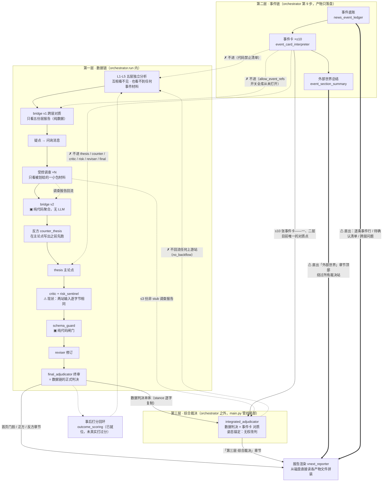
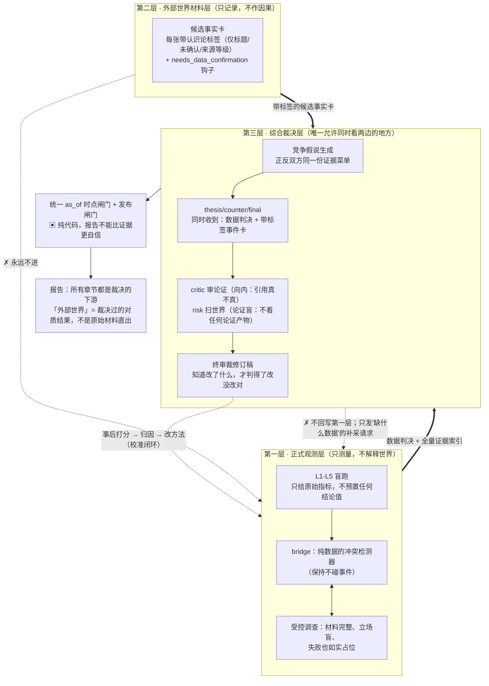

# 当前真实架构流程图 × 第一性原理理想架构 × 差距清单

> 2026-08-10。当前架构图全部来自代码实测（`架构校准报告.md` §二，每条带 file:line）；
> 理想架构从三层认识论（07-03 老文档，07-18 对辩"骨架不动"，08-10 拍板重申）+ 第一性原理推出；
> 差距清单的每一项标注证据与当前处置状态。
> 本文只画图、讲理、列差距，不改任何代码与文档。
>
> ⚠️ **勘误（2026-08-11 三明治重决策，所有者拍板）**：差距清单 G1**翻案**（事件只到 IA 是正确隔离，非"建了一半"）；G2 缩窄为"外部世界章节标签化"问题；理想架构图中"带标签候选卡进 thesis/counter/final"的接法作废——事件只进第三层 IA 一站。G3-G11 其余各项不受影响。依据：`investigation_reports/20260811_sandwich_redecision/三明治重决策对照稿.md`。

---

## 一、现在代码里真实在跑的架构

**读这张图要抓住的四件事：**

1. **两条链只在 IA 一个点相遇。** 数据链（上）和事件链（中）各自独立跑完，全系统唯一"同时看见两边"的站是 IA——而且 IA 不在主编排器里，是 `main.py` 在编排器跑完后从磁盘读文件拼起来的（`main.py:800-806`）。
2. **事件材料到报告有两条路，一条经过裁决（IA 章节），一条不经过（"外部世界"章节直出）。** 粗箭头那两条直出路径是 T47 与 08-10 拍板点名的"最坏组合"的一半。
3. **事件进不了治理链不是代码写死，是开关从没打开**：`allow_event_refs` 默认 False 且全库无调用方传 True（`packet_builder.py:365`），导致 `key_event_refs` 效果上恒为空。
4. **▣ 标记的三站（bridge v2、schema_guard、事后产物）是纯代码**，其余每个框都是一次独立 LLM 对话。

---

## 二、第一性原理：理想架构应该长什么样

不从"别人怎么做投研系统"出发，从四条不可约的事实出发：

**P1 · 判断质量的上限 = 每站实际看到的材料。** 模型再聪明，也只能用它手里的东西判断。所以架构的第一要务是**供给设计**：每站该看什么、禁看什么，必须是显式的、可审计的、机器可核对的。

**P2 · 独立判断的前提是信息隔离。** "五个分析员交叉验证"要成立，五个人就不能提前看到彼此的结论——否则五份报告是同一个结论的五份复读。隔离必须是代码强制的、事后可举证的，不是写在纸上的承诺。

**P3 · 测量与推断必须分开。** 数据回答"世界现在是什么样"（测量），新闻回答"世界上发生了什么"（材料），两者都可能撒谎或过时；只有把它们放进同一个证据权限框架里对质的那一站，才有资格写"这意味着什么"（推断）。推断站可以很多，但**消费两边材料的资格必须稀缺且显式**。

**P4 · 审查者不能和作者吃同一碗饭。** 挑逻辑漏洞的、扫未知风险的、做最终裁决的，如果拿到的材料和写作者圈定的一模一样，审查就退化成复读。独立性 = 输入的独立性。

由此推出理想架构：

**理想架构的五条硬性质（每一条都能用第一性原理推出为什么必须如此）：**

1. **一层只出"干净观测"**：L1-L5 的输入里没有任何预置结论（预置答案 = 把独立判断换成确认偏误，P2）。
2. **二层只出"带镣铐的材料"**：每张事件卡自带"我是什么级别的材料、哪条数据能确认我"（P3——材料自己能说什么不能说什么，跟着材料走，不靠读者记得）。
3. **三层是唯一对质点，且对质先于展示**：报告里凡是让事件材料露脸的地方，内容都必须先经过裁决站（P3——没对质过的材料直出，等于让读者自己做系统该做的功课）。
4. **审查站分料**：critic 向内审论证、risk 向外扫世界且论证盲、终审裁的是修订稿不是原稿（P4）。
5. **时点与共时性是硬闸门**：同一份报告引用的所有材料必须同属一个信息截止时点；判断做完要被打分，打分回流改方法（这是"判断质量随时间可测量地变好"的唯一通路）。

---

## 三、现有 × 理想的差距清单

> 状态列说明：【拍板已定】= 08-10 拍板记录已给方向；【待点头】= 拍板列为倾向/待确认；【已立案】= 工单在册未施工；【未立案】= 本次校准新点出。

| # | 差距 | 现状（证据） | 理想（原理） | 状态 |
|---|---|---|---|---|
| G1 | **事件卡只到 IA，到不了 thesis/counter/final** | 消费方全库只有 IA + 报告渲染 + 降级注记三处；`allow_event_refs` 开关全库从未打开（`packet_builder.py:365`、`main.py:721-725`） | 带标签候选卡进第三层全部裁决站（拍板⑥；P3） | 【拍板已定方向，未施工】 |
| G2 | **报告"外部世界"章节绕过裁决直出** | `vnext_reporter.py:3833-4035` 直接读事件底账与 ESS 产物拼装 | 展示必须先经对质（P3） | 【拍板已定性"最坏组合"，未施工；与 07-24"第三层不接管首页"裁决的边界待细化——两说 3】 |
| G3 | **L1-L5 输入预置本层结论 state** | `packet_builder.py:606` 硬编码阈值规则生成 state 喂给各层；L5 实证预置值与材料内信号方向相反（T47 C6） | 一层只给原始指标，结论是模型的职责（拍板⑤路线二；P2） | 【待点头】 |
| G4 | **critic 与 risk 吃逐字节相同的一碗饭** | 两站 Runtime Input sha256 一致（T47 A1）；30 条证据子集是 thesis 引用集的真子集、缺的恰是反证位（A2） | critic 向内审论证、risk 论证盲扫世界（拍板①④；P4） | 【拍板已定①，④待点头】 |
| G5 | **终审裁原稿不裁修订稿** | final 输入 19 个 thesis 字段与修订前逐字节相同（T47 A3） | 终审同时收原稿+修订稿+修订说明（拍板②；P4） | 【拍板已定，未施工】 |
| G6 | **反方原文对审查/裁决四站不可见** | 只有 thesis 的 hypothesis_responses 二手转述（T47 A4） | 反方原文进 critic/reviser/final（拍板③；P4） | 【待点头】 |
| G7 | **求真回路带伤运转** | 调查材料 3953 字符硬截断、立场声明与实物矛盾、失败调查静默缺席无占位（T47 A6/A7） | 材料完整、立场盲、失败如实占位（P1） | 【已立案（T47 常设检查+供给设计），未施工】 |
| G8 | **IA 许可闸门曾半瘫，止血后待复核** | 基线 run ref_authority 67.6% unknown（T47 A5）；08-05 T42① 改"许可从实发导出"（`integrated_synthesis_report.py:331`），尚无新 run 验证 | 许可 ⊆ 实发，构造上恒真（P1） | 【止血已上，待新 run 复核】 |
| G9 | **同名指标多值并存无 reconcile 闸门** | PE/OBV/expected_return 等横穿 ≥6 站逐字复制（T47 A11） | 一个数字一个出处，矛盾必须显式裁决（北极星"数字经得起独立重算"） | 【已立案（常设检查 8），口径裁决待拍板】 |
| G10 | **校准闭环只有前半段** | 打分器就位但零次真实打分（`现在.md` 系统现状） | 打分→归因→改方法闭环常开（P5/北极星第三支柱） | 【已立案 T09/T41】 |
| G11 | **文档架构漏掉整个第三层** | 系统说明书 387 行零次提及 IA/第三层（本次校准实测） | 文档是供给设计的载体，漏一站 = 下一轮融资不到对它的体检（P1） | 【未立案——建议 1 待点头】 |

**已追平理想的部分（如实记功）**：五层隔离（代码强制+实测干净）、不可回写、双轨盲跑、统一 as_of 时点闸门（W1，07-19）、反方先于正方跑（物理防走过场）、冲突是资产、宁缺毋滥（事件卡不足留白）、正反材料层对称（T47 阴性实测）、bridge 保持纯数据（拍板明文维持且实然一致）。

**一句话总结差距**：骨架早已是理想的骨架——三层分工、隔离、闸门都在；差距集中在**"第三层的接线只接了一半"**（G1-G2、G6）和**"审查站的独立供给没兑现"**（G4-G5），外加三处内伤（G3、G7、G9）。没有一项需要推倒重来，全部是接线和供给问题——这正是 08-10 拍板"配餐单"计划的用武之地。
