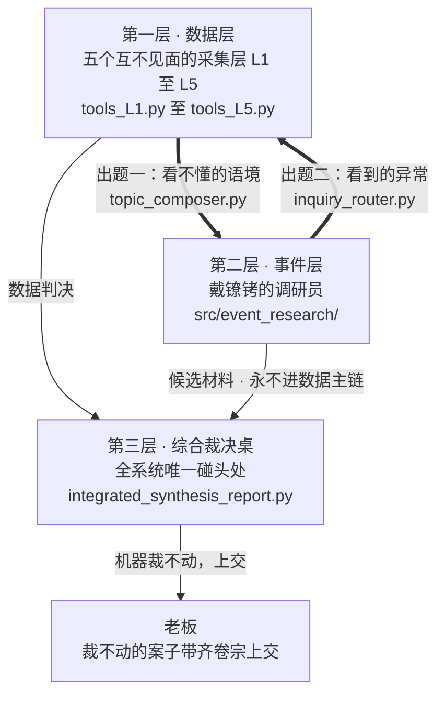
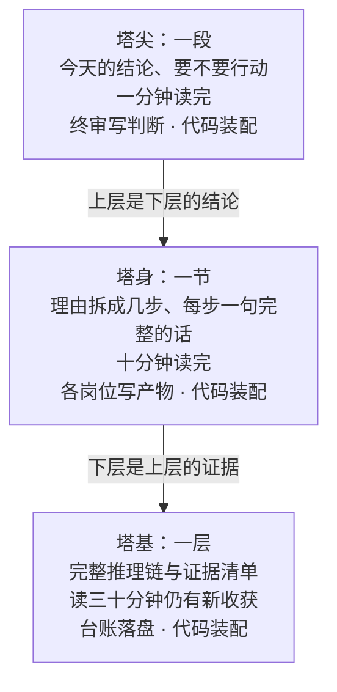
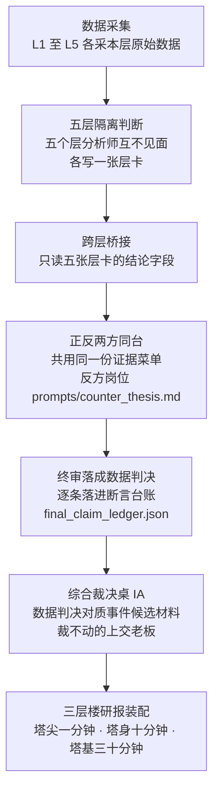

# 理想系统说明书

> 这份说明书写的是一个已经建成的系统：一套由 AI 驱动、为纳斯达克 100 指数（下称 NDX）做投资判断的研报流水线。它回答三个问题：这个系统是什么，为什么它必须是这个样子，它怎么运转。它不谈施工——施工图另有专文（`research_fundamental/Q8_whitelist/ideal_blueprint.md`），本文是宪法说明书：系统的每一处结构都要能答出"它从哪条原理长出来"，每一条原理都要能指回一个具体的机制和文件名。本文假设读者没有软件工程背景，真术语第一次出现时配半句人话解释。
>
> 全系统的存在理由只有一句话：做出可靠的 NDX 判断，覆盖短、中、长期，帮老板做出比"长期持有"更好的买卖决策。系统的全部产出围绕一份决策研报运转，下面五篇分别从哲学、金融原理、架构、实现、工程纪律回答"它为什么长这样"。
>
> 全系统如果只准记住一处结构，请记住双向提问回路：数据层看不懂的语境会变成事件层的调研题，事件层看到的异常会变成数据层的家庭作业，两个器官互相给对方出题。三层骨架决定系统看得全不全，这条回路决定系统看得远不远。

**全图先看一眼：三层骨架，两条反向的题。**

这张图要读出两件事：细实线是产物走的路，两条粗箭头是问题走的路；骨架保证互不污染，粗箭头保证互相出题。

***

## 第一篇 哲学篇：为什么这个系统必须长这样

系统的每一处结构都不是设计口味，而是五条哲学原理的推论。这五条原理没有一条是为 AI 发明的，它们原本是人类用来约束自己判断的纪律；系统做的事，是把纸面上的自律变成结构上的他律，让偷懒、自欺、和稀泥的冲动在机制里无处下手。康德的认识论决定系统必须分成两个器官、全身只留一个汇合点；金字塔原理决定研报必须是三层楼；波普尔的可证伪性决定每个判断必须自带失效条件；竞争假说决定多空两方必须同台对质；辩证法的主要矛盾决定裁决必须给出取舍原则。去掉任何一条原理，系统就有一处结构失去存在理由。

**康德：数据无语境则盲，语境无数据则空——所以系统分成两个器官，只留一张汇合桌。** 一组市盈率分位数字本身不告诉读者此刻它意味着什么，这是数据无语境则盲；一则新闻本身不告诉读者它是否已被价格消化，这是语境无数据则空。任何严肃的判断系统因此至少需要两个器官：一个管可重算的事实（数据层，真名是 `src/tools_L1.py` 至 `src/tools_L5.py` 五个采集层），一个管事实的语境（事件层，真名是 `src/event_research/`）。两个器官必须分开，因为它们的采集纪律相反：数据层要产出可重算的事实，就必须把新闻噪声挡在门外；事件层要抓住语境，就必须放开手脚去搜、去抓、去读网页——把两条相反的纪律塞进同一个器官，结果是两头都做不到位。

两边各自产出之后，全身只留一处把两边放上同一张桌子对质：第三层综合裁决（内部叫 IA，真名 `src/integrated_synthesis_report.py`）。汇合桌只能有一张，因为桌子若有两张，系统就会对同一件事给出两个结论，老板无法知道哪个算数。

**金字塔原理：结论先行、同层不重不漏——所以研报是一座三层楼。** 塔尖只有一段：今天的结论是什么、要不要行动，一分钟读完；塔身是一节：结论的理由拆成几步，每步一句完整的话，十分钟读完；塔基是完整的推理链和证据清单，读三十分钟仍有新收获。三层说的是同一件事，只是粗细不同：上层是下层的结论，下层是上层的证据，读者读到哪一层停下，手里都握着一个完整、可直接用的结论。这个形制由两件人脑事实反推出来：读者读研报的时间不固定，要读到结尾才给结论的报告会让只有十分钟的人颗粒无收；而读者是扫读的，前两段拿到最多注意力，所以注意力最高的位置必须放最重要的东西。形制规格的真名是 `ideal_blueprint.md` 第一节。

这座楼谁写、谁装配、各读多久，画出来是这样：

三层共用同一套事实，区别只在粗细；装配一律交给代码，理由第四篇展开。

**波普尔：一个判断必须事先说清什么情况出现它就错了——所以每个判断自带失效条件。** 可证伪性是科学哲学家波普尔划的线：一个说法必须事先写明"出现什么证据我就认输"，否则它永远正确、也永远无用。这条原理落到系统里是两个机制：每次运行的每条最终判断都带证据、反证、失效条件落进断言台账（真名 `final_claim_ledger.json`）；报告里的风险条款一律写成"什么情形发生→什么结论受影响"的条件句，不许写"市场有风险"式的万能免责，因为万能免责里不含任何可以事后核对的内容。

**竞争假说：互相排斥的解释必须同台竞争同一份证据——所以系统内设正反两方，冲突不许抹平。** 同一份数据可以配多个说法：一次回调可以读成"健康洗盘"，也可以读成"下跌中继"；如果场上只有一个解释，证据就只会被往一个方向读。系统因此专设一个反方假说岗位（真名 `prompts/counter_thesis.md` 对应的 AI 站），它的任务是造出最强版本的反对解释，并且它与正方论点岗位互相看不见对方的产物。对质的结果不许为报告顺滑而抹平：败方的说法和证据留在案卷里（冲突矩阵真名 `conflict_matrix`，逐行落盘），项目宪章把这条叫"冲突是资产"。

**辩证法：诸多矛盾里找最决定走向的那一对——所以裁决必须指明主要矛盾、给出取舍。** 在任何时点上，看多与看空的证据都同时存在，判断的质量取决于抓没抓住当下最决定走向的那一对矛盾。这条原理落到两个机制：终审判决必须写明本期主要矛盾（研报里有"主要矛盾"区块）；裁决的取舍按"两类错误代价的比较"来定——动手动错了亏多少、不动手错过了亏多少，哪边亏得狠，哪边重点防。这条取舍原则的金融形态，在第二篇展开。

***

## 第二篇 金融原理篇：系统拿什么认识 NDX

系统对 NDX 的认识从一个会计恒等式长出来：价格 = 盈利 × 估值。这个恒等式的好处是穷尽：任何一股推动指数的力量，要么作用于等式的某一项，要么作用于短期价格对等式的偏离，要么就是改写整个定价环境的外部事件，没有第四种藏身之处。把恒等式彻底展开，驱动力共有七类，系统用五个数据层加一个事件层覆盖它们，不重不漏。不是所有材料都有资格影响判断：证据要先过三关。证据够不够动手也没有统一标准：门槛按决策类型分三档，卖出的门槛低，买入的门槛高——门槛不对称不是心态保守，是算术：两类错误标着不同的价格，防线就该摆在不同的位置。

**七类驱动力与五层划分。** 七类力量依次是：①盈利，恒等式的分子，要测盈利水平、盈利预期、盈利预期的修正方向；②无风险利率，把未来的钱折算成今天价值的利率，由货币政策和通胀决定；③风险溢价，投资者为承担风险额外要求的补偿，市场报价是信用利差（企业债比国债多付的利息差）和隐含波动率（从期权价格反推出的市场对未来波动的预期）；④资金供需与参与者行为，即新钱多少、仓位挤不挤、情绪恐慌还是贪婪，它决定短期价格偏离均衡多少；⑤指数内部结构，因为 NDX 不是天然物体而是规则化合成物——最大的 100 家非金融公司、改良市值加权、季度再平衡，截至 2025 年底前十大成分股权重占 52%（`RESEARCH_CANON.md:259`），100 家一起涨还是前 10 家拖着走，风险完全不同；⑥价格趋势自身，它是前五类力量的最终结果，管执行节奏；⑦离散的外部事件，如疫情、战争、政策突变，它们直接改写整个定价环境，而不是让恒等式的某一项渐变。前六类可连续测量的力量由五个数据层覆盖：L1 利率宏观、L2 市场风险偏好、L3 指数内部健康度、L4 盈利估值、L5 价格趋势；没有两层测同一股力量，也没有一股连续力量无家可归（推导见 `research_fundamental/answers/Q4.md`）。第⑦类由事件层覆盖，因为事件是开关不是刻度，它的合理形式不是第六个指标层。

**证据资格三关。** 第一关是准入关：证据必须可核验且时点合法。可核验要求两条——来源可追溯（每个数字能指回出生证：哪个机构、哪个序列、哪天发布）和可独立重算（换一个不看原结论的人，拿同样的输入能算出同样的结果）；时点合法（英文叫 point-in-time，"当时可见"）要求证据的发布日期不得晚于判断的日期。过不了这关的材料可以记录、可以观察，但不许被引用，这叫隔离观察。第二关是分级关：证据强弱是连续谱，系统按来源权威度把证据分七档（从官方发布到来源不明，真名是 `src/data_evidence.py` 的 `source_tier` 字段），再按字段逐条发牌照——能定案的、只能旁证的、只能审计留痕的、永不许进引用的，越权发言直接拦截；弱来源不是扔掉，是关进"只能旁证"的隔间。第三关是对称关：同一份证据对利好和利空用同一把尺测量，多空同一份菜单；唯一合法的不对称是明示的防自欺条款——对容易被误读成利好的信号额外加限制，且必须明写出来，例如"波动率期限结构平静时，不得引用为看多证据"（`src/tools_L2.py:575-580`）。

**三类决策的证据分界线。** 门槛高低的本质是算账：动手动错了亏多少，不动手错过了亏多少，哪边亏得狠哪边重点防。

逃顶（在大跌来临前减仓离场）的分界线低。错过顶的代价是本金毁灭：NDX 在 2000 年顶后跌去 83%，含分红再投资也要 14 年 11 个月才回本；2007 年顶后跌约 53%；2021 年顶后跌 35.1%（数字均为有来源的大致水平，明细在 `research_fundamental/QH/evidence_boundary.md`）。错杀回调的代价只是一次摩擦：趋势没坏，过几周买回来，亏几个百分点的价差。一边以年计、一边以点计，所以两类以上互不相关的证据同时变坏——典型的是利率政策转向、信用利差触底回升、市场广度（指数成分股里有多少股票还在跟着涨）背离三样里占两样——就该减仓，宁可错杀。

黄金坑（恐慌抛售砸出的、事后证明是真正底部的买入机会）的分界线高。接飞刀（把下跌中继当坑买）的亏损会复利放大：2000 年顶之后，指数在一年多里出现过三次两到三成级别的反弹，每一次事后看都是中继；而错过最低点只是机会成本，本金还在，多数底部有回踩确认。所以买坑必须三样确认同时到场：恐慌情绪到历史极值区、信用利差见顶回落或有政策直接兜底、市场广度在反弹中开始修复，缺一不可，宁可买贵几个点。

健康回调与真正的顶，在下跌的第一段里原理上就分不出来：两者开场长得一模一样，区分它们的信息是下跌发生之后才诞生的——利差要跌了一段之后才分出方向，广度背离要等"指数反弹而成分股不跟"这个动作发生后才能观测——所以下跌初期系统只给降风险动作，定性判断留给下跌后的第一个反弹窗口：反弹里广度修不修、利差收不收、盈利下修停不停，三问的答案合起来才是分界线。

**这套分界线有实证地基。** 研究取证了 2000 年、2007 年、2021 年三个顶和 2020 年一个坑（每个数字带来源，见 `evidence_boundary.md` 第二节），三条发现必须点名。其一，信用利差触底回升是四次案例里唯一全勤的预警信号，领先时间从 9 天到 4 个月不等——它确认方向，但不给精确倒计时。其二，估值只定级别不定时机：2000 年估值极端到离谱却持续了一年多，2007 年估值处于历史正常区间、全程沉默——估值贵可以贵很多年，它的正当用途是定"万一跌下来坑有多深"的危险级别，不是定买卖点。其三，2020 年证伪了"黄金坑必须信用未穿透"这条旧教义：那年高收益债利差冲到约 1087 个基点，远超此前任何一次回调，但冲击是外生的、政策以史无前例的速度直接买断信用风险，坑照样成立——所以要件修订为"信用冲击属外生一次性、或有政策兜底"。

***

## 第三篇 架构篇：三层骨架怎么运转

系统的骨架是三层：五层互相隔离的数据层、在硬性限制下调研外部世界的事件层、以及唯一的综合裁决桌。这三层值钱的地方不在各自多能干，而在层与层之间三道刻意守住的"不"：数据层内部互不见面，事件层永不进数据主链，裁决桌裁不动就不裁。层间隔离不是为了整洁，是为了让"交叉验证"四个字为真；事件层的限制不是不信任调研员，是让网页材料永远不能以证据身份混进数据主链；裁决桌不是汇总处，是把冲突显性化、把裁不了的案子上交人的地方。

一次判断从数据采集到研报成形，完整旅程画出来是这样：

读这张图时记住次序：终审先把数据判决落成文字，判决再端到裁决桌上，与事件层的候选材料对质。

**数据层：五层互相隔离。** L1 至 L5 各配一个层分析师岗位，五个岗位运行时互相看不见对方的任何材料，各自只读本层事实与原始数据。隔离的理由是一条认识论纪律：如果五个岗位互相看得见，一个层的判断会传染其他层，五张层卡实际是一个判断的五次复述，"五层一致"就不再是交叉验证。隔离同时是 AI 性能手段：实测证明，"像答案的错材料"——主题相关、但这个岗位不该用的材料——比完全无关的材料更能把 AI 带偏（依据见 `research_fundamental/answers/Q6.md`），所以刻意让某个岗位看不到某些东西不是信息缺失，是物理拆除干扰项。五层之间唯一的汇合通道是跨层桥接岗位：按蓝图菜单，它只读五张层卡的结论字段和候选跨层关系清单，不读指标级逐字叙事（诚实声明：现状实测相反——它目前收到的是层卡整包约 13.8 万字符、含逐字叙事，属待重建项，实测见 `research_fundamental/Q6/context_audit.md`）。

**事件层：戴镣铐的调研员。** 事件层是一台自造的自主调研框架（内部叫 DSH，真名 `src/event_research/`）：老板或宪章出一道题、给一张经费卡（每次调研的 token 花费上限，token 是 AI 的计费字数；卡面默认 3000 万，日常巡逻档 300 万，真名 `budget.json`），调研员自主上网搜索、抓取、写材料卡。镣铐指它的四副硬性限制：经费卡超额即硬停，每次发模型请求前机器先查账，超额请求根本发不出去（`hooks/budget_gate.py`）；抓取目标有域名白名单，不在名单里的来源直接拒抓（`hooks/fetch_gate.py`）；每张材料卡的每条事实必须指回某次抓取的原文，由对账器逐条核对，引文对不上抓取记录的卡被降级（`reconcile.py`，相似度阈值 0.8 是老板 2026-08-26 拍板）；产物永远以"候选材料"身份流向第三层裁决桌，红线写在代码里——永远不进数据主链（`src/event_research/__init__.py`）。

**综合裁决：唯一的汇合桌，双向对质。** 数据判决与事件材料在全系统只在 IA 这一处碰头。桌上的规则有四条：冲突显性记录，每张事件卡一行对质记录，败方说法留在案卷里；双方证据地位对称，双向都可以被改判，任何一方的结论在原则上都必须能被另一方动摇——只允许单方赢的规则不是对质，是听汇报；改判门槛按证据硬度分级，对称不等于平权——事件层材料来自网页抓取，天然比数据层的官方数字软，所以它掀翻数据锚的门槛高于反方向；机器按规则裁不动的，带齐双方卷宗上交老板。裁决规则在冲突发生之前写好，因为事后定的规则一定会偏向当时占上风的那一方。桌上另有一盏保留的红灯：经核实的外部事实与数据判决正面冲突时，报告第一屏亮起抗诉横幅（常设检查 PC-28，真名 `persistent_checks_b.py`），这是全系统承认"数据层可能错"的专用通道。

**双向提问回路。** 第一次看架构图的人多半盯着三层骨架，但图上最值钱的不是骨架，是骨架之间那两条反向的题：骨架保证看得全，出题保证看得远。数据层和事件层互相给对方出题。正向回路已建成在跑：每次运行收尾时，出题官岗位（`topic_composer.py`）读六站对抗残局——桥接未解问题、跨层开放题、终审主要矛盾、家里数据能力清单——写出零到两份调研任务书，经缺口桥（`gap_bridge.py`）转成候选议程，落进议程账本（`event_agenda.jsonl`，老板关闭的题不复活）。反向回路把事件层的题变成数据层的家庭作业：事件层在新闻主线里发现"这事数据层该回答"的问题（由 `event_narrative_ledger.py` 的纯代码出题工厂产出，带 `event_to_data` 标记），这一截的建成状态要如实说：出题工厂已建成在跑，但"把题路由成数据层受控调查任务书"的接线是蓝图规格、尚未建成（挂点真名 `inquiry_router.py`，新器官建造时接通，规格见 `ideal_blueprint.md` 2.3 节）；接通后沿用既有纪律——调查报告不得回写五张层卡。提问回路保证系统的问题清单不被单一器官垄断：数据层看不懂的语境变成事件层的题，事件层看到的异常变成数据层的题。

***

## 第四篇 实现篇：代码与 AI 各干什么

系统把判断留给 AI，把其余一切留给代码。这条分工换个说法更好记：把 AI 从一切不需要读懂内容就能验收的活里开除——AI 每转抄一次编号就多一次笔误机会，代码每冒充一次"读懂意思"就多一面假红牌，而假红牌会训练人无视真红牌。划界的尺子只有一把：验收方式决定归属。每个 AI 岗位按职责领一份上下文菜单，必要且充分、一块不多；最重要的材料摆在开头和结尾两个位置。闸门只留不读懂内容就能判对错的四种；意思层的规矩不住在代码里，住在岗位说明书和老板的复核里。

**Context-first，role-second。** 系统拆分 AI 岗位的理由是上下文隔离和认知变换的边界，不是模仿人类职位——先想清楚"这段判断需要什么样的上下文、不能看见什么"，再决定设几个岗位。需要 AI 出判断的岗位，数据侧十四类、事件侧四类，共十八类，每个岗位各领一份职责菜单（逐站菜单表的真名是 `ideal_blueprint.md` 2.1 节）：五个层分析师各判本层状态；跨层桥接判候选关系哪些成立；受控调查一次只答一个问题；正方论点给方向性结论；反方假说造最强反对解释；批评者挑论证的错；风险哨兵刻意看不到论点论证，独立问"什么会让我们错"；修订者按批评意见改稿；终审落成判决；IA 主持对质桌；事件层一侧，事件卡一次只写一件事、事件总结压缩卡片、调研员按议程调研、出题官读残局出题。菜单由职责推导：做这个判断所需的最少材料，加判断规则，加可用资源清单——每块材料进上下文之前先回答"不喂它会怎样"，答不上来的不喂。这条纪律有反面教材：反方假说岗位曾被一次灌进 32.4 万字符材料，其中约 15.4 万是落盘备查的证据审计底账——按"AI 读长材料丢中段、材料变长伤性能"两条实测特性，这个体量已深入性能退化区（依据见 `research_fundamental/answers/Q6.md`）；正面样板是受控调查岗位，材料有 1.2 万字符的代码硬顶且按相关性筛过。

摆位也是设计变量，不是排版偏好：岗位干什么放开头，输出硬约束和必须逐条回应的清单放结尾，因为 AI 读长材料时开头和结尾记得最牢；中段只放供查阅的参考材料，不放必须逐条执行的指令。

**代码与 AI 的分工：验收方式决定归属。** 对流水线里的任何一件活，只问一个问题：验收它需不需要读懂内容？不需要读懂内容就能判对错的活——编号在不在清单里、枚举值合不合法、数字在不在代码预生成的允许菜单里——归代码；必须读懂语境、权衡冲突才能判对错的活——这个跨层冲突的严重度是否与证据相称——归 AI。由这把尺子推出一条铁律：机械字段不出答卷——凡代码能确定性生成或回填的字段（身份名、枚举值、编号、时间戳、引用键）一律由代码装配，AI 碰不到。实现形态有两种：一种是模型报序号、代码回填编号，设计原话是"抄写笔误物理不可能"；另一种是严格表单锁，把"代码填"的字段从发给 AI 的表单里物理剪掉，AI 根本见不到抄写任务（真名 `llm_engine.py` 的表单剪枝登记）。边界划错方向各得一种病：代码的活派给 AI，AI 变成抄写员，转抄必出笔误，簿记还挤占判断的注意力；判断的活抢给代码，代码变成假闸——用关键词词表冒充"读懂了意思"，误伤合法写法、放过真问题，还挂出名不副实的红牌，训练人无视红牌。

**闸门只留四种。** 闸门是代码里的校验点：AI 的产物送到下一站之前，闸门先检查一遍。系统只保留不读懂内容就能判对错的身份与形状校验，共四类。身份闸：编号、引用、枚举值必须在许可清单里；正面样板是第三层的引用白名单，许可集合从实际发送给 AI 的材料里导出，"许可集合 ⊆ 实发集合"恒真（`integrated_synthesis_report.py`）。形状闸：每个岗位的输出必须过契约校验（`contracts.py` 定义全部岗位输出的数据形状）。装配闸：防装配错误的检查一个不减——判决里的数字必须在代码预生成的数字菜单里或挂着证据编号；证据发布日期不得晚于判断日期的时点闸；数据完整性检查；重算带（`recompute_belt.py` 的 16 个函数用原始序列独立重算分位与比率并与管道比对，是"代码自己重算、不要求 AI 自证"的样板）；常设检查 28 项（落盘产物之间的身份与计数对账）。资格闸：来源七档分级、字段级牌照、四类硬阻断，是数据层的既有防线（`data_evidence.py`）。位置纪律只有一条：只有身份与形状闸有资格站拦截位（失败打回重写），因为拦截位一次误伤就烧掉一整次 AI 调用，只有充要条件的机械判定做得到误伤面近零；意思层检查若保留，一律站留痕位（只在报告里记一笔），留痕位的误报多到读报告的人学会无视它，信号价值归零，等同废除。

**意思层的道住在哪里，范例必须亲自达标。** 要读懂语境才能判对错的规矩有三个去处：需要判断力的写进岗位说明书，说明书只约束"AI 必须交代什么判断"，不替代码复读规矩；终审判决的意思层质量由老板拿验收卡抽查；能由代码消灭检测对象的直接消灭——某个字段改由代码装配之后，"字段与正文不一致"在物理上无从发生，对应的检查器随之删除。范例按发布物管理，因为实测证明示例只教腔调不教内容：示例里出现一个立场，输出就染一分；示例的措辞风格会被当成目标风格模仿。所以每个层站最多配四条范例（机制真名 `few_shot.py`），且范例发布前须经选型审查（这条纪律出自 `research_fundamental/answers/Q6.md`）；反面教材是范例库曾亲自示范"引力拉满""空心胜利"这类没有定义的生造词，研报里的同类缺陷与它逐字同构（验尸记录在 `research_fundamental/Q8_whitelist/content_autopsy.md`）。

**三张验收卡与老板的席位。** 系统的产出靠三张固定检查单验收。卡一是三层楼语言卡：塔尖一分钟抽查（逐句找主语、必须有方向性断言），塔身十分钟抽查（每个理由完整、争议判断多空两侧都有代表性论据），塔基三十分钟抽查（随机抽一条推理链读到底不许断、抽十个数字逐个要出生证），三层分开打分、互不代偿。卡二是上下文菜单核对：系统每次运行把每个岗位的提示词逐字落盘（`prompt_audit` 目录），拿落盘件对照菜单表逐站打勾，六个核对点都不需要读懂内容。卡三是闸门五问：没有它判断还能否被信任地交付、它守的规矩能否一句人话写出、能否构造出误伤与漏检两个反例、误伤成本配不配它占的位置、这条规矩最终归谁守。机器只管形状，意思归人：老板是意思层的最终判官，他的验收动作叫人复述——把报告交给不了解前因后果的人，对方能复述出"说的是谁、会怎么样、我该干什么"才算过关。

***

## 第五篇 工程纪律篇：系统凭什么值得信

系统的可信度不来自它聪明，来自它守纪律。一个永远有答案的系统让人不敢托付，一个会说"这里我测不到、这份是半成品、这个分数别全信"的系统才敢托付本金：可信的反面不是犯错，是犯错不留痕迹。纪律有五条：每个数字能独立重算、能指回出生证；每个判断落账、每次调研记账、每次调研有花费上限；证据尊重时点，宁可报错也不拿今天的数据冒充历史；已知的盲区如实登记；说不准的地方明说说不准。

**事实扎实。** 这条纪律有三个具体要求。其一，数字可独立重算：换一个不看原结论的人，拿同样的输入能算出同样的结果——价格层快照带哈希指纹（一种防篡改的数字指纹，供他人复算比对，真名 `tools_L5.py` 的 `ohlcv_sha256` 字段），重算带用原始序列独立重算并与管道比对。其二，来源可追溯：每个数字能指回出生证——哪个机构、哪个序列、哪天发布、来源定哪一档。其三，时点纪律：投资判断的本质是"在 T 日，用 T 日已经公开的信息做决定"，晚于判断日期的证据不许进上下文；回测（用历史数据假装回到过去做判断，以检验系统）里混进一条未来数据，整个回测作废。所以执行方式是宁可缺、不可假：拿不到历史成分股名单就硬失败，绝不落回当前名单（`tools_L3.py` 的幸存者防线）；只在实时可用的数据源进回测时直接拒答并写明理由。数据缺口不藏：哪个指标本轮不可用、为什么不可用，由数据可用性登记处（`data_availability.py`）如实写进数据边界。

**台账体系。** 系统的记忆是几本账。判断落账：每次运行的每条最终判断带证据、反证、失效条件落进断言台账，这是事后能对每个判断打分的前提。议程记账：事件层的每道调研题落进 `event_agenda.jsonl`，只追加不改写、编号永不复用。经费记账：每次调研的花费上限落在卡面，每次模型请求前查账，超额硬停；钱花超了，已采材料照常落盘，产物标"半成品"。另有一本特殊的账：方法修正台账（`method_revision_ledger.jsonl`）是修改系统判断方法的唯一合法入口，每条要求老板批准、挂真实代码提交号、带复查日期；系统里专设一道闸门查提交号的真伪（`state_ledger.py`），这是全系统唯一"查代码提交真伪"的闸门。

**校准闭环：按老板裁决延后的明确交代。** 校准闭环指一个三段回路：判断先落账；事后拿真实行情给每个判断打分，看兑现了还是打脸了；再用评分结果回头修正判断方法。系统里前两段建成在跑：打分器（`outcome_review.py`）在判断满 20 个自然日后按写死的阈值、用三个时间窗口（判断后 20、60、120 个自然日）给每条判断打出"兑现、打脸、没法判"三档，分数落盘落账。第三段按老板 2026-09-20 的裁决整体延后：分数不进任何岗位的提示词或权重，方法修正只经老板手工批进方法修正台账。这个断是有意设计，不是烂尾，两条理由如实登记：打分器目前靠关键词判定方向（判断文本里含"进攻、买入"就判看多），它每份产物里都内嵌一句坦白——"本分数优先作为数据问题探测器使用，不代表对判断质量的最终结论"，让这样粗糙的分数直接指挥系统，只会污染判断；分数进提示词还会扩大时点泄露面。闭环在现阶段的正确形态是前半截保持自动、最后一截先接到人：打分汇总定期摆到老板面前，哪条教训值得写进方法修正台账，由老板亲自定。

**局限与诚实声明。** 四处已知的边界如实登记。其一，系统测得到事件的后果——波动率飙升、利差走阔——测不到事件的性质是外生还是内生：2020 年 3 月利差爆炸像崩盘，实际却是十年最大的黄金坑，所以"最近有没有大事发生"这一问只能由老板补。其二，三个已知缺口登记在案：信用利差的官方免费长历史正在消失（FRED 的 ICE/BofA 利差序列自 2026 年 4 月起只保留三年观测，而它恰是四个历史案例里表现最好的证据家族）；情绪拥挤度在历史和实时都没有分位刻度，系统对疯牛末期的定级偏盲；四个广度指标共用单一数据源，区分回调与顶的核心证据押在一条数据源上。其三，打分器积累至今的分数分布没有人统计过——不知道，验证方法是等打分记录落盘后读 `output/state_ledger/claim_outcome_ledger.jsonl` 做分布统计（核验时该文件尚未在盘上生成，说明尚无比分成熟到期的记录）。其四，机制有"只增不减"的体态风险，对抗手段是年检：每年按同一收录规则重跑一遍闸门普查、再拿五问过一遍堂，不许废物机制重新堆积。另有一句对本说明书自身的交代：它按建成后的状态陈述系统；其中事件层反向提问回路的接线规格在取证时是按现成挂点推导的决定（`ideal_blueprint.md` 2.3 节有诚实声明），它的实际建成状态以验收卡二的逐站实测为准。
