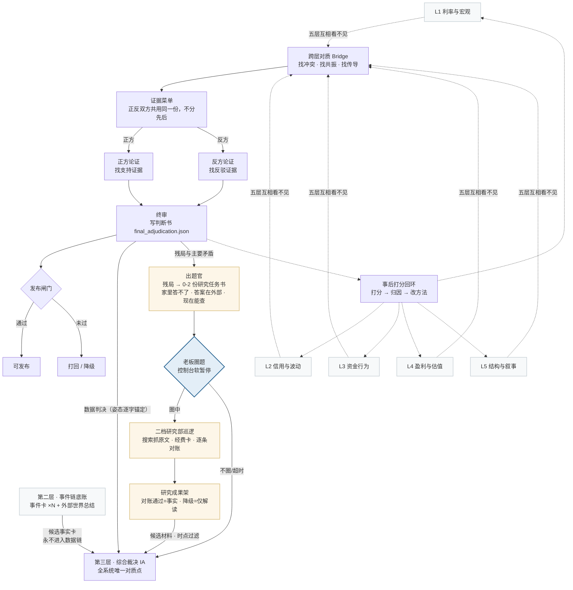

# NDX vNext 系统说明书

> 写给谁看：这份文档人和 AI 都能读。如果你是**系统的所有者**（投资决策者，不是程序员），读完你应该能自己判断三件事：这套设计合理吗、这里是不是在乱花钱、哪些地方还没人真正替你验证过、需要你自己盯着。如果你是 **AI / 工程师**，这份文档是系统的总纲：先看第一节地图建立全局，再看第二节逐站点说明理解每一站的职责与隔离，最后看第四节原则与概念（那是最不能破坏的部分）。
>
> 本文由三份旧文档合并而来（2026-08-08）：原《系统说明_人话版.md》为正文骨架；原《系统地图.html》卷宗 01 的全局流水线图改为 mermaid 流程图置于第一节；原《ARCHITECTURE.md》的长期原则与核心概念并入第四节。原《系统地图.html》卷宗 02/03（事故解剖、保护分布）是结构病诊断素材，已归入 T47 上下文根本性审查工作，不再属于本说明书。
>
> 指标判读标准见 `RESEARCH_CANON.md`（给 AI 自己看的指标判读法典），本文不重复其写法。
>
> 两个绕不开的词，先说清楚：
> - **LLM（大语言模型）**：就是 ChatGPT、Claude 这类"读一段文字材料、按要求写出另一段文字"的 AI 模型。这套系统里几乎每个"判断步骤"背后都是一次独立的 LLM 对话——给它一包材料和一份"说明书"（下文说的 prompt），让它按说明书的规则输出一份结构化结论。
> - **token（词元）**：LLM 读材料、写答案时计费和计算量的最小单位，大致可以理解成"字/词的计量单位"（中文一个字常常算不止 1 个 token）。材料越长，读入的 token（术语叫 prompt tokens）越多；模型自己写出来的答案对应的 token（completion tokens）通常小得多。本文第三节会用真实数字说明这套系统一次判断到底"读"了多少材料、"写"了多少结论。

---

## 零、系统地图：判断书是怎么造出来的

先看全局。系统只做一件事：把纳指100（NDX）相关的多方数据，变成一份可以逐条追溯来源的投资判断书。五个分析员各自独立看自己那摊数据——利率与宏观、信用与波动、资金行为、盈利与估值、结构与叙事——然后跨层对质找冲突，正反双方拿**同一份"证据菜单"**（这次可以引用哪些证据的清单）辩论，终审写成判断书。判断做完不是终点：它还要在事后被打分，打分结果反过来修正方法。

配图：`系统架构图.html`（2026-08-26 重绘，浏览器打开，含二档研究部全链路）；下面是同口径的 mermaid 简图。

**这张图要读出的五件事：**

1. **五层互相看不见，是刻意设计，这条边界叫层间隔离。** L1-L5 只共享静态规则——五层框架各自的职责、纳指怎么定义、本层指标该怎么判读——不共享"这次谁看到了什么、判断了什么"。这不是写在纸上的承诺：审计时用真实提示词逐层核对，五层"是否出现跨层信号"的字段全部为空，跨层的函数名只出现在格式示例里、从不带数值。
2. **正反双方（论点建构与反方两站）拿的是同一份证据菜单。** 菜单在代码里是同一个对象，做不出"给反方少发材料"这种事——"菜单先天偏科"这种失败模式，实测不存在。（注意别和另一条链搞混：批评者与风险哨兵属治理链，08-15 起刻意分料不同，见 2.5/2.6——那是设计，不是偏科。）
3. **发布闸门**是判断书出口的一道关卡：产物一旦被判定 blocked 或 unpublishable，就不能再被当成可发布结论继续使用。
4. **事后打分回环**是校准闭环：判断做出之后，等一段时间检查它对没对，再把结果用来修正方法——这是判断质量能不能"随时间可测量地变好"的关键一环。
5. **虚线全部代表"刻意不联通"**——隔离是资产，不是缺陷。

---

## 一、整条流水线先看一遍地图

一次完整的"NDX 该怎么判断"，背后不是一次 AI 对话，而是十几次相对独立的 AI 对话接力完成，外加几段纯代码检查。每一棒只允许看被明确许可的材料，看不到别的棒在说什么、想什么。这是反复要讲清楚的设计核心：**不是在模仿一家公司的部门分工（宏观组、估值组、风控组……），而是刻意用"信息隔离"防止上一个判断污染下一个独立判断**。如果不隔离，最后你看到的所谓"五层交叉验证"，很可能只是同一个结论被复述了五遍。

真实执行顺序（读自 `src/agent_analysis/orchestrator.py` 的 `run()` 方法）：

1. **L1-L5 五层独立分析**——五个专家各自只看自己那一层的数据，依次产出五份互不知情的报告。
2. **桥接 Bridge 第一版**——读五份层报告，画出层与层之间"谁支撑谁、谁和谁打架"的关系图。
3. **反馈调查支线（紧跟桥接的独立环节）**——桥接发现自己判断不了的疑点、以及代码自动检出的材料缺口，会写成一批"求证问题"，交给一个"受控调查员"去查；调查员只能看被明确划给它的一小包材料，不能自己上网查、不能自由翻阅其他文件。
4. **桥接第二版**——把调查结果吸收进关系图，形成修正后的最终桥接结论。**这一步不是 AI**，是纯代码聚合。
5. **反方 Counter-Thesis**——在正式主论点还没写出来之前，先逼一个"反方角色"构造出目前证据能撑起的最强对立解释。
6. **事件链生成**（事件卡 ×N + 外部世界总结）——它在编排里的真实位置是反方之后、论点之前，但属于**第二条独立的链**（见本节末段与 2.10），产物不进入数据链任何一站。
7. **论点建构 Thesis**——读桥接结论和反方假说，写出主论点、赔率判断、分仓位的行动建议。
8. **批评者 Critic + 风险哨兵 Risk Sentinel**——两者同时对主论点开火，一个专挑逻辑漏洞，一个专列风险边界（自 2026-08-15 起分料：critic 拿论点论证 + 压缩证据包；risk 论证盲，只拿冲突清单 + 各层摘要 + 压缩证据包，见 2.5/2.6）。
9. **结构检查 Schema Guard**——**这一步不是 AI**，是纯代码脚本，核对桥接的证据引用是不是编的、它标出的高严重度冲突有没有被论点建构偷偷弄丢、复合指标子项有没有越权升格。没通过且属结构性缺失，就触发批评者和风险哨兵各重跑一次。
10. **修订者 Reviser**——吸收批评和风险意见，产出修订稿，但被明确要求"不许把结构性冲突改没了"。
11. **终审 Final Adjudicator**——写最终判决书，包括给读者看的人话结论和给系统自己看的内部质量闸门判断。至此，**第一层的数据报告完成**。
12. 判决书写完之后，还有一串**纯代码**的收尾工序：把最终结论拆成一条条可复核的"证据台账"（claim ledger）、生成一份"用户决策画像对照清单"、生成运行复盘和事后复盘记录，并生成 27 项常设机械检查（PC-01~PC-27）报告 `persistent_checks_report.json`。这些不是新的 AI 判断，是对上面判断结果的结构化整理和审计留痕，本文档不展开。
13. **出题官 Topic Composer**（2026-08-26 新增，AI 一步）——读六站对抗的残局（桥接没答了的疑点、跨层开放题），对着"家里能力清单"（现有数据指标表）论证"家里答不了"，酿成 0-2 份**研究任务书**（题目/为什么现在问/连着哪个矛盾/家里已知/验收标准/认错条件）。判据是老板定的：家里答不了、答案活在外部世界、现在就能查，三条缺一不可；"本期没有好课题"是合法输出。数据侧缺口（该采没采的指标）分流进 data_gaps 清单，不花巡逻的钱。
14. **同步巡逻（软暂停）**——系统停下来，把任务书亮在控制台（或终端）上等老板圈题；**圈中的题当场由二档研究部巡逻**（联网搜索抓原文，经费卡封顶，每条事实对回原文），成果经消费端过滤后放上"研究成果架"。没人理就超时跳过，run 永不等人；回测 run 整体跳过（时点纪律）。
15. **第三层综合裁决 IA**——它**不在主编排器里**：由管线尾部（`src/main.py` → `src/integrated_synthesis_report.py`）从磁盘读取数据判决、事件卡与研究成果架，组装后做一次独立的 AI 对质（见 2.11）。这是全系统唯一"同时看见数据侧和事件侧"的一站。

**另有一条完全独立的新闻事件支线**（Event Card Interpreter + Event Section Summary）：它把采集到的新闻事件加工成一批带认识论标签的"事件卡"（仅标题标仅标题、未确认标未确认，每张卡带"哪条数据能确认我"的钩子）和一段"外部世界对照"总结。这条支线从头到尾**不进入上面的数据判断链路**——L1-L5、桥接、治理链各站都拿不到事件材料；体检时发现这些站的事件字段**为空是正确隔离，不是断供**（三层架构见 4.7）。~~唯一受控的例外：调查员读事件层文件回答"事件挑战"类疑点~~——**该例外已于 2026-08-25 老板裁定拆除**：事件侧求证转给二档研究部（08-26 起经出题官酿成研究任务书、老板圈题后巡逻；cross_layer_questions 留在 IA 对质通道由数据作答），调查员回归数据侧本分，隔离恢复无例外（PC-06 机器断言调查员材料块不得引用事件侧 artifact）。事件材料的消费端只有两处：**第三层综合裁决 IA**（与数据判决对质，见 2.11），以及报告的"外部世界对照"章节——后者是第二层独立报告的展示位，内容必须带认识论标签、不得冒充经过裁决的结论。这是 `CLAUDE.md` 里"弱来源不进主链"这条硬规矩在代码里的具体落地。

下面第二节对每一个站点用固定的四个问题展开说明。

---

## 二、逐站点说明

### 2.1 L1-L5 五层独立分析（五个站点，一次说清）

五层分工：**L1 宏观流动性**（利率、通胀预期、流动性）、**L2 风险偏好/信用**（VIX、信用利差、恐贪指数）、**L3 指数内部结构**（多少只股票在真涨、还是少数龙头硬撑）、**L4 估值**（贵不贵、有没有安全边际）、**L5 价格趋势**（趋势是否有效、有没有过热）。五层的说明书文件几乎是同一个模板套五遍：`src/agent_analysis/prompts/l1_analyst.md` 至 `src/agent_analysis/prompts/l5_analyst.md`。

- **这一步在回答什么问题？** 每一层只回答本层职责范围内的那一个问题，例如 L4 只回答"当前价格相对盈利、现金流、无风险替代收益是否有吸引力"，不判断趋势何时反转（那是 L5 的事）；L5 只回答"趋势是否仍然有效、有没有过热"，不判断估值是否合理（那是 L4 的事）。五层都被明确禁止直接给买卖建议——那是后面论点建构和终审的事。

- **它凭什么有资格回答（能看到什么材料）？** 只能看自己那一层的原始数据（比如 L4 只能看估值、盈利收益率相关的数据字段）、本层的事实摘要，以及一份"静态五层说明书"（帮它理解 L1-L5 各自的职责边界，但不含任何当前数据）。

- **它被明确禁止看到什么、为什么？** 这是五层设计的核心。代码里有一份显式的"层级输入政策"（`_build_layer_input_policy`），白纸黑字列出每一层被**禁止**接触的东西：其他四层当前的原始数据和结论、候选跨层关系、桥接结论、论点、批评、风险报告、修订稿、终审结果、调查报告，甚至新闻事件材料。原因很直白：如果让 L4（估值专家）提前看到 L5 说"趋势很强"，它很容易在潜意识里把"趋势强"当成"估值可以更贵"的理由，那五层就不再是五个独立判断，而是同一个结论的五份复读稿，交叉验证也就失去了意义。**注意五层是依次执行的（L1 跑完跑 L2……），不是同时进行，但顺序不影响隔离——关键是运行时谁也看不到谁的当前结论。**

- **它失败了会怎样？** 每一层最多尝试 2 次（第二次会把上一次的报错原样告诉模型，让它自己修正）。如果两次都没通过格式和内容校验，代码会直接抛出错误，**整条流水线在这里崩溃退出，不会产出报告**。已经跑完的层（比如 L1、L2、L3 已经成功，L4 失败）产物文件会留在磁盘上，下次重跑可以从这个断点接着跑，不用从零开始，但当次运行不会有最终判断书。

- **答卷里的机械字段（T54，2026-08-17）**：层卡的层级号、指标展示名、六个法典字段（发言权类型、指标正问、误读防线等）、覆盖自检编号都由代码装配——法典是唯一权威；模型对法典值有异议写 `canon_dispute` 自由文本（进审计区）。`function_id` 仍由模型自报，但代码拿输入键集校验：抄错一个字、且有唯一高相似近邻的直接回正，配不上的打回重写，绝不按位置硬配。

**分层职责速查表：**

| 层 | 回答的问题 | 关键数据举例 |
|---|---|---|
| L1 宏观流动性 | 当前宏观环境在给估值"加油"还是"抽油" | 政策利率、实际利率、期限利差、净流动性 |
| L2 风险偏好/信用 | 市场愿不愿意冒险，这种冒险健康吗 | VIX、高收益债利差、恐贪指数、拥挤度 |
| L3 指数内部结构 | 上涨是大部队推进，还是少数龙头孤军深入 | 腾落线、涨跌比例、Top10/M7 权重集中度 |
| L4 估值 | 当前价格相对盈利/现金流是否有吸引力 | PE、Forward PE、盈利预期修正、简式收益差距 |
| L5 价格趋势 | 趋势是否有效、有没有过热、失效点在哪 | 均线排列、RSI、MACD、ATR、成交量 |

---

### 2.2 桥接 Bridge（含反馈调查支线）

说明书：`src/agent_analysis/prompts/cross_layer_bridge.md`；调查员说明书：`src/agent_analysis/prompts/controlled_investigator.md`。

- **这一步在回答什么问题？** 五层各自的结论之间是互相支撑，还是互相打架？如果打架，谁是当前"主要矛盾"（最决定收益和风险的那一对张力）？这些矛盾有多少已经反映在价格里了？桥接被明确要求"姿态中立"——证据一边倒时，诚实答案可以是"多层共振、需要盯过热风险"；证据撕裂时，必须如实标记为高严重度冲突。说明书原话："不得为了显得审慎而把弱张力升格，也不得为了顺滑而把真冲突降级"。

- **它凭什么有资格回答？** 能看到全部五份层报告的完整结论、候选跨层关系清单（哪两层理论上可能相关，预先配置好的）——就这两样。"事件永不进第一层"从桥接就开始执行：输入里没有事件材料，模型万一写出事件引用，校验器直接打回。如果桥接自己判断不了某个疑点，它可以生成"求证问题"，交给受控调查员去查——调查员只能看被打包好的一小包材料，规则写得很硬："材料里没有的事实，一律写进'无法确认'，不许猜、不许补"；调查员也**不知道系统当前的整体判断是什么**，不会揣摩"迎合"哪个方向。

- **它被明确禁止看到什么、为什么？** 桥接看不到论点建构（thesis）、批评、风险报告、终审这些下游产物——它们此时还没生成，这是执行顺序自然保证的隔离，不是额外加的规则。更重要的是：桥接不能因为"报告要显得完整"就把五层之间真实存在的矛盾抹平——`CLAUDE.md` 的"冲突是资产"原则在这里体现得最直接：提示词要求 conflicts 字段不许交空清单。如实标注这条的效力边界：它目前只守在提示词层、没有机器闸门——真有零冲突的时刻，代码不会拦（2026-08-19 所有者裁决：不补闸门，保持诚实标注）。

- **它失败了会怎样？** 和 L1-L5 一样，最多 2 次尝试，失败即整条流水线崩溃退出，没有兜底稿顶上。受控调查员本身有兜底：如果调查确实找不到材料或规则不允许开口，会产出一份明确写着"无法确认"的报告，而不是硬编一个结论。

- **编号口径（T54，2026-08-17）**：`typed_conflicts` 是冲突的唯一权威容器——各级编号（冲突 `TC_01…`、共振链 `RC_01…`、传导路径 `TP_01…`）由代码按序发放，legacy `conflicts` 由 typed 反向重建；模型只填冲突的内容与判断，不填编号。产物内部对旧编号的引用由代码重接，模型自编编号留痕在 `normalization_notes`。规范全文见 `investigation_reports/20260817_T54_文书字段代码装配/02_编号规范.md`。

---

### 2.3 反方 Counter-Thesis（对抗性假说构造）

说明书：`src/agent_analysis/prompts/counter_thesis.md`。

- **这一步在回答什么问题？** 如果桥接给出的主线解释不是最好的解释，还有哪个解释能更好地说明当前证据？它要求这个反方假说必须"尽力而为"——说明书原话："'证据不够所以主线可能不对'不算合格的反方假说，那是数据边界，不是替代解释"。而且明确要求至少一个假说必须做**方向对抗**：如果桥接姿态偏谨慎，反方必须构造出当前证据能支撑的最强乐观解读；反之亦然。

- **它凭什么有资格回答？** 只能看桥接第一版的结构摘要、桥接第二版的反馈总结、非兜底的调查报告，以及一份"允许引用的证据清单"。

- **它被明确禁止看到什么、为什么？** 这是整个系统里表述最硬的一处隔离：反方被**明文禁止**读取 `thesis_draft.json`（主论点）、`analysis_revised.json`（修订稿）、`final_adjudication.json`（终审结论）——而且这个顺序是故意安排的：**反方在主论点写出来之前就先跑完了**，物理上不存在"先看主论点、再假装反对"的可能。原因很直白：如果反方能看到主论点，它写出来的"反对"很容易变成走过场的辩护式反对，起不到真正对抗的作用。

- **它失败了会怎样？** 反方有兜底：如果 LLM 两次尝试都没通过结构校验，代码会用一段固定模板生成一个"证据不足、无法形成有区分力反方假说"的降级稿顶上（标记为 `deterministic_fallback`）。这个降级会显式追加进终审判决书的质量说明（`counter_thesis_degraded_deterministic_fallback`），读者看得见这次反方是模板凑数——早期版本曾经不记录（只在 `counter_thesis.json` 自己的审计字段留痕），该不对称已于 08-10 修复（T21，已关闭）。

---

### 2.4 论点建构 Thesis Builder（主论点）

说明书：`src/agent_analysis/prompts/thesis_builder.md`。

- **这一步在回答什么问题？** 把证据状态转成一句能落地的判断：当前市场状态是什么、价格在定价什么、坏消息反映了多少、承担风险的补偿有没有变厚、核心仓/战术仓/等待者应该分别怎么做、什么证据出现会推翻这个判断。说明书特别强调"姿态校准"：证据一边倒时必须敢写进攻或防守结论，"把谨慎/骑墙当默认安全答案"和"证据恶化时喊进攻"被列为**同等严重**的失真——这条规则是为了防止系统为了显得稳健，永远给和稀泥的结论。

- **它凭什么有资格回答？** 只收到一份`synthesis_packet`——桥接结论的整合版，包含五层摘要、高严重度冲突、证据索引、以及本次的反方假说清单。它被要求对反方清单里每一个候选假说逐一回应（接受修正/部分吸收/驳回三选一），驳回必须点名具体反证，不许用"证据不足"四个字带过。

- **它被明确禁止看到什么、为什么？** 说明书里写得非常直接："你不是重新分析原始指标的人"——它不能绕过五层和桥接、自己重新解读原始数据，只能在桥接已经整理好的结论上做综合判断，防止它绕开层间隔离直接"看穿"底层数据、把自己的猜测当成独立证据。

- **它失败了会怎样？** 最多 2 次尝试，失败即整条流水线崩溃退出，没有兜底稿。

---

### 2.5 批评者 Critic

说明书：`src/agent_analysis/prompts/critic.md`。

- **这一步在回答什么问题？** 专门找主论点的逻辑漏洞：跨层因果链有没有跳步、证据引用是不是选择性的（只引对自己有利的）、高严重度冲突是不是被轻描淡写了、置信度标注是不是和证据强弱不匹配。说明书特别要求"对称攻击"：不仅要抓"过度乐观的跳跃"，也要抓"为了不犯错而过度谨慎、错过赔率"的问题——这是防止批评者本身带有天然的悲观偏见。

- **它凭什么有资格回答？** 收到一份"压缩后的治理材料包"（`governance_input`），包含主论点各段落、支撑链、时间尺度判断、仓位动作建议、高严重度冲突清单、关键证据索引。

- **它被明确禁止看到什么、为什么？** 批评者不能自己重新调用原始数据源、不能凭空添加统计数字——它必须针对材料包里已有的证据挑刺，不能自己编一个不存在的反证。

- **它失败了会怎样？** 最多 2 次尝试，失败即整条流水线崩溃退出，没有兜底稿。

---

### 2.6 风险哨兵 Risk Sentinel

说明书：`src/agent_analysis/prompts/risk_sentinel.md`。

- **这一步在回答什么问题？** 列出所有可能让判断失效的条件、评估一整套风险边界（估值压缩、盈利 miss、流动性冲击、集中度崩塌……）当前是"安全/警告/已触发"哪个状态，并且被要求同时列出反方向的风险：过度谨慎的机会成本、等待确认要付出的代价、"风险看似消失但价格也不再便宜"的假安全风险。说明书原话："这不是要求系统冒进，而是要求风险报告完整。"

- **它凭什么有资格回答？** 论证盲分料（2026-08-15 施工）：收到不含任何论点论证的 `governance_input`——五层摘要、高严重度冲突清单、主要矛盾候选、未解决问题，以及从冲突与层摘要重建的关键证据索引；批评者则拿论点论证 + 关键证据索引，两边不再同料。

- **它被明确禁止看到什么、为什么？** 明文禁止编造历史胜率、回测收益、样本区间、点位阈值或任何具体概率数字，除非输入材料里明确给出——只能用"若……则……"这类条件语言。这是为了防止风险描述听起来很精确、实际是编出来的假精确。

- **它失败了会怎样？** 最多 2 次尝试，失败即整条流水线崩溃退出，没有兜底稿。

---

### 2.7 结构检查 Schema Guard（唯一不是 AI 的一站）

代码位置：`orchestrator.py` 的 `_run_schema_guard` 方法，**没有对应的 LLM 说明书文件，因为它根本不调用 AI**。

- **这一步在回答什么问题？** 这是一段纯 Python 代码检查，回答的是机械性问题：桥接产物里引用的证据编号是不是真的存在、格式合不合规、桥接标出的高严重度冲突有没有被论点建构悄悄弄丢（逐条认亲）、复合指标（比如恐贪指数这种"一个总分+多个子项"的指标）有没有被某个子项越权升格成强结论。注意分工：论点、修订、终审三站的引用合法性由它们各自生成时的校验器把关，不归这里；批评者与风险哨兵产出里的引用目前没有任何机器校验（已知空白，留档待评估）。

- **它凭什么有资格回答？** 它直接扫描原始数据文件，把所有函数级、字段级的合法证据编号列成一张表，再拿桥接实际用到的编号逐条比对。

- **它被明确禁止看到什么、为什么？** 它不判断"这个投资结论对不对"，只判断"这份结论的引用和格式站不站得住"——判断权和把关权是分开的，它不能替代批评者和风险哨兵做实质性判断。

- **它失败了会怎样？** 这一站的"失败"不会让流水线崩溃——它只是产出一份 `passed: true/false` 的检查报告。如果没通过、且发现的是**结构性缺失或字段缺失**（`structural_issues` 或 `missing_fields` 非空），会自动触发批评者和风险哨兵各重跑一次（把问题反馈给它们），重跑之后再检查一次；如果没通过的只是**一致性问题**，不会触发重跑，而是直接带着这条问题继续往下走。残留问题的去向要说实话：代码保证它们落盘（`schema_guard_report.json`、`run_review_report.json`）并注入终审的输入，提示词要求终审把它们写进判决书的质量闸门结论——但**写不写，靠的是终审按提示词执行，不是代码强制**。落盘是兜底的铁证，"一定出现在报告里"不是代码能担保的。

---

### 2.8 修订者 Reviser

说明书：`src/agent_analysis/prompts/reviser.md`。

- **这一步在回答什么问题？** 吸收批评者和风险哨兵（以及结构检查）的意见，产出修订稿。说明书把它的角色定义得很克制："你是一名编辑，不是重写者"——修复问题、强化论证，但**明确禁止**为了让报告显得完美而把批评者和风险哨兵坚持要保留的高严重度冲突改没了。

- **它凭什么有资格回答？** 收到主论点原文、批评意见、风险清单、结构检查的问题清单，以及一份"证据索引"用来核对引用是否合法。

- **它被明确禁止看到什么、为什么？** 它不能自己拼接证据引用——说明书原话："看到 `m7_quarterly_total` 不代表 `L4.get_m7_buyback_flow#m7_quarterly_total` 是合法 ref"，只有证据索引里逐字存在的名字才能用。这条规则直接对应一个核心问题：模型在叙述里看到的数据字段名，和系统认定的"合法引用名"，根本是两套词汇。

- **它失败了会怎样？** 它有全流程里独一份的软着陆方式：**失败时退回上游已验证的原稿**——如果两次尝试都没通过校验，代码直接把"修订前的主论点原稿"当作结果使用（原稿已独立通过同一套合约校验，所以退回不等于放水），但会显式打上 `degraded_fallback` 标记，一路传递到终审判决书的质量说明里（`reviser_degraded_unrevised_thesis`），**不会被当成正常结果悄悄放行**。（注意区分：反方和事件总结另有"模板兜底"，见 2.3/2.10——它们是新造一份降级稿顶上；修订者是退回原稿，性质不同，全系统只有它这么干。）代码注释里写明了这个设计的用意：修订者是"编辑岗"，它失败不该让上游约 25 分钟的采集、五层分析、桥接、论点、批评、风险全部推倒重来。

---

### 2.9 终审 Final Adjudicator

说明书：`src/agent_analysis/prompts/final_adjudicator.md`。

- **这一步在回答什么问题？** 写最终判决书，同时兼顾两个身份：`quality_gate`（内部质量闸门：能不能发布、证据是否可追溯、风险有没有被完整保留）和 `reader_final`（给普通读者看的人话结论：状态、价格、赔率、行动、失效条件）。说明书专门强调这两个身份不能混在一起写——不能把内部审批话术当成读者首屏结论。终审还被要求写一段 600-1200 字的"总-分-总"判决正文，规定"必须至少点名三条主要理由，每条至少带一个方括号标注的证据引用"，且"必须保留 must_preserve_risks 里的每一条风险"。

- **它凭什么有资格回答？** 收到修订后的主论点、批评意见、风险清单、结构检查结果、修订说明——是整条链路里能看到材料最全的一站，因为它就是要对整条链路的产出做最后收口。

- **它被明确禁止看到什么、为什么？** 这是设计原则里最容易被误解、但其实最关键的一条——**终审不能给自己放行**。它不能跳过批评者/风险哨兵/结构检查的意见另起炉灶，不能自己重新调用原始数据源"绕过"前面的判断另写一套结论，也不允许为了让结论显得顺滑就把冲突抹平。终审的"终"字，指的是它是链路的最后一棒，不是指它有权推翻前面所有站点的独立判断。

- **它失败了会怎样？** 最多 2 次尝试，失败即整条流水线在这里崩溃退出，没有兜底稿。

- **台账与用量装配（T54，2026-08-17）**：`claim_ledger`（最终结论的 claim 级台账）和 `token_usage` 不由模型填——完整台账由代码在终审后重建（`final_claim_ledger.json`），模型答卷里的同名字段在归一化阶段一律摘除、不参与校验（20260728"模型猜台账形状、整跑硬崩"的事故面由此从结构上消除）。

---

### 2.10 新闻事件支线：Event Card Interpreter + Event Section Summary

说明书：`src/agent_analysis/prompts/event_card_interpreter.md`、`src/agent_analysis/prompts/event_section_summary.md`。

- **这一步在回答什么问题？** 事件卡解读员把一条条采集来的新闻（标题、来源、日期、正文摘录）加工成结构化卡片：事实是什么、这条新闻**可能**通过哪条金融传导渠道影响 NDX（只能是假设性表述，不能写成"已经发生的因果"）、它对当前竞争假说是支持还是挑战。事件总结员再把这批卡片收束成一段 100-1500 字的"外部世界对照"总结文字，供报告展示。

- **它凭什么有资格回答？** 只能看三样：被采集到的单条新闻材料本身（标题、来源、发布时间、正文摘录，如果有的话）、"允许引用的九条金融传导渠道"清单，以及当前的竞争假说清单（只作"这条新闻支持/挑战谁"的引用背景，不当证据用）。总结员只能看已经生成的事件卡内容，不能看任何原始新闻之外的东西。

- **它被明确禁止看到什么、为什么？** 这条支线被两道边界卡死：第一，它看不到 L1-L5 任何一层的指标、读数或结论——说明书原话"那是数据层的事，你看不到也不许装作看到"；第二，它产出的所有内容被明文标注"必须不能变成 L1-L5 证据引用、必须不能反向写入主链"（`must_not_feed_back`）。这正是 `CLAUDE.md` "弱来源不进主链"原则的具体落地：新闻是弱来源，未经正式升级不能进入 L1-L5 主证据链；连桥接也拿不到事件材料（模型写出事件引用会被校验打回，见 2.2），更不能替代真正的数据证据去证明任何数值结论。此外它有严格的时间纪律：不能引用晚于"有效日期"的信息，防止回测场景下"事后诸葛亮"式的信息穿越。

- **它失败了会怎样？** 这条支线的失败不影响主链。每张事件卡是独立生成的，单张卡失败只会被记进失败清单（`failures`），不影响其他卡片和主报告；如果失败卡片太多导致有效卡片不足两张，事件总结这一步会直接跳过、明确留白（记录为 `insufficient_cards` 或 `no_cards`），**不会用套话硬凑一段总结**——这是 `CLAUDE.md` 提到的"宁缺毋滥"闸门在这条支线上的体现。

**形态定案（T48，2026-08-11 定；2026-08-26 按施工实况更新）**：第二层采用"确定性底账 + agentic 补采升级层"混合形态——现有采集与事件卡流水线是底账，不动；上盖 agentic 层分三档：一档流水线体检（每个采集源过"靠谱／必要／能死板拿"三性，不过即撤出流水线；从一次性体检转为常驻规则）；二档议程化补采（**已建成**：议程三来源——静态宪章／出题官研究任务书（缺口驱动，08-26 重构后只收任务书）／所有者临时命题；底盘 DeepSeek Harness 0.1.1rc1，三圈制度=议程账本+经费卡+对账器）；三档自由深挖专题（冻结，老板 08-24 裁）。材料按"补数据说不出来的话"分五类：①已发生的事 ②将发生的事 ③被相信的事（弱来源默认标签）④规则语境 ⑤历史语境（初装只做三档专题个案，"历史上像今天"引擎重建继续冻结）。四条镣铐对任何档位有效：事实/解读分离、来源等级、时间戳、needs_data_confirmation 钩子。靠谱性不做回测，用六件替代手段（主张-原文对账、来源分级机检、与第一层数据对质、渠道真空抽查＋所有者每周抽 5 张卡人审、事后兑现轻复盘、20 条真实任务测试集）。成熟度五项度量（全文率、来源等级分布、主张对账通过率、渠道真空覆盖率、IA 引用可用率）就是 4.7 第 3 条"复议"的达标尺子。全文：`investigation_reports/20260811_layer2_research/02_第二层形态探讨稿.md`。

### 2.11 第三层综合裁决 Integrated Adjudicator（IA）

说明书：`src/agent_analysis/prompts/integrated_adjudicator.md`；装配代码：`src/integrated_synthesis_report.py`。**注意：它不在主编排器（orchestrator）里**——数据链跑完后，由管线尾部（`src/main.py`）从磁盘读取各方产物、组装输入后触发。

- **这一步在回答什么问题？** 全系统唯一"同时看见两边"的站：把第一层的数据判决和第二层的事件卡放进同一个证据权限框架里对质——互相印证还是互相打架、事件能不能解释数据现象、数据能不能确认事件。它用竞争假说和主要矛盾分析产出综合裁决正文，写进报告的"第三层·综合裁决"章节。
- **它凭什么有资格回答？** 收到：数据判决本体（终审姿态、理由、主要矛盾、风险、失效条件——**数据判决是锚，它无权改判**）、至多 10 张事件卡、至多 3 份非兜底调查报告、至多 8 道跨层问题，以及一份"许可白名单"（从实际发给它的材料里导出，保证它能引用的编号 ⊆ 它实际收到的）。
- **它被明确禁止看到什么、为什么？** 它的权力边界写在 policy 里：不能改判数据姿态（stance_anchor_rule）、不回流任何上游站（no_backflow）、事件永远不能写成因果断言、不得引入输入之外的数字和事实。原因：它是裁决者，不是第四方数据源——它的权力是"对质"，不是"增补"。
- **它失败了会怎样？** DataIntegrity 判定 blocked 时根本不调 LLM，自动降级为确定性拼装，降级痕迹在报告里看得见——发布闸门对第三层同样有效。
- **已知缺口（08-11 立案；08-26 按施工实况更新）**：接线类三缺（ESS 进对质、竞争假说清单、question_answers 事件侧引用）已由 C8（08-16）补齐；**二档研究部已建成**（08-24 一期 + 08-26 出题官重构），IA 引用可用率有了真实通道（研究成果架进 IA 输入）。**仍在的深层差距：事件侧没有自己的对抗治理**（数据侧是六站对抗的"最终品"，事件侧底账只有单卡解读加汇总，巡逻成果有对账但无多空辩论）；needs_data_confirmation 钩子归 IA 对质通道（数据作答），不进题库。修复方向见 `investigation_reports/20260811_sandwich_redecision/三明治重决策对照稿.md`（R10/R12/N2）。

- **机械字段（T54，2026-08-17）**：`schema_version`/`judgment_object`/`llm_adjudicated` 由代码装配。`stance_echo` 已由代码装配（2026-08-19 所有者裁决 O16，T58 施工）；异议意图信号改由 PC-27 常设检查看守（`conflict_matrix`/`unexplained` 非空即亮灯）。

---

## 三、钱花在哪：一份真实结算单

下表数字来自最近一次完整基线跑 `output/analysis/vnext/c6_baseline_20260815/final_adjudication.json` 里的 `token_usage` 字段（2026-08-15），**不是估算，是这次跑真实消耗的记录**。按"读入材料量"（prompt tokens）从大到小排序——这个数字最能反映"这一步喂给 AI 看的材料有多厚"，材料越厚通常意味着这一步花的钱越多。

| 站点 | 读入 tokens（prompt） | 写出 tokens（completion） | 合计 |
|---|---:|---:|---:|
| L4 估值层 | 183,608 | 15,626 | 199,234 |
| L2 风险偏好/信用层 | 172,334 | 16,709 | 189,043 |
| 批评者 Critic | 95,442 | 8,560 | 104,002 |
| 反方 Counter-Thesis | 95,166 | 5,863 | 101,029 |
| 论点建构 Thesis | 91,321 | 13,066 | 104,387 |
| 终审 Final Adjudicator | 54,194 | 18,362 | 72,556 |
| 新闻事件卡（10 张合计） | 30,295 | 43,507 | 73,802 |
| 桥接 Bridge | 45,136 | 18,459 | 63,595 |
| 修订者 Reviser | 44,231 | 15,556 | 59,787 |
| 风险哨兵 Risk Sentinel | 42,328 | 7,415 | 49,743 |
| L1 宏观流动性层 | 28,366 | 18,504 | 46,870 |
| L5 价格趋势层 | 23,466 | 15,389 | 38,855 |
| L3 指数内部结构层 | 18,668 | 14,557 | 33,225 |
| 事件总结 | 7,158 | 6,892 | 14,050 |
| 反馈调查支线 | 5,088 | 2,471 | 7,559 |
| **合计** | **936,801** | **220,936** | **1,157,737** |

读这张表注意两点：① 与 2026-07-25 的旧样本相比，论点建构和反方两站经瘦身从各约 28 万降到 9 万量级——现在花钱的大头是 L4/L2 两个数据层，材料厚度跟着数据走；② 这次跑另有约 20.4 万读入 token 命中了缓存（`prompt_cache_hit_tokens`），实际计费低于表观数字。③（2026-08-26 补充）这张表是主链基线，不含两处新开销：出题官每次 run 一次 flash 调用（量小）；二档巡逻按圈题计费，一题经费卡封顶 300 万 token（实测一次约百万级）——巡逻钱花没花、花了多少，看 run_summary 的 `gap_patrol` 字段。

---

## 四、第一性原则与核心概念（最不能破坏的部分）

本节来自原《ARCHITECTURE.md》的长期原则与概念定义，是系统的**骨架原则**。它们不以普通待办为转移；要改变它们，必须由所有者明确拍板。

### 4.1 约束该住在哪：轨道 > 导出 > 规矩（2026-07-31 确立）

每个 Agent 都是**精力有限的专家**。把精力花在"怎么填才合规"上，就没花在它擅长的分析上。但**取消结构不是答案**——结构是可审计推理链的载体，代码要靠它定位"这句话引的是哪条证据"。

真正的答案是**换结构的住处**：

| 顺序 | 问什么 | 落点 | 模型的注意力成本 |
|---|---|---|---|
| 1 | 接口能强制吗？ | 放进 schema（严格模式 enum、类型、可空性） | **零**——它想违反都写不出来 |
| 2 | 代码能从正文里导出吗？ | **别让模型填**（内联标记 + 事后扫描） | **零**——它本来就要在正文里写 |
| 3 | 既锁不住也导不出？ | 才写进提示词，且只约束"必须交代什么"，绝不约束"必须怎么说" | 有成本，故必须稀缺 |

**为什么这个顺序成立，有实测支撑，不是审美**：

- **写在提示词里的规矩要模型时刻记住**，每写一个字都得分神自查；**锁在接口里的结构它根本没机会违反**。同一件事换个住处，成本从"持续分神"变成"零"。
- 真实对照：严格模式上线后 `event_card_interpreter` 从"3 次重试 + 2 次彻底失败"变成 **0 失败**。加了更严的结构，返工反而清零。
- 反向对照（T33）：删掉的 14 条"必须怎么说"的措辞规矩，占全部重试的 50%。
- 篇幅与代价不成比例：实测各站提示词里模板（含分析要求与格式要求）只占 **0.6%–5.1%**，其余是资料。格式规矩用 1-3% 的篇幅造成了 50% 的返工——因为一次返工是把整段上下文重读一遍。故不能按篇幅判断它便宜。

**配套原则（压舱石，2026-07-31 用户确立）**：**任何一层都不许因为形式问题拒收内容。** 宁可要一段没有完美索引的真思考，不要一片空白。**但"不拒收"必须配牙齿，否则会滑成"从不检查"**：收下 ≠ 认可。索引缺失的产出必须被明确标记为**未经索引、不可作发布依据**，接到既有的发布闸门/降级机制上，不得静默通过。空一节看得见；混进来一段无法核实的结论看不见，后者更危险。

**T54 落地（2026-08-17）：机械字段不出答卷。** 凡代码能确定性生成或回填的字段（身份名、枚举值、编号、时间戳、引用键），一律由代码装配，不让模型填；模型只回答需要判断的问题——这是上表第 1、2 行原则的批量推广：六批施工把 25 站答卷里的 51 个机械字段位改为代码装配或"模型自报 + 代码校验回正"（逐批清单与落订对照见 `investigation_reports/20260817_T54_文书字段代码装配/01_机械字段清点.md`）。两个配套件：①**canon_dispute 异议通道**——模型对法典装配值有异议时写进自由文本字段，进审计区、不静默丢弃（"形式不得拒收内容"的配套）；②**编号规范**——`typed_conflicts` 是冲突的唯一权威容器，各级编号（TC/RC/TP/假说内容哈希）由代码发放，legacy conflicts 由 typed 反向重建（`investigation_reports/20260817_T54_文书字段代码装配/02_编号规范.md`）。闸门只守代码装配不到的地方：配不上的 function_id、非法引用，该拒收重试照拦不误。

### 4.2 冲突是资产，不是瑕疵（张力实例）

系统必须保留以下张力，报告不能为了读起来顺滑而抹平它们：

- 高真实利率 vs 高估值。
- 价格趋势强 vs 市场广度弱。
- 流动性改善 vs 信用恶化。
- VIX 回落 vs 集中度上升。
- 龙头股强势 vs 等权指数疲弱。
- 降息预期来自软着陆，还是来自经济压力。

跨层冲突的实现载体：Bridge 输出 `typed_conflicts` / `resonance_chains` / `transmission_paths` / `unresolved_questions`，每个冲突必须带涉及层级、证据引用、冲突机制（为什么冲突）和反证。

### 4.3 静态规则可以共享，运行时状态不能共享

> 允许知道"别人负责什么"，禁止知道"别人这次看到了什么、判断了什么"。

L1-L5 可以知道：

- 五层框架的静态职责。
- 投资对象定义。
- 本层指标的法典规则。

L1-L5 不能知道：

- 其他层本次看到的运行时数据。
- 其他层本次的结论。
- Python 预生成的跨层候选关系。
- Bridge 或 Thesis 的当前判断。

**边界声明（08-15 定）**：以上隔离是材料层的真实隔离、可审计；它挡不住模型脑内自带的世界知识（训练先验）。这是已知边界，不为它新增机制。

### 4.4 核心概念词典

**ObjectCanon（投资对象法典）**：先说明"我们到底在分析什么"。当前默认对象：`NDX`（主要判断对象）、`QQQ`（常用可交易代理）、`NDXE / QEW`（等权口径参考，观察广度和集中度）。关键边界：QQQ 不是所有科技股；NDX 是市值加权指数，头部权重很高；等权参考落后时，不能假装指数内部很健康；对象口径不清楚时，Final 应降低置信度甚至拒绝放行。

**IndicatorCanon（指标法典）**：每个指标都要说明：它真正回答什么问题、能证明什么、不能证明什么、需要哪些指标确认、什么证据会反驳它、它是长期框架指标还是短线执行指标还是风险提醒指标。例子：RSI 只能说明短线交易节奏，不能证明估值便宜；VIX 说明保险价格，不等于买入信号；净流动性是代理指标，不是官方真理；高估值不是自动看空，但高估值加高真实利率是核心冲突。

**PermissionType（指标发言权）**：指标按发言权分成五类——`fact` 事实型 / `proxy` 代理型 / `composite` 合成型 / `technical` 技术型 / `structural` 结构型。目的不是复杂化，而是防止越权推理：技术型不能替估值层下结论；代理型不能被当成官方事实；结构型主要判断广度和集中度，不负责短线买卖点。

**RegimeScenarioCanon（市场状态情景法典）**：保存可复用的市场状态模板（软着陆延续、狭窄龙头牛市、高真实利率压制估值、流动性修复、信用压力市场、黄金坑候选）。情景只是模板，不是自动结论，必须由本次 evidence refs 验证。

**ObjectiveFirewallSummary（客观性防火墙）**：强结论前必须检查：投资对象是否清楚、指标发言权是否正确、数据时间和频率是否匹配、是否有跨层验证、最强反证是什么、哪些张力仍未解决。答不清就不应使用"大买""大卖""顶部""黄金坑"等强标签。

### 4.5 L4 估值数据发言权

L4 估值锚必须带数据发言权元数据，并优先使用 Wind 的 NDX 指数级数据：

- 来源等级固定为 `licensed_provider/Wind`、`licensed_manual/Wind`、`official`、`component_model`、`third_party_estimate`、`proxy`、`unavailable`。
- 每个 L4 估值指标应携带 `data_date`、`collected_at_utc`、`update_frequency`、`formula`、`coverage`、`anomalies`、`fallback_chain`、`source_disagreement`。
- `get_ndx_wind_valuation_snapshot` 是实时 L4 的主锚：读取 Wind NDX 指数级 PE/PB/PS、历史分位和 NDX 专属风险溢价。它是高信任付费数据源，但不是系统硬依赖；Wind 不可用或用户设置 `NDX_DISABLE_WIND_L4=1` 时，必须显式降级。
- Damodaran 美国 implied ERP 保留为美国市场股权风险补偿背景，不替代 NDX 专属风险溢价。
- WorldPERatio 保留标准差、滚动均值和相对位置参照，不冒充 Wind 的指数级历史分位。
- yfinance / Yahoo / SEC / 东财的成分股模型用于解释成分、forward、margin、事实对账和轻量校验（成分模型默认关闭、仅审计），不替代 Wind 的指数级 PE/PB/PS 与风险溢价。
- 回测模式下，当前 Wind 快照、当前网页和 yfinance 最新成分股基本面批量代理默认不进入 agent 上下文。当前严格回测基线是"数据日期不超过回测日"；ALFRED first-vintage、财报 first-reported、point-in-time universe 和 LLM 训练后验知识属于后续升级项，不能在当前报告中伪装成已经解决。

### 4.6 一句话北极星

> 做出可靠 NDX 判断，覆盖短、中、长期，帮所有者做出比"长期持有"更好的买卖决策。

判断→决策连接维持现状（报告给人、人自己定）：这是**有意识地接受的缺口**，不是遗漏（08-15 定）；"价值买入、趋势卖出"的登记句仍由政策书施工（C5）完成。

### 4.7 三层架构与站点归属（2026-08-11 所有者重决策，口径以此为准）

系统骨架是"三明治"：两条独立链 + 一个对质点。**层是证据治理分工，不是排版。**

| 层级 | 范围（哪些站属于它） | 核心职责 |
|---|---|---|
| 第一层 · 正式观测层（数据链） | L1-L5、桥接 Bridge、受控调查（仅限数据侧，08-25 拆洞后无例外）、治理链（反方/论点/批评/风险/修订/终审） | 独立读取正式数据，产出**数据报告**（终审判决）；事件材料**永不进入**任何一站 |
| 第二层 · 外部世界材料层（事件链） | 事件采集、事件卡解读、外部世界总结、**二档研究部**（出题官→老板圈题→巡逻→对账→研究架） | 记录事件、制度、政策、叙事，产出带认识论标签的候选事实卡和**事件报告**；研究部巡逻成果经研究架流向 IA |
| 第三层 · 综合裁决层 | **只有 IA 一站**（见 2.11） | 唯一对质点：数据报告 × 事件材料对质、竞争假说、主要矛盾，产出综合判断 |

三条硬规矩：

1. **事件永不进第一层（含治理链）。** 桥接与治理各站的事件字段恒为空是**正确隔离，不是断供**；体检时发现非空才是污染事故。
2. **两条链各自先跑完，对质只发生在第三层。** 盲是**单向**的（2026-08-26 体检修正口径，T67/W2）：数据链看不见事件（PC-06/07 机器把守，无例外）；事件卡解读看得见数据链的反方假说清单——仅作 supports/refutes 的引用背景、不当证据用（见 2.10 与 2.3，代码依据 `orchestrator.py:541-559/1653`）。旧表述"双轨盲跑、两边都干净"与代码实况不符，已废。防复读的核心（事件永不进数据链）完整保留；反向开门是有意设计（事件卡需要假说钩子才有可对质的立场），其已知代价——落不进当轮假说空间的事件会被系统性弱化——作为结构局限登记在案。
3. **IA 暂不接管报告首页是权宜之计**（第二层质量未达标），不是永久原则；第二层成熟后复议——"成熟"的尺子 = T48 五项度量（全文率、来源等级分布、主张-原文对账通过率、渠道真空核查覆盖率、IA 引用可用率），先量基线再定达标线，达线后由所有者复议（形态与度量定义见 2.10 末段）。

依据：三层定义自 2026-07-03 老报告起逐字未变（`docs/2026-07-03_NDX_VNEXT_EPISTEMIC_ARCHITECTURE_REPORT.md` §4，其 §5.2 受控追问消息表与 §11.5 已明确"事件材料的终点是综合层，不静默改写第一层"）；2026-08-11 三明治重决策推翻了 8.10 拍板记录⑥"事件进 thesis/counter/final"的接法（该接法把治理链误划进第三层，与同节"两者完全独立"自相矛盾）。完整翻案清单：`investigation_reports/20260811_sandwich_redecision/三明治重决策对照稿.md`。

---

## 五、代码模块地图（概念索引，AI 读代码时用）

本节按概念分组列出 `src/` 下的核心模块，回答"这个能力在哪个文件"。它是索引不是描述——细节以代码为准；新增模块必须在这里补一行（见文末维护义务）。

**数据采集与校验层**（`src/core/`）：

- `collector.py`：数据采集器，负责生成数据包、`backtest_data_boundaries`、`strict_backtest_invariants`。
- `checker.py`：数据完整性检查（DataIntegrity），判定覆盖率与时间一致性。
- `reporter.py`：报告组装出口。
- `evidence_families.py`：证据家族映射（指标 → 数据源家族）。

**数据源接入**（`src/` 根级）：`tools_L1.py` 至 `tools_L5.py` 五层数据工具、`tools_common.py` 公共工具、`data_evidence.py` 证据登记、`data_availability.py` 数据可用性、`data_cache.py` 数据缓存、`data_manager.py` 数据管理、`vintage_archiver.py` 历史时点归档、`recompute_belt.py` 重算带（历史结果重算）。

**台账与档案体系**（系统自产的历史档案，非运行时 prompt）：

- `state_ledger.py`：状态台账（含 `method_revision_ledger.jsonl` 路径定义）。
- `expectation_ledger.py`：预期台账。
- `event_narrative_ledger.py`：事件叙事台账。
- `news_event_ledger.py` / `news_event_data_linker.py` / `news_layer_analyzer.py`：新闻事件采集、链接与分析（第二层报告架构）。
- `analog_history_audit.py`：历史类比审计（"历史上像今天"引擎，当前冻结）。

**agent 分析链**（`src/agent_analysis/`）：

- `orchestrator.py`：流水线总编排（`run()` 真实执行顺序见第二节）。
- `contracts.py`：所有站点产物合约（ObjectCanon、IndicatorCanon、PermissionType 等概念在此落为代码）。
- `packet_builder.py`：材料包拼装（许可、证据菜单、数值的组装；含 `allow_event_refs` 等隔离开关）。
- `prompt_inspector.py`：上下文体检器（查"不该进的东西"）。
- `inquiry_router.py`：查询路由（桥接疑点 → 受控调查）。
- `context_spread.py`：上下文开销分析。
- `outcome_scoring_runner.py`：结果评分器（打分闭环，产出 `claim_outcome_scores.json`）。
- `outcome_review.py`：评分复核。
- `run_review.py`：运行复盘自动化（产出 `run_review_report.json`）。
- `persistent_checks_a.py`：常设机械检查 A 包（PC-01 ~ PC-10，只读 run 落盘产物）。
- `persistent_checks_b.py`：常设机械检查 B 包（PC-11 ~ PC-27，只读 run 落盘产物）。
- `legacy_adapter.py`：旧 HTML 兼容导出（降级为兼容映射，不是主分析）。
- `deep_research_canon.py`：静态法典注入。
- `few_shot.py` / `prompt_examples.py` / `reasoning_examples.py`：少样本与范例。
- `vnext_reporter.py`：brief/workbench/console 报告生成。

**第三层综合裁决**（`src/` 根级）：

- `integrated_synthesis_report.py`：IA 的输入组装与综合裁决报告生成（见 2.11；管线入口在 `src/main.py`）。

**事件层二档研究部**（`src/event_research/`，DeepSeek Harness 底盘，一期 2026-08-24；产出永远是第二层候选材料、流向 IA，不进数据主链）：

- `agenda.py`：议程账本——三来源（宪章/缺口候选/老板命题）汇入 `output/state_ledger/event_agenda.jsonl`，只追加不改写。
- `topic_composer.py`：出题官（老板 08-26 全盘重构裁决）——主链六站对抗之后、IA 之前跑一次：把残局（桥接未解问题/跨层开放题）酿成 0-2 份研究任务书（run_dir `research_topics.json`，六字段契约：题目/为什么现在问/连着哪个矛盾/家里已知/验收标准/认错条件），对着家里能力清单（evidence_registry 指标表）论证"家里答不了"才准出题；数据侧缺口分流进 data_gaps（不花巡逻钱）。出题判据（老板定）：家里答不了 + 答案活在外部世界 + 现在能查（验收标准不许要未来的材料）。提示词 `src/event_research/topic_composer.md` 带好题五性与 08-26 烂题/错题反面教材。
- `gap_bridge.py`：缺口桥（08-26 重构）——唯一货源是出题官任务书；`gap_ref=topic:<标题哈希>` 去重（同一课题不重复入帐，老板关闭的题不复活），候选一律 candidate 待老板圈题。重构前的三个旧货源（底账 needs_data_confirmation / adjudication_gap / cross_layer_questions）经 08-26 真实 run 验证全是"家里数据能答"的内向题，已废除。
- `sync_patrol.py`：同步巡逻（老板 08-25 快慢分路 + 08-26 重构与时序回摆）——挂在主链 IA 组装**之前**（老板原话：不许把题推到下次 run）：收任务书 → 软暂停亮任务卡（终端或控制台面板，服务启动的 run 走 pending/answer 文件交接，子进程注入 `NDX_CONSOLE_LAUNCHED=1` 切换）→ 老板圈题当场 `run_agenda` 巡逻（日常档经费 300 万 token）→ 成果两落：run_dir `event_research_patrols.json`（留痕）+ `output/event_research/research_shelf.json`（研究成果架，跨 run 累积；本次 IA 即从架上取，含刚巡逻的，按 effective_date 时点过滤）。消费端过滤：对账通过的卡可当事实，降级卡仅解读（带原因码）。软暂停：非交互/回测/超时一律跳过，run 不等人；回测整体跳过（时点纪律）。慢叙事（宪章/跟踪名单）不走同步，维持异步。
- `budget.py` + `hooks/budget_gate.py`：经费卡——每次模型调用前折叠 session 日志查余额，耗尽硬停（dsh pre-step 卡口），半成品如实标注。
- `hooks/fetch_gate.py` / `hooks/source_tagger.py`：搜索腿卡口——分档域名白名单（`config/event_source_whitelist.json`）执行前拦截、执行后来源分级打标。
- `reconcile.py`：主张-原文对账器——材料卡 source_pointer 指回 session 落盘原文逐字核对，对不上降级标注（不打回），产出对账通过率。
- `card.py`：材料卡校验——复用原型四条镣铐（`scripts/layer2_supplement_prototype/`），加 source_pointer 出生证与可选字段（falsification 改判条件 / counter_one_liner 最强反方）。
- `runner.py`：巡逻执行器——渲染 dsh 组合（`dsh_profile/` 模板）、注入镣铐语义层（`src/event_research/persona.md`）、锁 deepseek-v4-flash、落盘 run_summary（一手率、层内结论 narrative_state、机器标注）；tracking_key 跟踪名单把上期坐标喂给下期，同口径序列由此而来。二档无发布闸门（老板 08-25 裁决：措辞级误伤做不到零，校验全部降为标注层）。
- `narrative_check.py`：判断段数字核对（G7 省版）——判断里的每个带单位数字必须能在证据卡找到同值数，找不到标"无据"（黄灯只标注不拦截）。
- `brief.py`：金字塔简报装配——第一屏三行（变没变/本期判断/认错条件），代码从落盘产物装配，不经模型手写。
- 配套：`config/event_charter.md`（五类材料常备巡逻职责，带复查日）；原型小循环保留作对照。

**图表与展示**（`src/` 根级）：

- `chart_time_series_artifacts.py`：workbench 图表的时序产物装配（定义 `WORKBENCH_MODULES` 清单）。

---

## 附：本文档的维护义务

本文档是系统的"总纲"，与 `CLAUDE.md`、`AGENTS.md`、`现在.md`、`RESEARCH_CANON.md` 等文档一起构成项目文档体系。**凡系统架构发生重大变化（新增站点、改变隔离边界、改变数据主锚、改变发布闸门、新增核心模块），本文档必须在同一批次内更新——新增模块要在第五节代码模块地图补一行。** 机器侧由 `tests/test_docs_consistency.py` 的"代码模块对照"测试守住"文档承认新模块"这条底线。这是对文档体系的维护纪律，由所有者 2026-08-08 明确要求。
